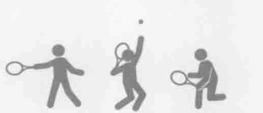
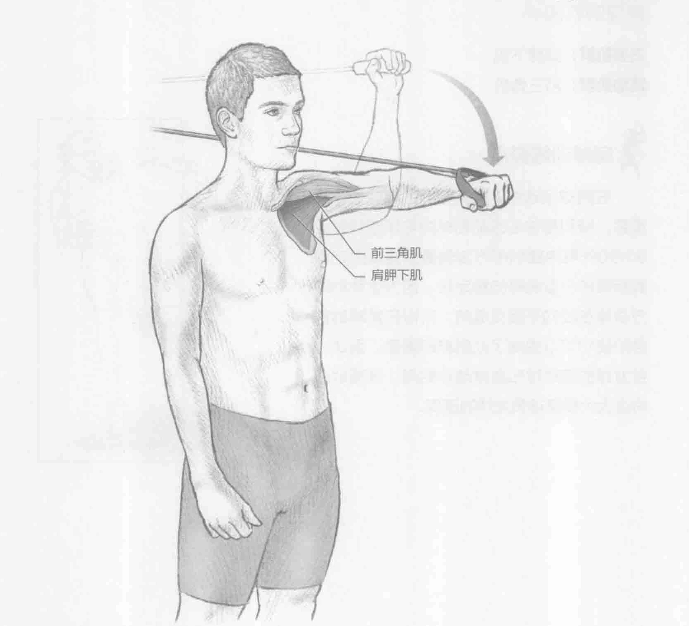
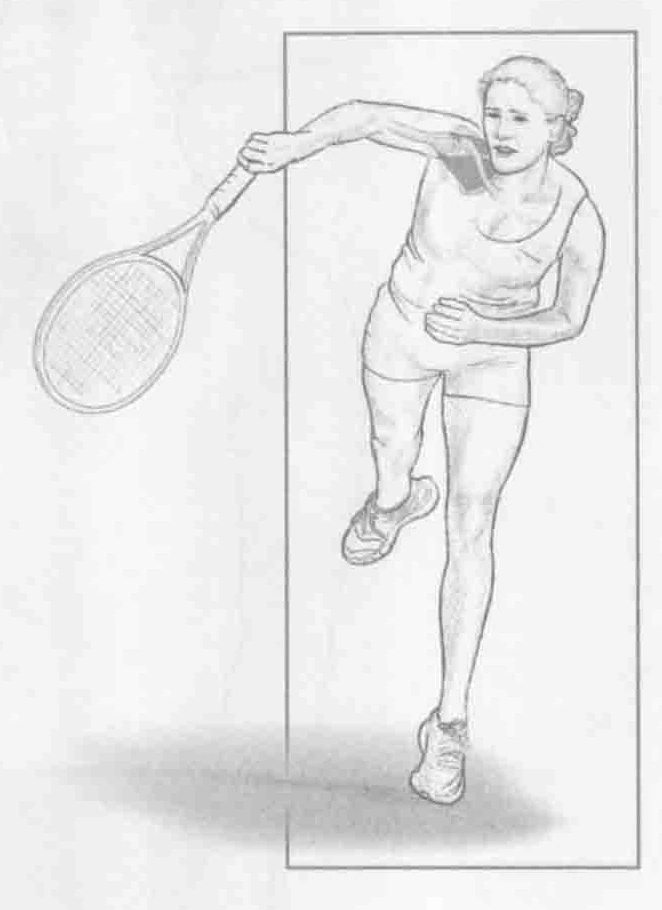

### 进行步骤

1. 身体站直，双脚分开与肩同宽，背对拉力器。将拉力器拉至与肩膀同高，并将肩膀与肘部保持为90度角。这是起始位置。

2. 以与手握弹力带相反的方向慢慢地内旋肩膀。开始时，前臂与地面平行，但在移动到底部时与地面平行。同时在移动快结束时保持2秒钟。

3. 慢慢放下手臂回到起始位置，按以上的步骤重复做10到12次。然后，换另一只手臂做相同的动作。

### 参与的肌肉

主要肌群：肩胛下肌

辅助肌群：前三角肌

### 网球训练要点

在网球运动中，拥有强壮的旋转袖非常重要，特别是在击球前和球拍与球接触时。90/90外展内旋训练方法侧重于提高固定双肩所需的小型肌群的稳定性。因为这种训练方法是在径向平面完成的，所以在发球的蓄势阶段它可以提高了此肌群的强度。因此，在发球的接触球和随球动作期间，这项训练将会大大提高球员发球的速度。

