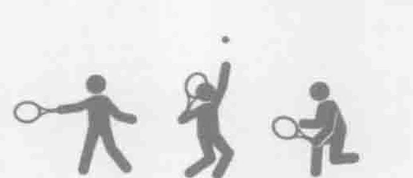
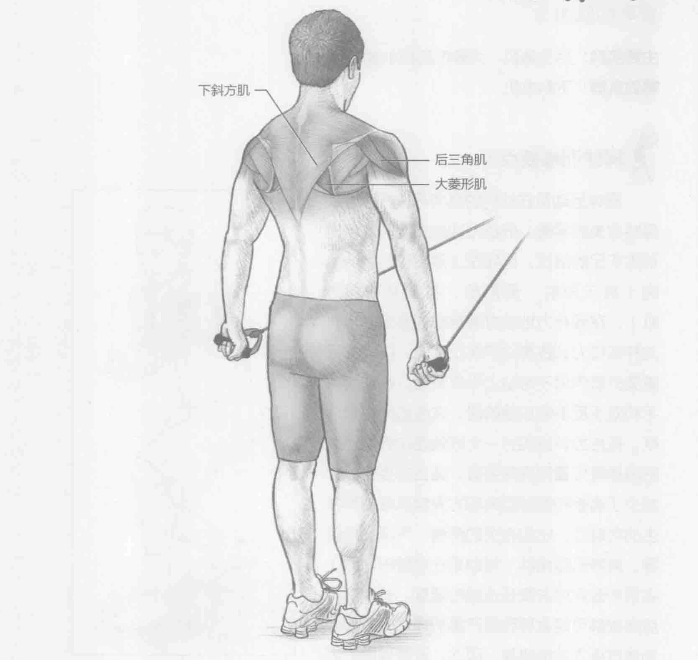
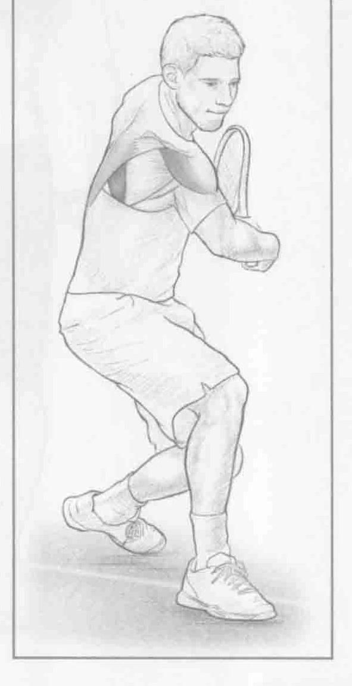

### 进行步骤

1. 身体站直，面对拉力器。手臂放在身前较低的位置，双手各握一个阻力管。通过收拢肩胛骨刺激菱形肌。

2. 手臂伸直，手臂施力抵抗阻力。固定手腕，同时在移动快结束时保持2秒钟。

3. 慢慢放下手臂回到起始位置，重复上述动作。

### 参与的肌肉

主要肌群：后三角肌、大菱形肌和小菱形肌

辅助肌群：下斜方肌

### 网球训练要点

网球运动员在他们的肌肉开发方面必须保持完美的平衡。低拉力训练主要关注平时训练不足的部位，比如在上背部和后肩的肌肉（后三角肌、菱形肌、甚至是下斜方肌）。在强有力地击打落地球或发球之后，这种低拉力训练有助于防止受伤，以及加强重要的肌肉用于帮助上半身减速。在使用单手和双手反手的加速阶段，这些肌肉也很活跃。低拉力训练的另一个好处是改善静止时的肩胛骨位置和肩膀姿势。适当的姿势大大减少了肩膀和胸部肌肉前方肩胛肌症候群发生的可能性，比如有关的疼痛、气闷或虚弱等。肩胛肌症候群（特别是在肩膀的前面）容易导致疼痛并降低击球的速度。长期肩胛肌症候群可能会导致更严重的损伤，最终必须通过手术才能康复。因此，改善肩膀的姿态对预防这些损伤非常重要。

