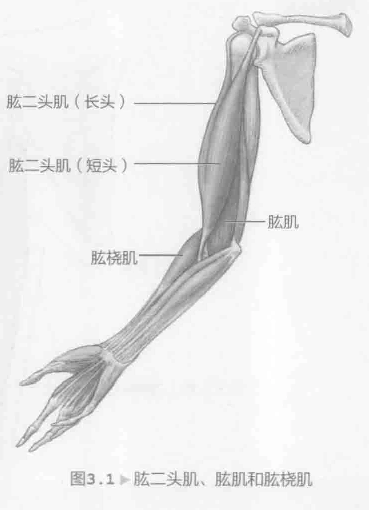
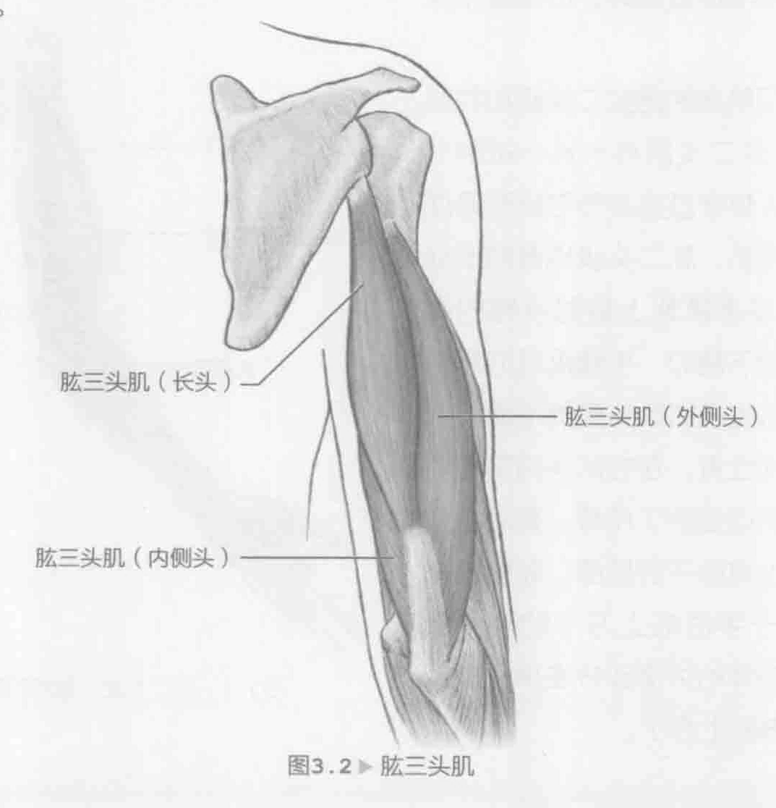
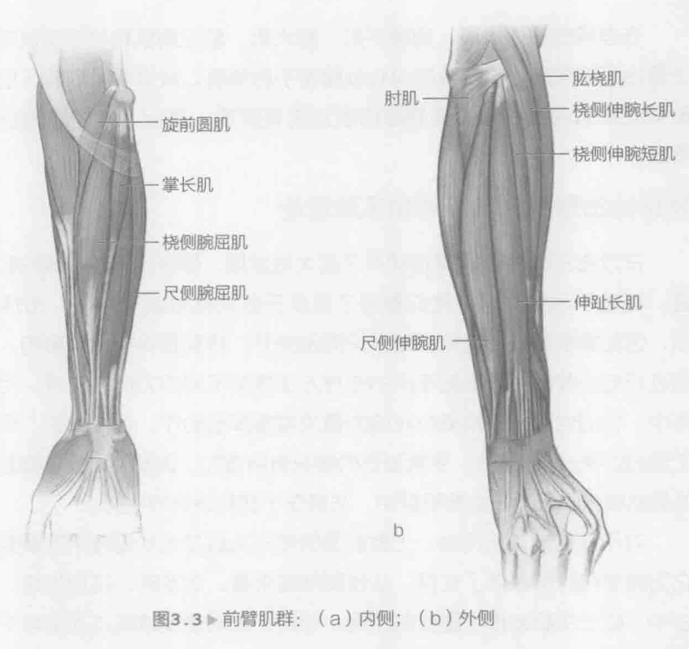

网球运动员从地面生成反作用力，这些力量依次通过腿部、臀部、躯干、肩膀、手臂和球拍，形成一个相互关联的系统。这样的动态链或动力学链，不仅提供了节律运动，同时也产生了力量。对于网球运动员，通过手臂和手腕将下半身和躯干与球拍紧密联系在一起，这是与球接触之前的最后一个环节。如果手臂和手腕的力量不强或者不灵活，那么通过下半身和核心肌群产生的力量就不能有效地转移到球上。这会导致击球和球飞出后旋转力量减小。

### 手腕和手臂解剖

手肘把手臂分为上臂和下臂两个部分。手肘是一个铰链关节，可进行两项活动：伸展和屈伸。将手臂从90度角伸直时就是手肘伸展。肘关节屈曲是相反的；带动前臂使其靠近上臂，可以减小肘部屈曲的角度。肱骨头是连接手肘和肩膀的骨头。下臂通常称为前臂，由桡骨和尺骨支撑着。主要肘屈肌指的是肱二头肌和肱肌（图3.1）。肱二头肌有一长一短两个头，这两个头都穿过肩关节与肩胛骨连接。除了肘屈肌，肱二头肌也有助于前臂后旋，这是手掌朝上翻时手臂的姿势。当手掌朝下翻时，手臂进行的是前旋运动。肱肌位于肱二头肌的下面，源于肱骨的中间位置。在它从头向前传到肘关节后，就连接到了尺骨。有时小型肌肉肱桡肌也有助于肘屈曲。肱桡肌来自肱骨（位于手肘的上方）的外侧部分，它沿着前臂的外侧部分连接到桡骨（位于腕关节的上方）。

主要肘伸肌指的是肱三头肌（图3.2）。肱三头肌是指肌肉近端附着的三个头，头是指它来源于手臂。肱三头肌的内侧头和外侧头附着在肱骨上，而长头穿过肩关节附着在肩胛骨上（肩膀）。这三个头结合起来形成肌腱，肌腱穿过肘关节后面，插入到尺骨鹰嘴突中。当尺骨鹰嘴突弯曲90度时就形成了肘尖。小型肌肉肘肌不仅有助于肱三头肌伸展肘关节，而且对于保持肘关节稳定非常重要。肘肌与肱三头肌的外侧头连接非常紧密；有时两块肌肉的纤维混为一体。

前臂肌肉由屈肌和伸张肌组成（图3.3）。顾名思义，旋前圆肌使前臂向下翻转。与肱桡肌、掌长肌、桡侧腕屈肌、尺侧腕屈肌和旋前圆肌都有助于弯曲前臂。肘肌、桡侧伸腕长肌、桡侧伸腕短肌和伸趾长肌有助于伸展前臂。尺侧伸腕肌有助于伸展手腕。这些肌群对将身体力量转移到球拍都非常重要。同时还有助于稳定肘关节和腕关节。除了屈曲和伸展，手腕也可以进行外展和内收，这两种动作是现代网球比赛中重要的动作模式，特别是与正手和反手挥拍路线密切相关。桡侧伸腕长肌是手腕最主要的外展肌，而尺侧伸腕肌是手腕最主要的内收尺偏运动。

在所有网球击球方法中，有一种在向心和离心肌肉收缩相互作用的方法，特别是在上臂和下臂肌肉中。例如，在正手球向前挥拍阶段，前三角肌、肩胛下肌和胸大肌进行向心收缩，使上臂水平运动并内旋。当背阔肌和腕屈肌做向心运动时，前臂旋前肌不但使前臂和二头肌内转，还会使肘部伸展和弯曲（替代向心和离心肌肉收缩）。

在单手反手球的向前挥拍阶段，棘下肌、小圆肌、后三角肌和斜方肌进行向心收缩，使上臂外展和横向伸展。肱三头肌向心收缩使手肘和腕伸肌伸展，而内收肌向心收缩使手腕伸展和内收。肘肌离心收缩使手肘伸展。在双手反手球中，这些相同的肌群在惯用侧是非常活跃的。然而，在加速阶段，这些肌群在非惯用侧会收缩。前三角肌、肩胛下肌、二头肌、前锯肌、胸大肌、届腕肌和外展肌向心收缩，使上臂内收和水平前屈。截击与击打落地球遵循同样的手臂和手腕的肌肉动作模式。

在发球的加速阶段，肩胛下肌、胸大肌、前三角肌和肱三头肌向心收缩，使上臂抬高并向前。肱三头肌向心收缩使手肘伸展。背阔肌、肩胛下肌、胸大肌和前臂旋前肌向心收缩，使肩部内旋且前臂旋前。最后，腕屈肌向心收缩使手腕弯曲。

### 网球的击球方法及手臂和手腕运动

在过去30年中，网球运动有了很大地发展，部分原因在于球拍和球拍线的改进。得益于这些发展，我们看到了更多开放式站位击球方法。击球变得更加猛烈，因此需要更多力量来帮助保护周围关节，特别是保护手臂肌肉。尽管上臂肌肉进行向心收缩必须根据不同的击球方法提供不同的力道来击球，但是在随球动作中，它们也需要提供离心收缩力量来减缓挥拍动作。我们看到，现代球拍导致了激烈的桡-尺偏运动，手腕受伤的情况有所增加。因此，必须加强屈伸肌群以及外展肌和内收肌。在这些肌群中，关键在于拥有适当的平衡。

对于网球运动员而言，上臂后面的肱三头肌是运动过程中的重要肌肉，因为它为肩部和肘部提供了支撑。从性能角度来看，在发球、过顶扣球、反手球和截击中，肱三头肌发挥了重要的作用。例如，在网球发球或过顶扣球中，整个动力学链的最后一个环节是在接触球之前伸展手肘。这个击球力量由强有力的肱三头肌收缩而产生，且力量从躯干和上臂转移到球拍上。从预防肌肉损伤的角度来看，拥有强壮的肱三头肌有助于缓解手腕、手肘和肩关节等处的压力，减少肌肉损伤的风险。因为网球运动是通过使用球拍进行比赛，而且比赛通常会持续几个小时，所以对于网球运动员的发展来说，手臂和前臂的力量以及肌肉的耐力非常重要。网球运动员拥有的手和前臂力量更强，肘关节和腕关节的压力就越小。足够的前臂力量和握力也可以减少肩膀受伤发生的可能性。手和前臂力量较弱的网球运动员可能会过度使用肩膀，这样做增加了受伤的风险。

### 手臂和手肘的训练

如果运用得当，接下来的训练将会锻炼手臂的力量和肌肉的平衡。一般来说，大家会想要使惯用侧和非惯用侧手臂的力量相当。这项训练对大臂和小臂都适用，但由于运动的性质，惯用侧手臂的力量会更大。强化锻炼应主要关注肌肉的平衡和耐力。因此，我们建议使用较轻的重量，并进行多次反复训练，特别是对于小臂。重量不超过8磅（3.63千克），除非另有说明，重复训练的次数通常是12到15次。与击球类似的几个方向的运动应纳入训练计划，下列训练对它们进行了介绍。适当地加强手臂的力量将有助于改善球场上的表现，同时也有助于防止肩部、肘部和手腕受伤。
