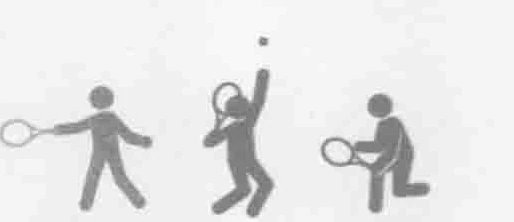
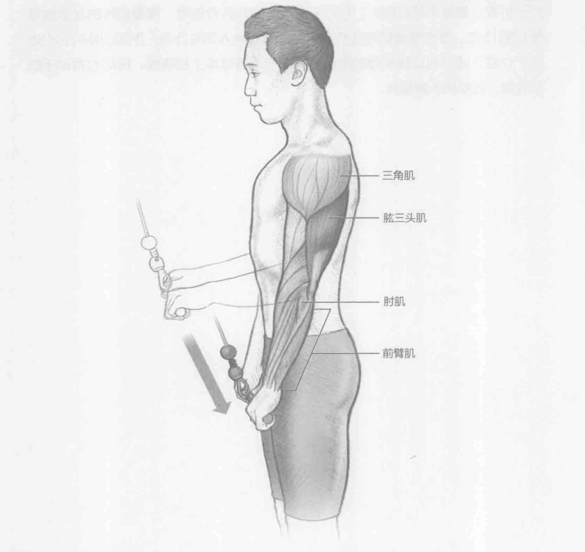
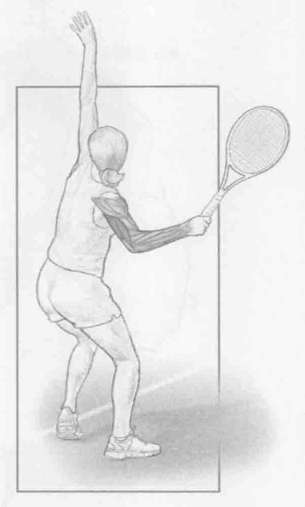
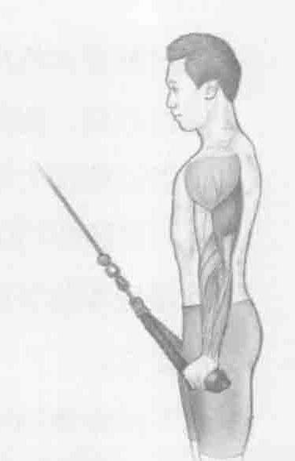

### 进行步骤

1. 双脚并拢站立，保持核心肌群收缩。同时以肩的宽度正手握住短缆索或拉力器。从腰部开始拉缆索，肘部弯曲大约90度。

2. 保持上背部伸直，手臂伸直，将缆索向下拉至大腿。唯一的运动是肘关节伸展。做此动作时，会感觉到肱三头肌收缩。在下拉位置保持2秒钟。

3. 慢慢回到起始位置，重复上述动作。

### 参与的肌肉

主要肌群：肱三头肌

辅助肌群：三角肌、肘肌和前臂肌

### 网球训练要点

在发球和过顶扣球的向后挥拍期间，肱三头肌会释放储存的潜在能量，在发球和扣球的向前挥拍中将它们转化为可用的动能。在向前挥拍期间，与接触球前、接触球时和接触球后一样，肱三头肌向心收缩，这有助于将下半身和核心肌群的力量转移给球拍和球。在单手或双手反手击打落地球时，会出现类似的肌肉收缩，最主要的区别是发球需要更多的垂直挥拍路径，而反手球需要更多的水平挥拍路径。正手截击和反手截击都涉及肱三头肌收缩，但这些肌肉收缩主要提高了肌肉张力。在击球期间，肘关节基本上不会伸长或缩短，但肱三头肌还是会收缩，以确保球拍能与球接触。并保证在击球时提供适当的力量。肱三头肌的力量和肌肉的耐力是减少手臂和肩部受伤的主要预防因素。

### 变化动作

#### 肱三头肌缆绳下压

通过肱三头肌缆绳下压，促使手腕强行内旋，这项训练主要针对肱三头肌的外侧头。在反手击球的最后阶段和截击球后的随球动作中，肱三头肌的外侧头起着非常重要的作用。在这些击球方法中，锻炼肱三头肌的外侧头既能够增强肌肉性能，还会减少受伤的可能性。
