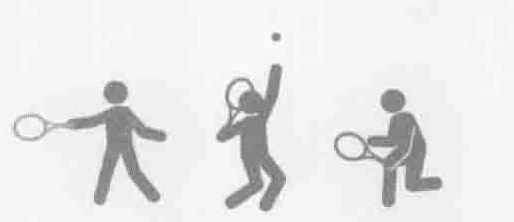
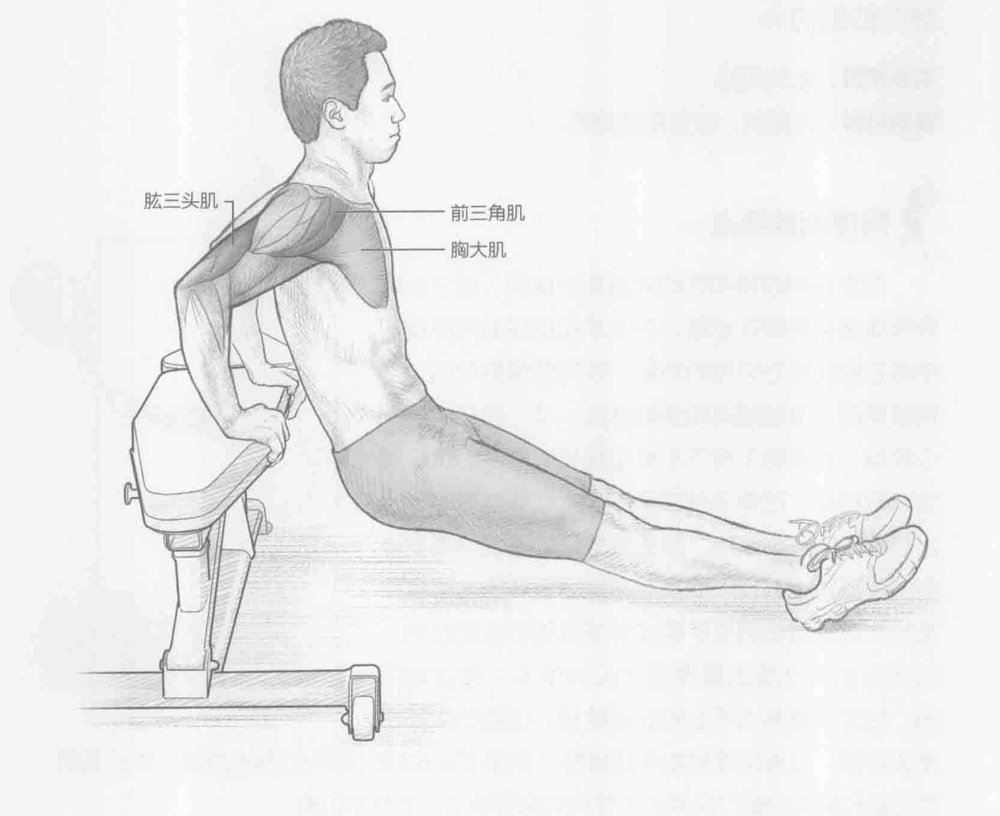
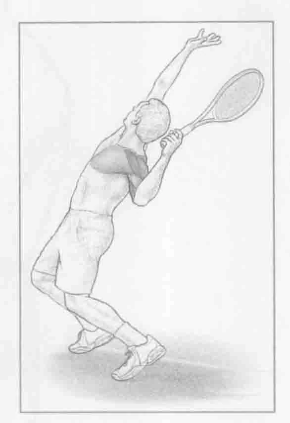

### 进行步骤

1. 背对举重训练椅。双手掌心向下按在举重训练椅的边上，手指指向前方。伸直双腿，脚跟着地，脚尖上翘（也可以把脚后跟放在另一台同样高度的举重训练椅上来增加阻力）。开始时，手臂通常是伸直的，然后慢慢地将手肘弯曲到150度至180度。

2. 慢慢地弯曲手肘，降低身体躯干，直到上臂与地板几乎平行。身体躯干保持直立。

3. 向下推举重训练椅，重点训练肱三头肌向心收缩，伸直手臂，直到手肘回到起始位置。重复上述动作。

### 参与的肌肉

主要肌群：肱三头肌和前三角肌

辅助肌群：胸大肌

### 网球训练要点

对于网球运动员而言，与完全屈伸相比，首选半屈伸或改良的屈伸训练。半屈伸主要锻炼肱三头肌，而不是前三角肌和胸大肌（完全屈伸锻炼这些肌肉）。由于在网球运动中，肩部受伤风险很高，因此减少肩部不适和冲击力非常重要。网球运动员进行半屈伸训练还能够增强肱三头肌并降低肩部受伤的概率。从性能角度来看，在网球的击球方法中，若能锻炼强壮的肱三头肌，将有助于提升网球运动员的整体实力。在准备发球阶段，肱三头肌的运动强度和范围对于将体内释放的储存能量有效地转移给发球的加速阶段非常关键。

### 变化动作

#### 其他握法

如果身边有双杆，也可以在双杆上进行半屈伸训练。标准的握法是手掌与大拇指向前，刺激肱三头肌的三个头，而主要刺激内长头。在双杆上手掌翻转向外，两手大拇指向后，主要刺激肱三头肌长头。然而，这项运动对于没有足够手腕力量的人来说，可能非常困难。好处是它使得肌肉能够在不同角度得到锻炼，同时提高技巧。
