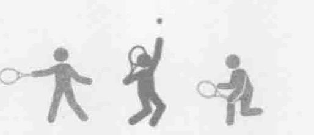
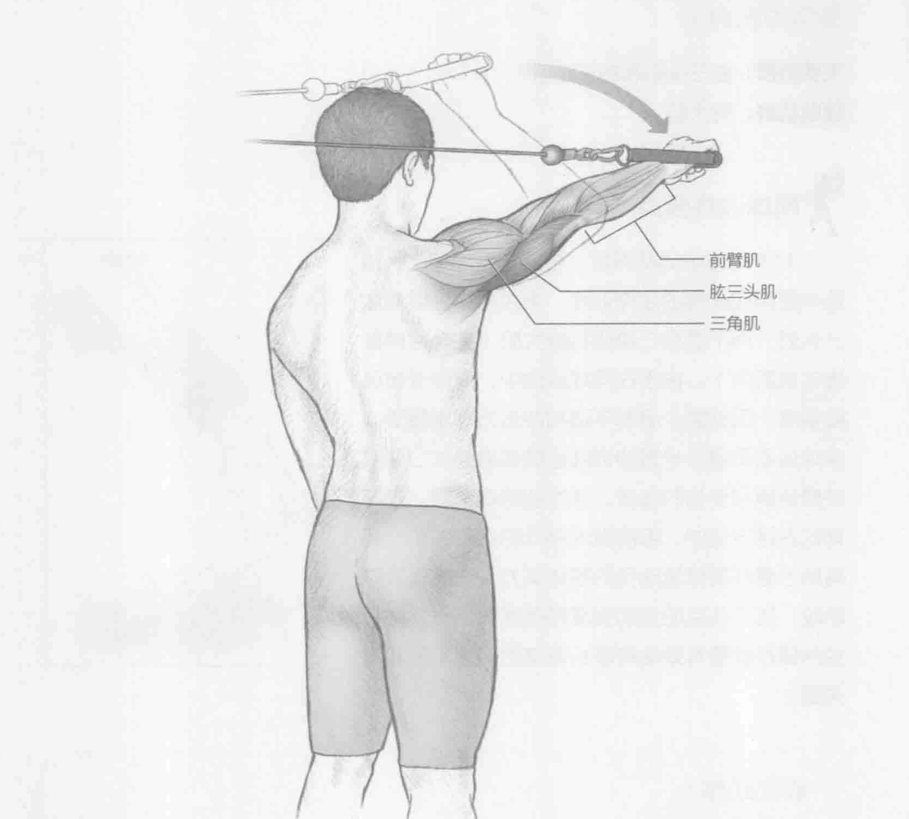
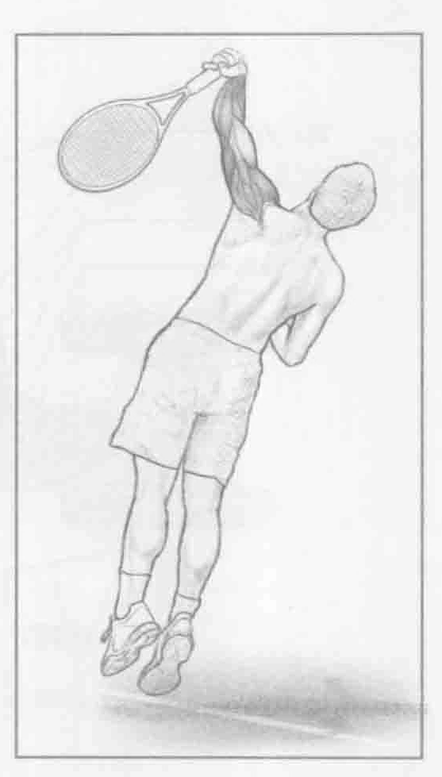

### 进行步骤

1. 身体站直，双脚并拢，背向缆索或拉力器。单手握紧拉力器。开始时手臂弯曲，肘部大约呈90度角。

2. 通过收缩肱三头肌，慢慢地向前伸展手臂，直到手肘伸直。保持重心和双肩稳定。

3. 在运动结束之前，停下来并通过肱三头肌离心收缩，使手柄慢慢地回到起始位置。重复此动作10到12次，然后换另一只手臂，重复上述动作。

### 参与的肌肉

主要肌群：肱三头肌

辅助肌群：三角肌和前臂肌

### 网球训练要点

类似于前面两项训练，拉力器过顶臂屈伸训练可增强肱三头肌，这不仅有助于预防肌肉损伤，尤其是肩关节和肘关节，还可帮助球员提高球技（更有力的发球、过顶扣球和反手击球）。在发球和过顶扣球的向上挥拍阶段，以及接触球之前、期间和接触球后，都需要大量的颈后臂屈伸运动。拉力器过顶臂屈伸训练对于发球和过头顶扣球动作都非常具有针对性。在发球和过顶扣球的类似平面运动中，这项训练还会锻炼肱三头肌的收缩。

