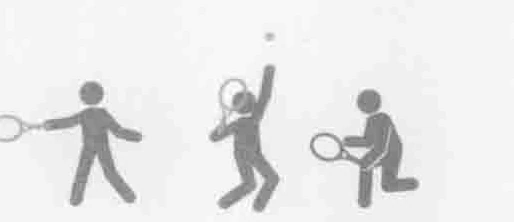
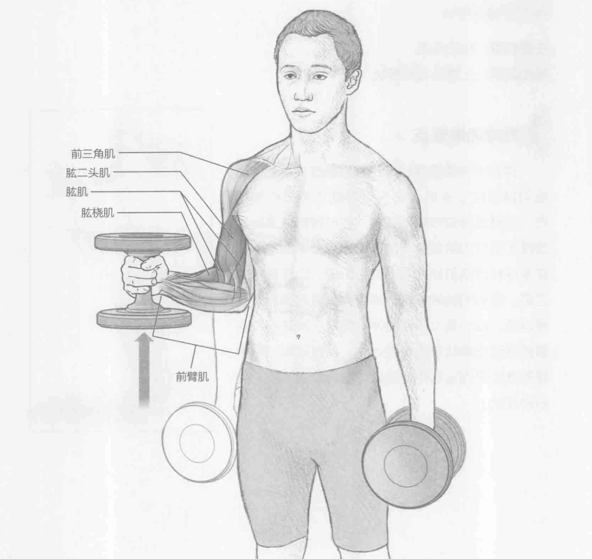
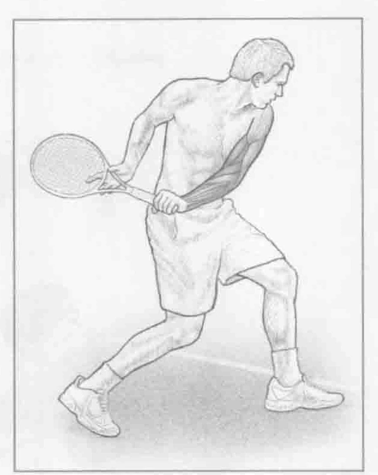

### 进行步骤

1. 身体站直，保持下半身稳定。双手各握一个哑铃，通过核心肌群收缩，在身体两侧伸展手臂。

2. 弯曲手肘大约90度，同时保持身体重心稳定和下半身位置不变，向肩膀处垂直推举哑铃。在最后一个动作结尾停下来，慢慢地将哑铃降低到起始位置。

3. 换另一只手臂，重复上述动作。每只手臂重复训练10到12次。

### 参与的肌肉

主要肌群：肱桡肌、肱肌和肱二头肌

辅助肌群：前三角肌和前臂肌

### 网球训练要点

因为网球比赛一般需要运动员握住球拍好几个小时，所以拥有足够的握力和前臂力量以及肌肉耐力非常重要。手臂和手肘是动力学链（力量的总和）的最后一个能量集中的地方，有助于力量从身体转移到球拍，最终提高击球速度。这项训练锻炼的肌肉在正手和反手击打落地球的随球动作中起着非常重要的作用。对于正手球来说，在向后挥拍期间，手臂的减速是依靠肱二头肌、肱肌和肱桡肌的收缩完成的，这些肌群充当肩部的减速器。在反手击落地球（尤其是双手击球）的向后挥拍和随球动作中，调用肱二头肌主要是帮助支撑肩膀和上背部周围的其他肌肉。

### 变化动作

#### 旋转锤

在标准的旋转锤中，哑铃沿一条直线向前三角肌移动。旋转锤开始是在同一个位置。但是当手肘开始弯曲时，大拇指向外旋转（前臂外旋），这在很大程度上刺激了肱二头肌。肱二头肌连接着前臂肌，并参与正手截击球。因为任何时候球拍面是开放的，所以大拇指可以向外旋转。
