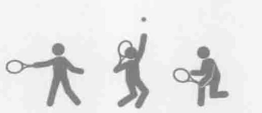
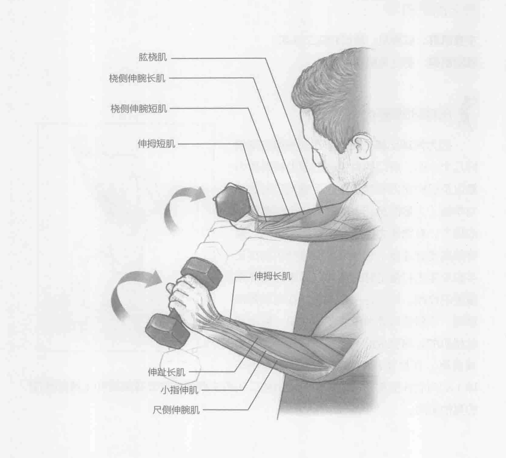
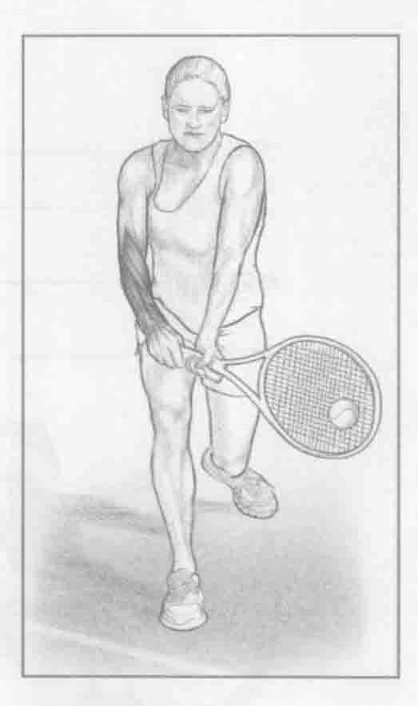

### 进行步骤

1. 跪在举重训练椅边上，用手肘支撑在举重训练椅上，手臂弯曲大约90度。使用正握方法握住两个哑铃（掌心向下）。将前臂靠在举重训练椅的边缘上。

2. 通过弯曲手腕慢慢降低哑铃。手指指向地板。

3. 通过前臂伸肌群收缩来举起哑铃，使手指指向天花板。重复上述动作10到12次。

### 参与的肌肉

主要肌群：前臂伸肌（肱桡肌、桡侧伸腕长肌和桡侧伸腕短肌）、伸趾长肌、尺侧伸腕肌、伸拇短肌和伸拇长肌

辅助肌群：手指伸肌和屈肌

### 网球训练要点

前臂肌群的耐力对于预防肌肉损伤和提升球技非常关键，尤其是在腕关节和肘关节。在接触球前，手腕是最后运动的关节。此时，所有力量都集中在手腕上以便进行强有力的击球。手腕屈伸训练有助于锻炼强健的手腕，便于击球。

### 变化动作

#### 杠铃正握腕弯举

也可以用杠铃完成这项训练。用正握方法握住杠铃（掌心向下）。用跟哑铃一样的训练步骤完成这项训练。
