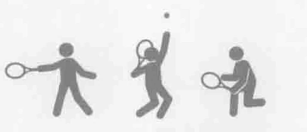
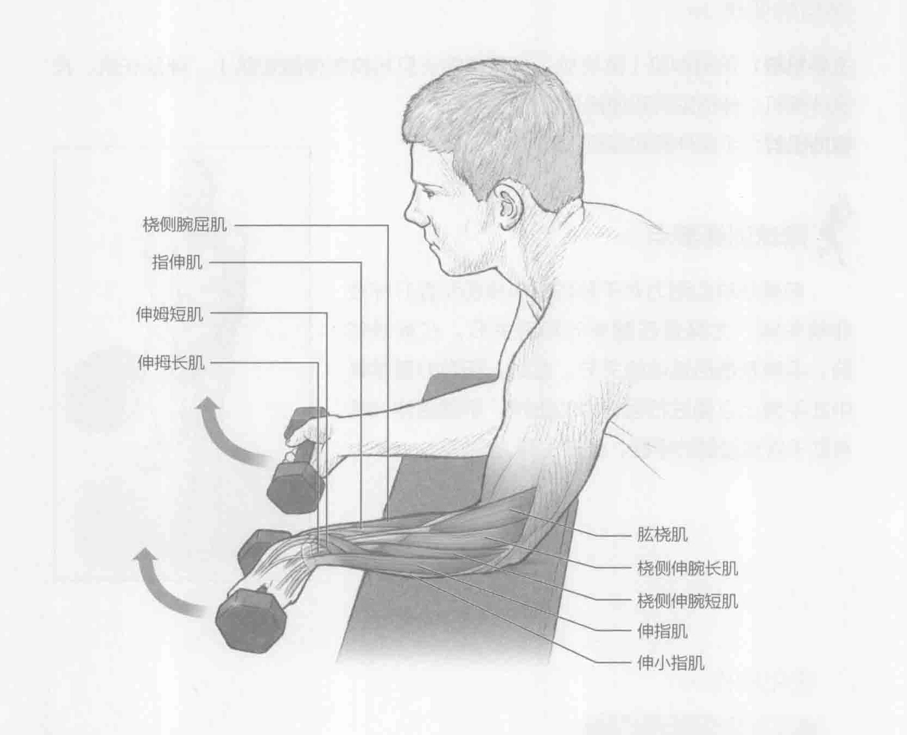
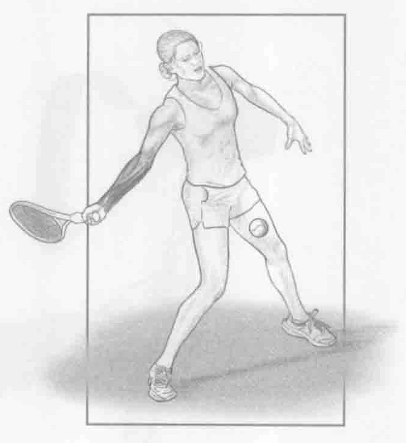

### 进行步骤

1. 跪在举重训练椅边上。用手肘支撑在举重训练椅上，手臂弯曲大约90度。用反握方法握住两个哑铃（掌心向上）。把前臂放在举重训练椅的边缘上。

2. 弯曲或者伸展手腕，手指指向地板，慢慢降低哑铃。

3. 通过前臂伸肌群收缩举起哑铃，手指指向天花板。重复上述动作10到12次。

### 参与的肌肉

主要肌群：前臂肌（肱桡肌、桡侧伸腕长肌和桡侧伸腕短肌）、伸趾长肌、尺侧伸腕肌、伸拇短肌、伸拇长肌和桡侧腕屈肌

辅助肌群：手指伸肌和屈肌

### 网球训练要点

从多个角度来看，前臂力量非常重要。前臂旋转（包含旋前和旋后）、屈曲和伸展有助于使肌肉做好对抗因击球产生的重复压力的准备。此外，开放式站位和现代化设备已经逐渐改变了网球运动。这些技术发展（尤其是新的球拍技术）将会考虑到强有力地击打落地球中的桡-尺偏运动。全面的手臂和手时训练计划应该纳入上述所有训练方法。

### 变化动作

#### 杠铃正握腕弯举

也可以用杠铃完成这项训练。双手反握，抓住杠铃（掌心向下）。用跟哑铃一样的训练步骤完成同样的动作。
