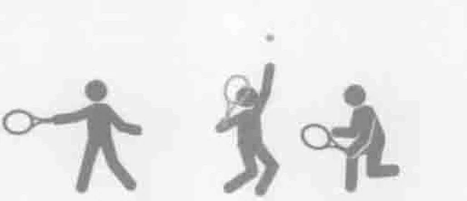
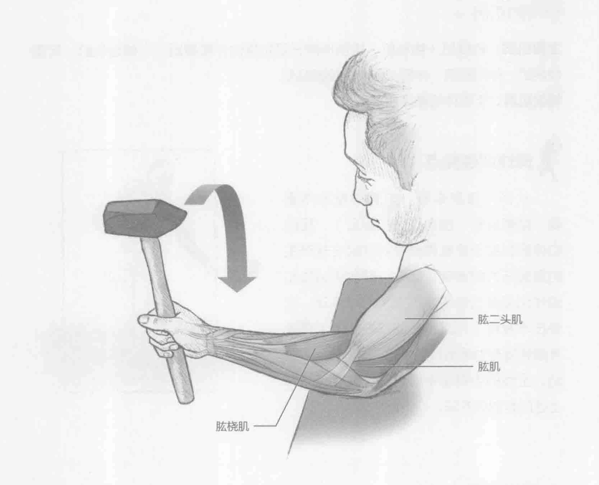
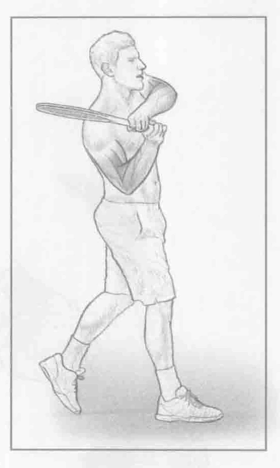

### 进行步骤

1. 坐或跪在举重训练椅边上。将前臂和手肘放在举重训练椅上不动。保持肩膀稳定。用一只手握住一个锤子或者端部带有一定重量的其他器械。开始时锤子头指向天花板。

2. 慢慢地控制前臂外旋。花2到4秒旋转前臂，不要用劲。如果锤子在右手上，旋转前臂时，拇指要移动到右侧。在动作末，保持现有姿势不动2秒，然后慢慢地回到起始位置。

3. 当一只手臂完成一组训练以后，更换到另一只手臂，重复上述动作。

### 参与的肌肉

主要肌群：肱桡肌、肱肌和旋后肌

辅助肌群：肱二头肌

### 网球训练要点

在双手击球的向后挥拍和随球动作期间，顶部的手促使前臂外旋。对于前臂肌肉而言，锻炼适当的力量和耐力将有助于快速击球，同时也会降低手腕和肩部受伤的风险。前臂外旋有助于在击球时调用手腕，能打出更大的旋转球和更偏的角度，如果没有进行这项训练是不可能做到的。锻炼前臂的力量对改善正手和反手截击以及反手削球十分有用。

