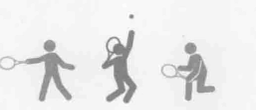
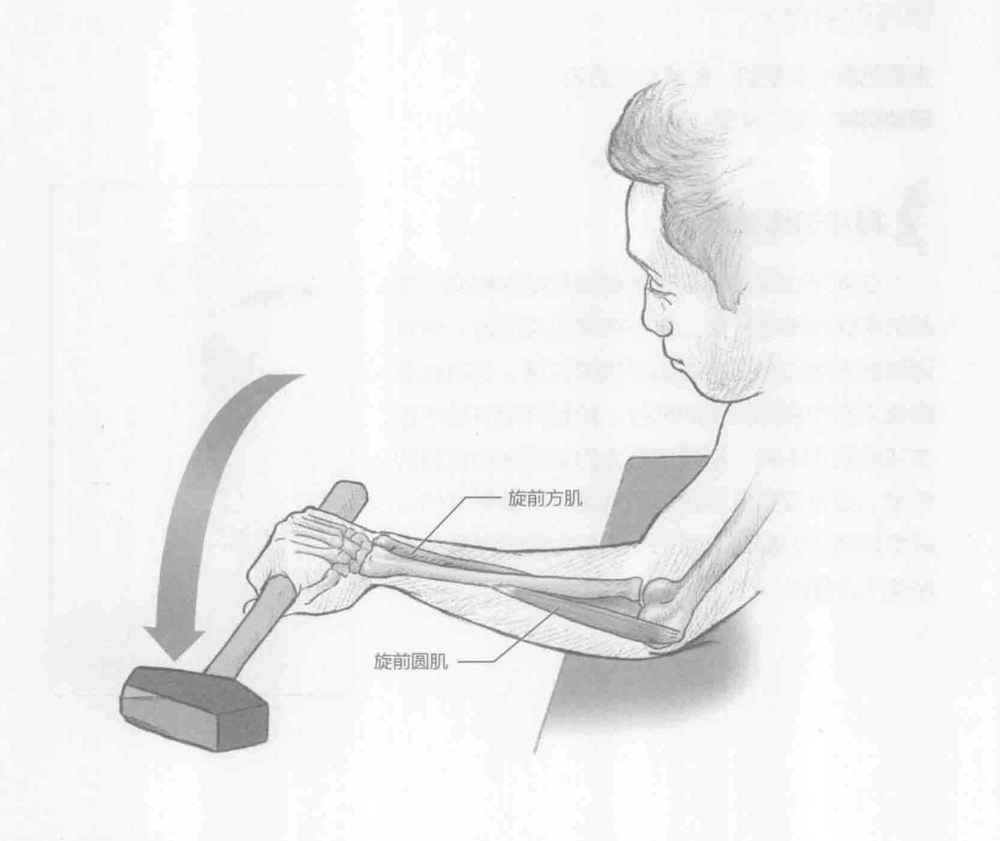
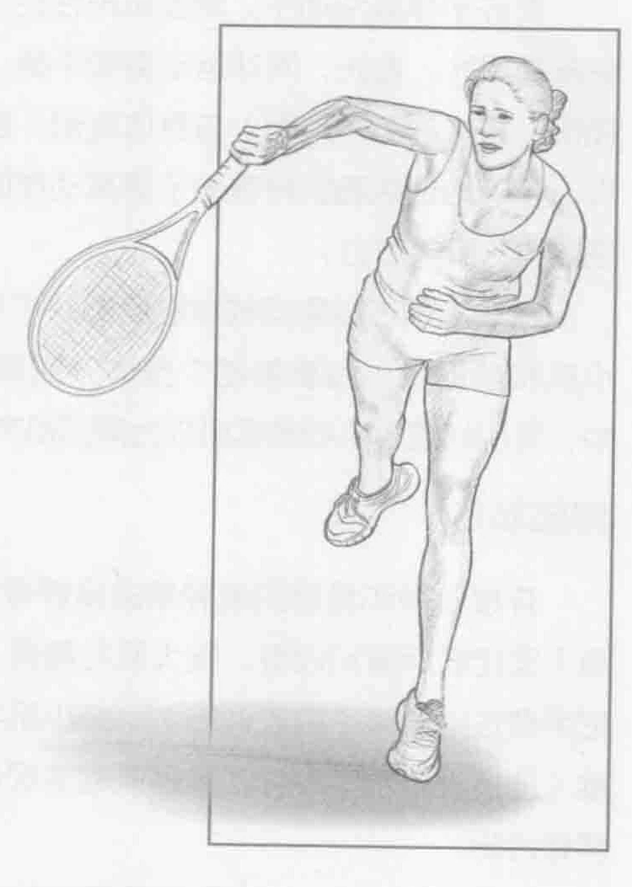

### 进行步骤

1. 坐或跪在举重训练椅边上。将前臂和手肘放在举重训练椅上不动。保持肩膀稳定。用一只手握住一个锤子或者端部带有一定重量的其他器械。开始时锤子头指向天花板。

2. 慢慢地控制前臂内旋。花2到4秒旋转前臂，不要用劲。如果锤子在右手上，旋转前臂时，拇指要移动到左侧。在动作末，保持现有姿势不动2秒，然后慢慢地回到起始位置。

3. 当一只手臂完成一组训练以后，更换到另一只手臂，重复上述动作。

### 参与的肌肉

主要肌群：旋前圆肌和旋前方肌

### 网球训练要点

在网球的击球方法中，手腕和前臂内旋发挥着主导作用，特别是在发球的向前挥拍期间。前臂旋前肌具有适当的力量和耐力将增加发球的旋转和速度，同时也有助于保护手腕、手肘和肩部不受伤。在网球发球和头顶扣球时，前臂内旋更能凸显其优势。在发球和头顶扣球期间，前臂内旋发生在惯用侧的肩内旋之后。在棒球投手和足球后卫发球之后，也会看到前臂内旋动作。在网球运动中，前臂内旋有时被视为甩腕，但与手腕相比，前臂内旋还调用了上半身和手臂的力量。

