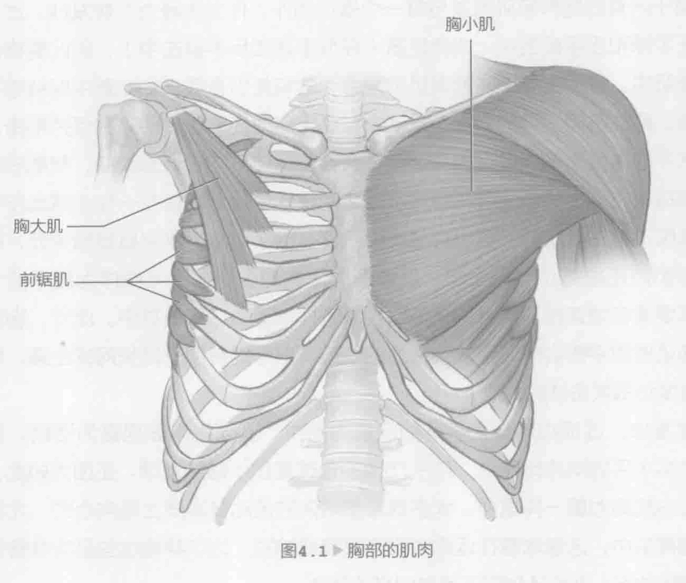

在许多体育活动中，胸部肌肉往往是训练的重点。在网球运动中，胸部肌肉有多种用途。首先，网球运动需要平衡。对于实现球场上出色的发挥与减少运动损伤，身体前侧（前面）与身体背侧（后面）之间适当的肌肉平衡至关重要。其次，正确地训练胸肌将有助于提高动作的力度，这在网球运动中非常重要，而且还能改善肌肉耐力。

将肌肉训练成胸部或背部肌肉并不总是那么简单，因为有几种肌肉（比如胸小肌和前锯肌）包裹着整个身体，或者有些肌肉深藏于其他肌肉之下。在本书中，我们将胸小肌和前锯肌视为胸部肌肉。

### 胸部解剖

连接上肢和骨骼的肩胛带由肩胛骨和锁骨构成。肩胛带肌肉（图4.1，第73页）固定肩胛骨和锁骨。胸大肌与胸骨、锁骨以及肋软骨相连，它的主要功能是把手臂拉向身体（内收训练）。胸小肌与肩胛骨的喙突部分相连，协助手臂向前推（伸展训练）。同样，前锯肌能实现伸展运动，它包裹着胸腔外围，连接到肩胛骨内侧。

如第2章所述，三角肌覆盖着肩关节。一块发达的三角肌使肩膀呈圆形。前三角肌是一块大三角肌的前束，它与胸大肌和其他肌肉在正手球与发球所需的上臂水平运动中起着非常重要的作用。从这方面看，在横向弯曲或内收训练中，前三角肌协助胸部肌肉完成动作。肱三头肌（已在第3章介绍）是一个功能强大的手臂伸肌，位于手臂后方肱骨的后侧。尽管肱三头肌实际上并不是胸肌，但在所有负重深蹲动作中，它都广泛参与，协助胸部肌肉完成动作。由于肱三头肌长头将肩部与肘部相连，因此它能在深蹲过头动作中帮助稳定肩关节。例如，正手和反手截击都包含上臂横向运动与肘部伸展。三头肌与胸肌（比如胸大肌）一起，产生一个向前深蹲运动。向前挥拍和向上挥拍也会出现类似的动作。

三头肌收缩以伸展肘部，同时胸部肌肉收缩，以让上臂和肩膀向前移动。

### 击球和胸部运动

在推拉运动中，健壮的胸部能帮助动作的完成。从这样的推拉运动获益的网球击球动包括发球、过顶扣球、正手击落地球和正手截击。相比其他击球动作，在动作模式上，发球与过顶扣球涉及更多的垂直分力。在向后挥拍（准备）阶段，胸部肌肉被拉伸；在向前或向上挥拍和随球动作中，胸部肌肉向心收缩。在正手击落地球与正手截击中，胸部肌肉的动作模式与上述类似，但涉及更多的水平运动。对于击打肩部以上的球，尤其是上旋高弹跳球，健壮的胸部肌肉是关键。击打这些典型的好球区之外的球，需要强大的力度，以及足够的力量和旋转以控制那些特定的点。当为了接到一个特别偏或低的球而伸展击球时，这一概念也同样适用。关键是要训练这些肌肉、背部肌肉以及促进身体旋转的那些肌肉。表面和深层肌肉都需要关注。由于网球运动可能导致上半身失衡，因此力量训练计划应重点关注不同肌群的平衡协调。左右两侧的胸部肌肉平衡，以及胸部肌肉与背部肌肉平衡都很重要，这不仅影响球技，更重要的是可以防止受伤。

由于所有的肩胛带肌肉参与每一个击球动作，作为主导力（在发球、过顶扣球、正手球和正手截击中）或稳定器（在反手球和反手截击中），因此要格外注意这些肌肉。我们主要关注的是肌肉耐力，这将使您在漫长的比赛中保持强有力的击球。胸部肌肉适当的力量、发动力和肌肉耐力还能改善姿势并保持平衡。从发挥水平的角度来看，良好的姿势和平衡会使身体方向更容易改变，帮助您准备好迎接每次击球，并能使您在每次击球之间快速恢复。即使在一些击球动作中，胸部肌肉不是主要肌群，但也会是辅助肌群。除了与发挥水平直接相关外，健壮的胸部肌肉还能防止肌肉受伤，促进形成正确的姿势。上半身作为躯干的一部分，需要紧密地连接下半身和优势臂，以转换地面力量于击球中。此外，胸部与上背部肌肉的平衡会帮助您找到合适的姿势，这可能有助于延长网球生涯，增加击球速度和每次击球的力量。

在发球、过顶扣球与正手球的向前挥拍中，胸部肌肉表现最为活跃。据估计，在高水平的网球比赛中，几乎75%的击球是正手球和发球。正因为如此，肌肉耐力与肌肉力量一样重要。大多数胸部肌肉的运动在本质上是向心的，尤其是在向前挥拍中，这意味着在运动中肌肉收缩或缩短。为了帮助这些肌肉准备好这样的缩短动作，训练计划应该反映同样的动作。

### 胸部练习

对于水平发挥和防止损伤来说，胸部和背部适当的肌肉平衡很重要。一定要交替前后练习。例如，可以在不同的日子进行这些训练。我们提供的通用指导原则是每次做两到三组，每组重复做10到12次，特别是想要建立一个坚实的基础时。惯用侧和非惯用侧之间保持平衡也很重要。因此，大多数胸部练习都是双侧的。为了经受漫长的比赛，肌肉耐力与力量和发动力一样重要。在了解网球的合格健身与体能专家的指导下，监视每项训练中所使用力量的大小。记住，您并不是想要训练成一个健美运动员，您的目标是成功地、无损伤地打好网球。因此，运动技术非常重要。胸前扔健身实心球（第83页）和仰卧胸前上扔健身实心球（第84页）提供了一个额外的好处；可以轻松地模拟击球的动作模式，使每个训练都具有网球运动针对性。对于多关节训练，健身实心球训练还涉及其他身体部位，能促进打球过程中肌肉的协调和稳定。
