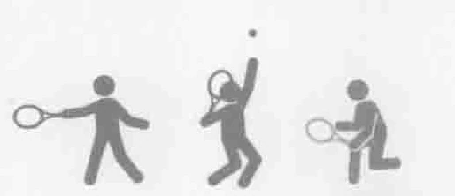
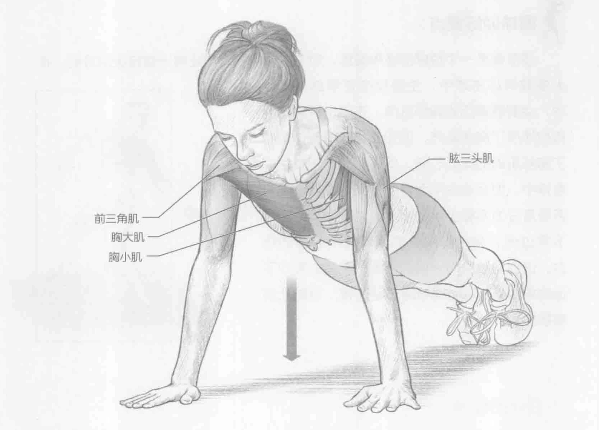
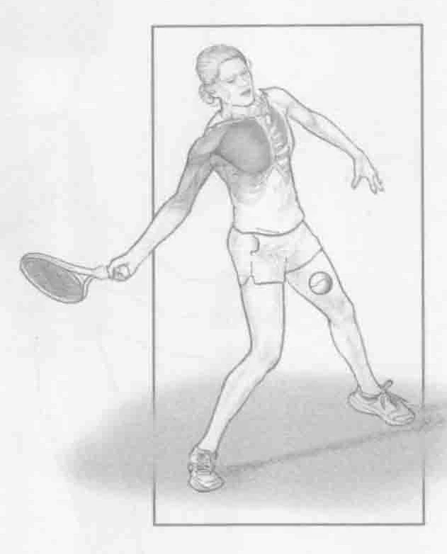

### 进行步骤

1. 头、肩、背、臀部、膝盖和脚在一条直线上，保持水平姿势。手臂伸开，手掌平放在地板上，双手与肩同宽。双脚并拢，用脚趾支撑下半身的重量。

2. 吸气，慢慢弯曲手肘，将躯干贴近地板表面。保持脊柱处于中立位，以防止过度拉伸（脊柱前凸）。

3. 在动作结束时，收缩胸部肌肉和三头肌以伸展手臂，抬起身体时呼气。重复上述动作。

### 参与的肌肉

主要肌群：胸大肌和胸小肌

辅助肌群：前三角肌和肱三头肌

### 网球训练要点

俯卧撑是一个很好的通用锻炼，对于网球运动，它还有一些特定的好处。在大多数网球击球中，主要是在正手球与发球中，会刺激调用的胸部肌肉。正手击球的向后挥拍伸展了胸部肌肉，而加速和随球动作刺激了胸部肌肉的向心收缩。同样的动作还发生在发球中，但运动的平面有所不同；发球涉及更多垂直分力而较少涉及水平分力。如果俯卧撑下弯过低，会给前肩关节囊带来不必要的压力，这会导致肌肉受损的疼痛和不适。将向下运动角度限制在肘部与肩部呈90度，以防止肩部损伤。

### 变化动作

#### 改变俯卧撑中脚的位置，将锻炼不同的胸肌部位。

- 将脚抬到一个重量训练椅上，以锻炼上胸肌，增加训练的难度。

- 抬起躯干，将手放在重量训练椅上，集中训练下胸肌。通过减轻训练中所承受的身体重量，降低了训练的难度。改变俯卧撑中手的位置，将锻炼不同的胸肌部位。

- 钻石手姿势增加了训练的难度，而且更大程度地训练了肱三头肌。做出一个俯卧撑的姿势，仅用食指和大拇指接触地面，这样就形成一个钻石手姿势。

- 双手距离更宽的姿势降低了难度，而且更大程度地训练了前三角肌、肱二头肌与胸肌。双手距离更宽的姿势与传统的俯卧撑姿势很相似，每只手只需向身体外侧移动6到12英寸（15至30厘米），增加双手之间的距离。其他的变化动作还包括在不稳定的表面做俯卧撑，比如一个健身实心球、苏博球、空气垫或重量训练椅。
