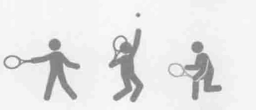
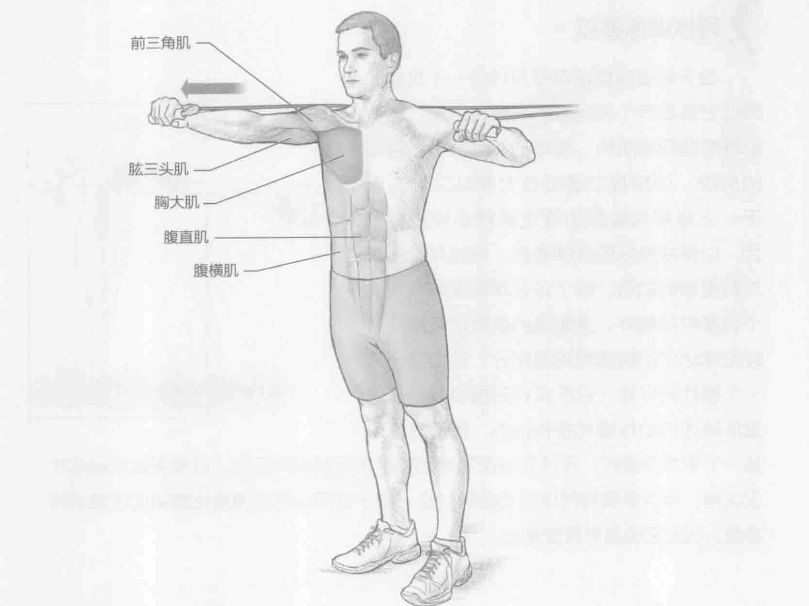
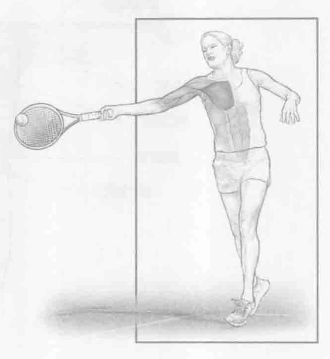
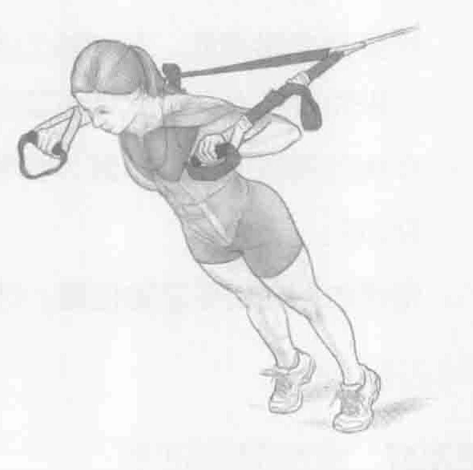

### 进行步骤

1. 将拉力器固定到一个固定物体上。双脚分开与肩同宽站直，这样重心和下半身都非常稳固。背对拉力器固定物，抓住拉力器的把手，一手一个。施力来克服阻力，保持肘部与肩同高。

2. 在体前慢慢地伸展右臂，收缩胸部肌肉，直至肘部伸直。保持最后的姿势1至2秒。

3. 慢慢收回右臂至起始位置。然后左臂重复上述动作。

### 参与的肌肉

主要肌群：胸大肌和胸小肌

辅助肌群：前三角肌、肱三头肌、腹直肌、腹横肌、竖脊肌和多裂肌

### 网球训练要点

由于站姿前推没有使用任何一个机器，因此它需要多个不同肌群来保持平衡。这些肌群包括胸部肌肉、旋转袖、肩部与上背部的肌群。使用拉力器或拉力带站立时，躯干、上背部与肩部的稳定肌群必须积极配合，以保持良好的身体姿势。这些是除胸部外利用到的肌肉。除了正手球和发球会从这个训练中获益外，受刺激的肌肉还有助于所有击球动作的加速和减速部分。拉力器还有一个额外的好处，它在旅行时携带方便。这里所描述的动作模式是有益的，因为它不仅是一个多关节锻炼，还涉及与正手球和发球使用的相同肌肉，这使得这项训练不仅实用，而且更具有网球运动的针对性。由于这项训练的速度比真实的击球动作要慢，因此它也是非常安全的。

### 变化动作

#### 悬挂式训练带（TRX）前推

双脚分开与肩同宽站立，重心和下半身保持稳定。背对TRX悬挂式训练带（组装信息请参见悬挂式训练带的说明书），抓住把手，一手一个。施力来克服阻力，直至悬挂式训练带（TRX）不再松弛。保持手肘与肩同高。在体前慢慢地伸展右臂，收缩胸部肌肉，直至肘部伸直。保持最后的姿势1至2秒。然后慢慢回到初始位置。

