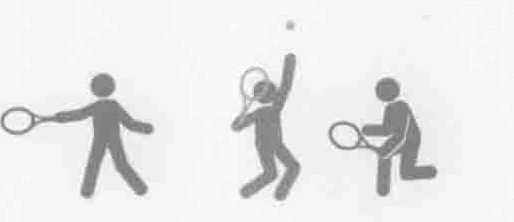
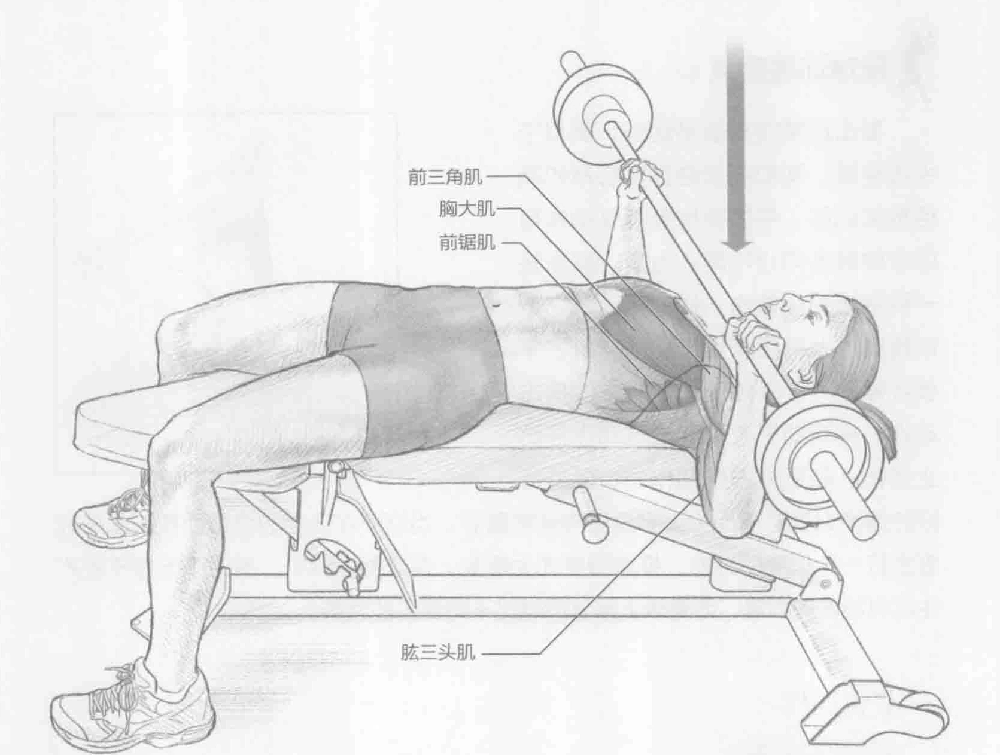
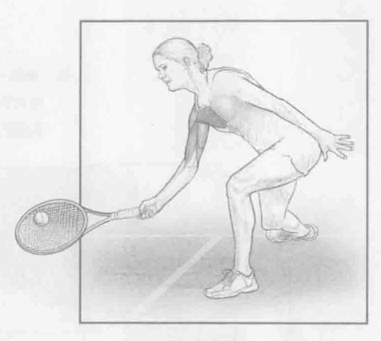
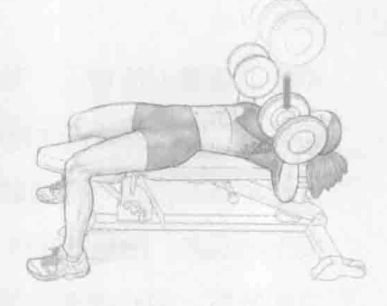

### 进行步骤

1. 平躺在重量训练椅上，双脚平放在地板上。双手与肩同宽，抓住杠铃。抬起杠铃，伸直手臂，保持双手在眼睛上方。

2. 从这个最高位置，弯曲肘部，慢慢地降低杠铃。离心收缩胸部肌肉和肩前周围的肌肉。控制好杠铃，慢慢降低，直到它轻轻地碰到胸部的中间。

3. 立即呼气，向心收缩胸部肌肉，推起杠铃，直至肘部伸直但并不用保持肘部不动。重复上述动作。

### 参与的肌肉

主要肌群：胸大肌、胸小肌和前锯肌

辅助肌群：前三角肌和肱三头肌

### 网球训练要点

截击通常需要推举动作，类似于平板卧推、胸部前推健身实心球和其他相关训练。平板卧推等推举动作可以帮助锻炼向心和离心力量。截击是一种短暂的像拳击一样的摆动，它依赖胸肌，尤其是胸大肌和前锯肌。平板卧推是一个受控制的慢版本的截击动作，将有助于改善此击球动作并防止受伤。在所有击球动作中，保持良好的推举力度对于保护上半身肌肉非常重要。当您不在适当的位置而被迫击球或者击打一个很高的球时，推举强度尤为重要。在这些击球中，有时下半身不能产生尽可能多的力量，而要求上半身贡献比平时更多的力量。

### 变化动作

#### 哑铃卧推

这个训练使用两个哑铃来代替杠铃，需要更强的单臂控制，这将更大程度地训练肩膀周围的稳定肌群。如果使用哑铃，也可以改变手的位置。传统的抓握是正握，手掌向上，能提供更多的伸展力量，因为哑铃重量被降低至胸部。对握（掌心相对）锻炼肱三头肌。

