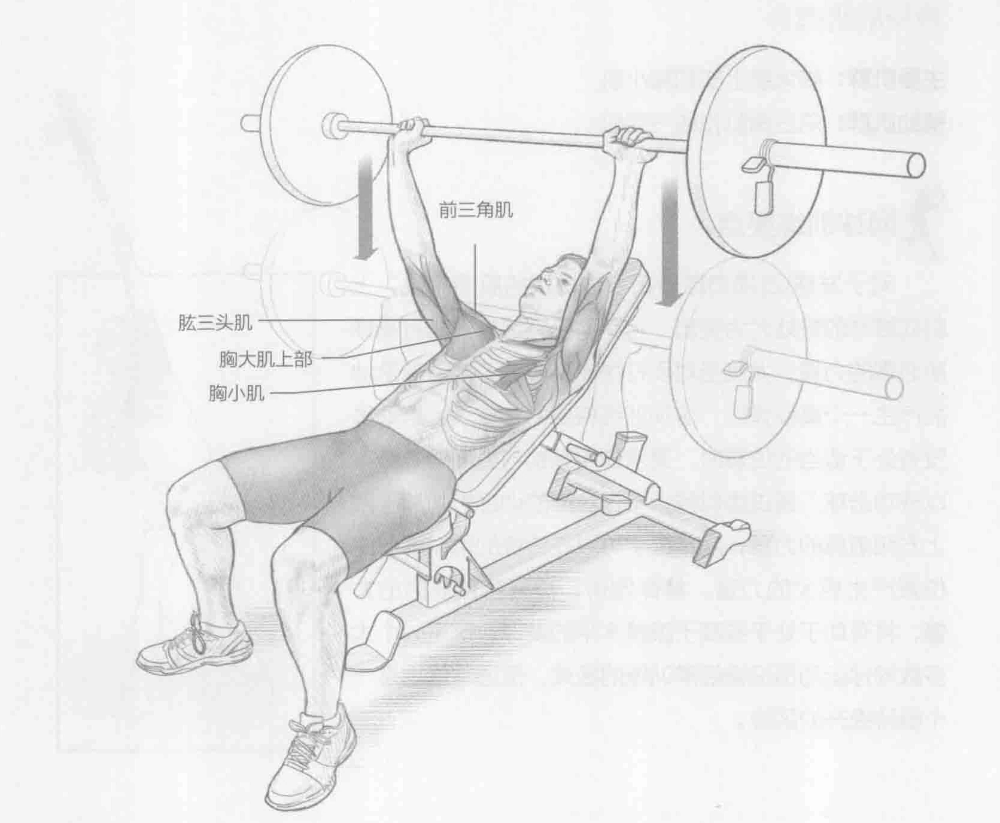
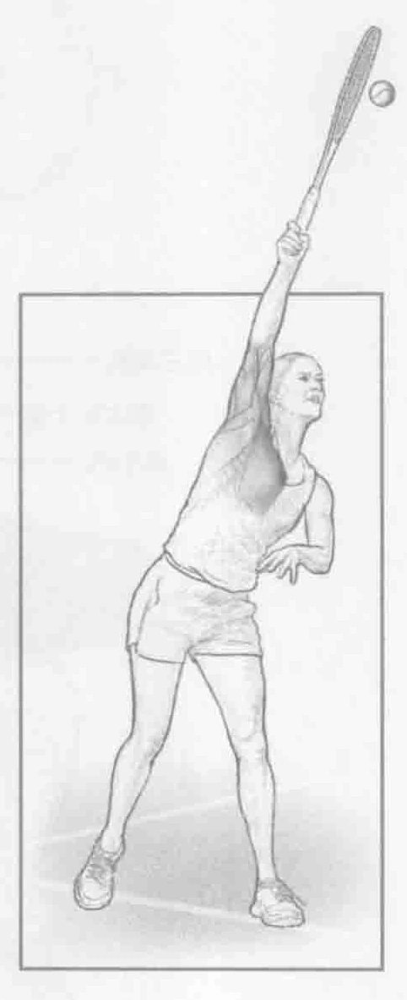
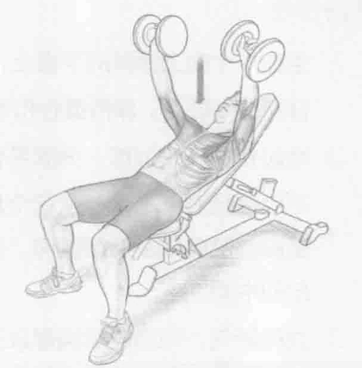

### 进行步骤

1. 坐在一个向上倾斜的平板上，坡度为30到35度，双脚稳固地抵在地板上，背靠在平板上。保持重心和下半身稳定，双手与肩同宽，抓握杠铃。

2. 举起杠铃开始训练，伸展手臂，保持双手在眼睛上方，直至胳膊伸直，但不用保持肘部不动。从这个最高位置，弯曲肘部，缓慢降低杠铃，离心收缩胸部肌肉以及肩前肌肉。控制好杠铃，缓慢降低，直到它轻轻地触碰胸部的中间。

3. 立即呼气，向心收缩胸部以及肩前肌肉，推起杠铃，直至肘部伸直，但不用保持肘部不动。重复上述动作。

### 参与的肌肉

主要肌群：胸大肌上部和胸小肌

辅助肌群：前三角肌和肱三头肌

### 网球训练要点

对于发球\过顶扣球与正手球调用的肌肉来说，上斜式推举的好处尤为突出。它有助于锻炼有效击打高球所必需的力量，尤其当对手打快速旋转球，或者球落地后产生一个高反弹时，这项训练将更为有益。当运动员没有处于适当的位置时，通常使用胸部与肩部的力量可以成功击球。通过类似倾斜平板卧推的训练，增加胸部上方和前肩的力量，网球选手可以在传统的难以驾驭的位置产生更大的力量。具体地讲，提高整体肌肉的力量，将有助于处于或高于眼睛水平的发球。这是一个大多数网球运动员没有经常训练的区域，但通常这也是一个亟待提升的区域。

### 变化动作

#### 上斜式哑铃推举

用哑铃代替杠铃，增加肩部周围稳定肌群的锻炼，有助于减少身体左右两侧不平衡发生的可能性。也可以增加坡度，从25度增加到75度，使胸部肌肉收缩集中到更高的部位。

