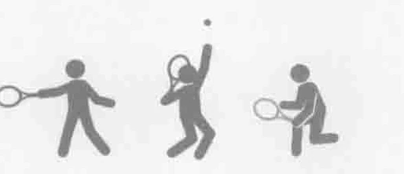
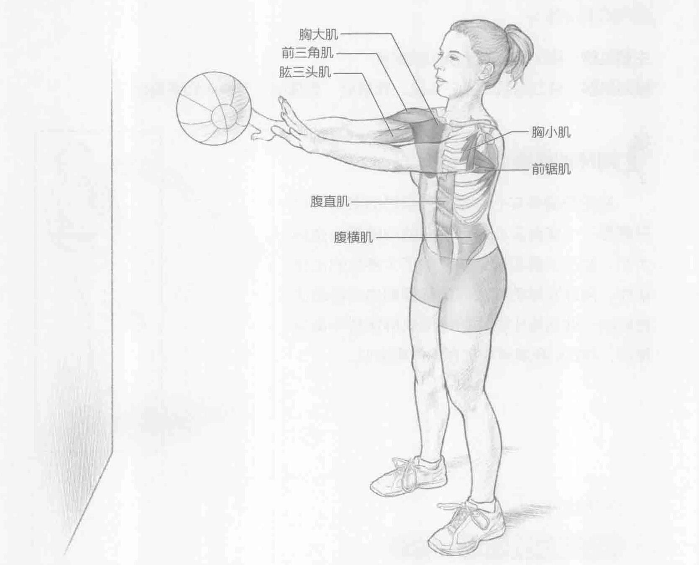
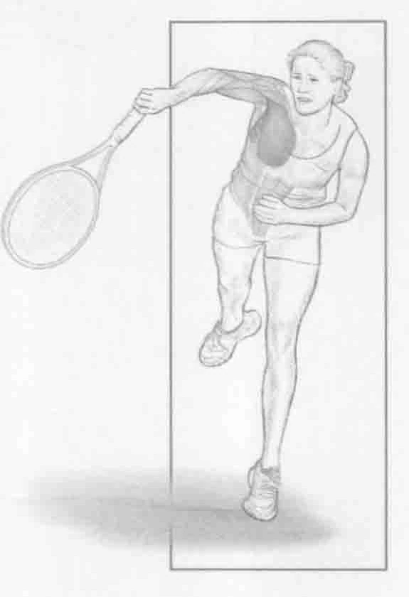

### 进行步骤

1. 选择一个重量适度的健身实心球，此次训练中，6至20磅（2.5至9千克）的健身实心球最为适宜。选择球时，要充分考虑到自己的力量、年龄和任何禁忌症。

2. 双脚分开与肩同宽，以准备运动姿势站立。膝盖微微弯曲，身体核心肌群收缩。面对一堵坚实的墙，双手托举健身实心球，起始姿势为双臂在胸前伸展。

3. 急速弯曲肘部，将健身实心球举到胸前，然后通过收缩胸部肌肉与肱三头肌，迅速把球扔到墙上，捡回球，然后重复动作。

### 参与的肌肉

主要肌群：胸大肌、胸小肌和前锯肌

辅助肌群：前三角肌、肱三头肌、腹直肌、腹横肌、竖脊肌和多裂肌

### 网球训练要点

胸前扔健身实心球是一项很好的锻炼，它只需要一个健身实心球。主要的训练重点是胸大肌、肱三头肌和前锯肌。除了大多数的击球动作，网球发球的向上与向前挥拍也会调动这些肌肉。此训练中调用的辅助肌群保持平衡与稳定，与它们在发球中发挥的作用类似。

### 变化动作

#### 仰卧胸前扔健身实心球

胸前扔健身实心球是一种剧烈的上半身增强式运动。为了增加难度，让一个伙伴或教练帮助您完成此变化动作训练。平躺在地面上，屈膝，脚后跟平放在地面上。在眼睛上方，伸直双臂，抓住一个轻健身实心球（4至8磅，1.8至3.63千克）。弯曲肘部，将健身实心球拿至胸前。当球碰到胸部时，迅速朝眼睛上方扔出，扔得越高越好，确保有一个伙伴能抓住它。抓住球后，您的伙伴会轻轻地将球扔到您的胸前。这时胸部肌肉进行离心收缩，可以抓住健身实心球，抓住之后，再次立即尝试往上扔出。注意上半身所产生的爆发力。
