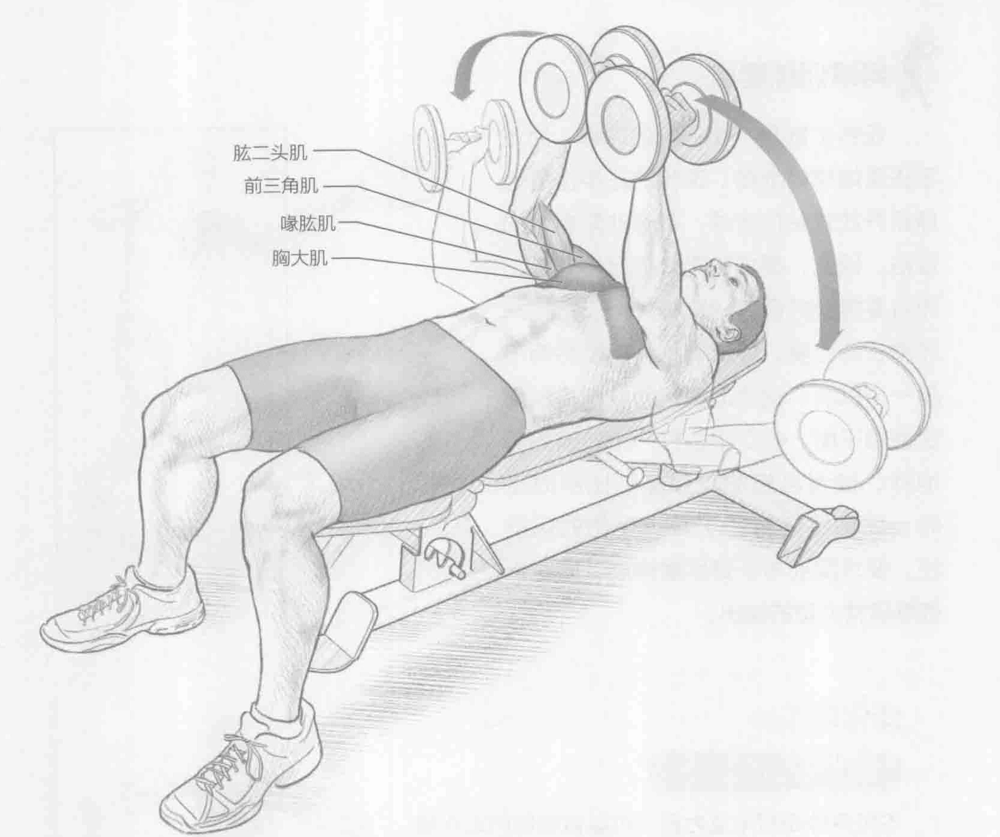
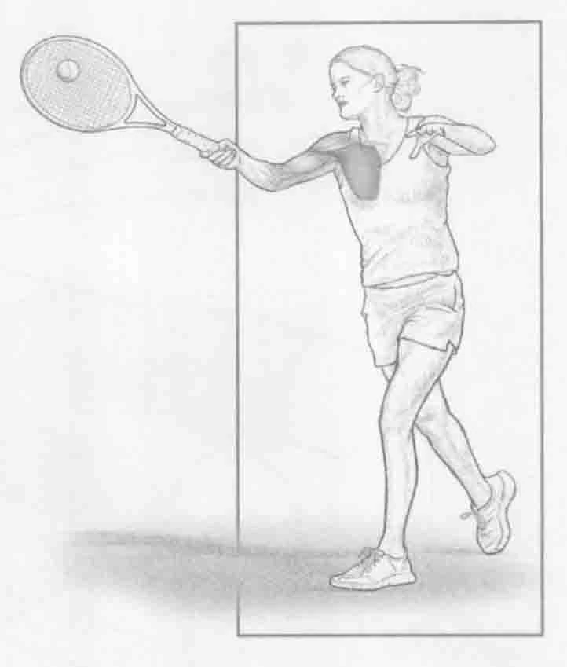
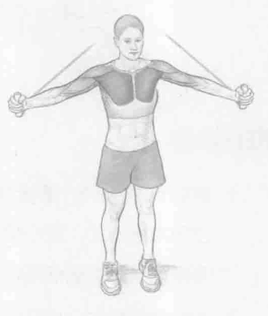

### 进行步骤

1. 躺在一个水平的重量训练椅上，双脚平放在地板上。双手各握一个哑铃，使用对握方式，掌心相对。在胸前伸展手臂，肘部略微弯曲。

2. 慢慢地向两侧放低哑铃，肘部略弯曲，直到肘部略低于肩高。

3. 收缩胸部肌肉，提升哑铃，以返回至起始位置，然后重复动作。

### 参与的肌肉

主要肌群：胸大肌

辅助肌群：前三角肌、喙肱肌和肱二头肌

### 网球训练要点

哑铃扩胸是一个很好的训练，为正手击落地球做准备。现代的正手击落地球是开放式站位击球，带有非常有力的挥拍。因此，要求肌肉必须足够健壮，而且要能抵抗疲劳，这样才可以打完一场漫长的比赛。此次训练利用哑铃而不是一个机器，这会迫使辅助肌群提供稳定性和平衡。在正手击打一个较偏的落地球，或者当您的支撑基础比平时宽时，此训练还有助于减少受伤的可能性。要求胸部与手臂尽量伸展，同时仍能够保持力量的输出。

### 变化动作

#### 拉力器站立扩胸

不用哑铃而利用拉力器，可以做相同的动作模式。双脚分开与肩同宽站立，背向拉力器。每只手抓住一个拉力器的把手，做哑铃扩胸中所述的相同扩胸动作。另一种替代方法是在一个向上或向下倾斜的椅座上训练，它从不同角度针对胸部肌肉进行锻炼。在此训练中，将刺激更多肌群。
