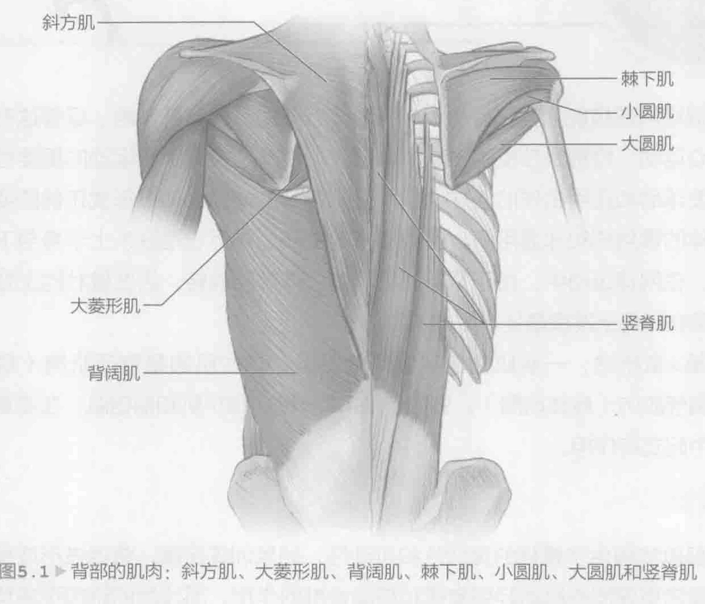
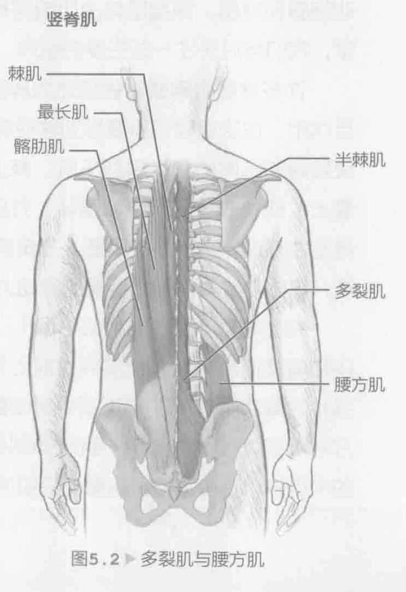

要提高网球技能和预防受伤，训练时千万不能忽视背部肌肉。尽管这些肌肉进行向心运动，特别是在反手击球中，但我们不能忽视其离心运动的重要性，尤其是在发球后和正手击球的随球动作阶段。强壮的背部会促进形成正确的姿势，平衡身体的惯用侧和非惯用侧，保护周围的关节，并且它是联系上半身与下半身的纽带。在网球运动中，由于背部必须弯曲、伸展和旋转，因此健壮的上背部和下背部是在球场上发挥最佳水平的关键。

如第4章所述，一些肌肉包裹着其他肌肉，这些肌肉是背部肌肉（身体后侧）或胸部肌肉（身体前侧）。例如，第4章介绍的胸小肌和前锯肌，在本章的一些训练中起支持作用。

### 背部解剖

背部肌肉提供了脊柱的灵活性和可动性，如果训练正确，将促进形成良好的姿势。通常更深层的肌肉起到支撑和移动脊椎的作用，而浅层的肌肉更多负责移动胳膊和肩膀。深层肌肉由肌肉层构成。在这些肌肉层里有许多肌肉，但对于本章，我们将只关注一些主要的肌肉，以及训练中所涉及的肌肉。

许多背部肌肉通常被描述为肩部肌肉；然而，由于他们与背部之间重要的相互作用，在这里我们需要提到这些肩部肌肉。旋转袖（参见图2.1，第31页）由四块较短的肌肉构成：肩胛下肌、棘上肌、棘下肌和小圆肌。这些肌肉附着在关节囊上，使关节囊变得更加强壮，并且能够维护关节接头处的肱骨。对于肩关节的稳定性来说，它们至关重要。三角肌（参见图2.2，第31页）使肩膀呈现圆形的外观，是体前或体侧抬举手臂的原动力。

在上背部（图5.1，第88页），斜方肌连接头骨，帮助支撑和旋转头部。它还和肩胛提肌一起，使肩胛骨向上和向身体的中线方向移动。背阔肌是最大、最强壮的背部肌肉（在拉丁语中背阔是最宽阔的意思）。这个肌肉从斜方肌下缘上方附着在脊柱上，向下一直延伸到骨盆的后面。它帮助下拉手臂（肱骨）向身体的中线移动，也有助于肩膀向后拉伸。

这些是构成V字形轮廓的主要肌肉。（大、小）菱形肌位于脊椎和肩胛骨之间，负责向上与向内（收缩）移动肩胛骨。在将两侧肩胛骨挤压到一起的动作中，菱形肌是所涉及的主要肌肉。前锯肌是促使反向运动（伸展）的主要肌肉，它包裹在胸腔外壁周围，附着在肩胛骨的内缘。竖脊肌的肌肉组织构成背部肌肉的外层。竖脊肌稳定了脊柱，帮助保持直立姿势或伸展脊柱。

下背部的两个重要的肌群是多裂肌和腰方肌（图5.2），它们在稳固脊柱方面起到了重要的作用。对于网球运动员而言，将腰椎连接到臀部屈肌的腰大肌也同样重要。

### 击球与背部运动

在发球时，蓄势阶段（向后挥拍）使背部处于一个过度拉伸和转动的位置。这个位置给肌肉和背部周围的关节带来了很大的压力，这也是加强上下背部肌肉的一个主要原因。网球是一项节奏很快的运动，需要面对许多突发紧急情况，在运动中，它有频繁的停止和启动、高难度的扑球动作以及每个点多次的方向变化。所有这些动作都对身体（尤其是背部）带来了更高的要求。许多运动员忽视了背部的训练，至少没有像训练体前肌肉那样锻炼背部肌肉，考虑到这一点，大家就可以明白他们是怎样让自己受伤或表现不佳的。本章介绍的训练能帮助加强背部肌肉，尤其关注以下肌肉：发球和正手击球的随球动作调用的肌肉，以及在单手或双手反手的加速（向前）挥拍中作为原动力的肌肉。由于在将下半身力量转移至上半身的过程中，作为动力链一部分的背部起着至关重要的作用，因此建议将转体训练也包含在内。

### 背部训练

背部训练应该定期做。对于网球运动员而言，肌肉平衡至关重要。网球运动员身体前面的肌肉（胸部和肩膀前面）通常比较强壮，因为在击球动作中经常需要用到这些身体部位，所以需要特别注意背部肌肉组织。每周做几次背部训练，每次训练之间要休息一天。恰当的技巧非常重要，因此，我们建议大家咨询了解网球的力量和体能训练认证专家。在使用体育设施时，做两到三组训练，每组重复做10到12次。可以利用自己的体重或健身实心球完成许多训练。健身实心球训练是全身锻炼，它将转体动作加入其中，因此特别具有网球运动针对性。尽管网球通常需要背部肌肉的离心运动，但我们建议从背部的力量训练项目开始，利用向心力量训练，先打下一个坚实的力量基础。力量与体能训练教练会告诉大家何时开始将离心力量训练加入到自己的个人训练计划中。
