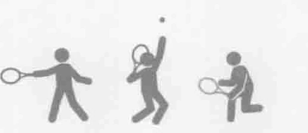
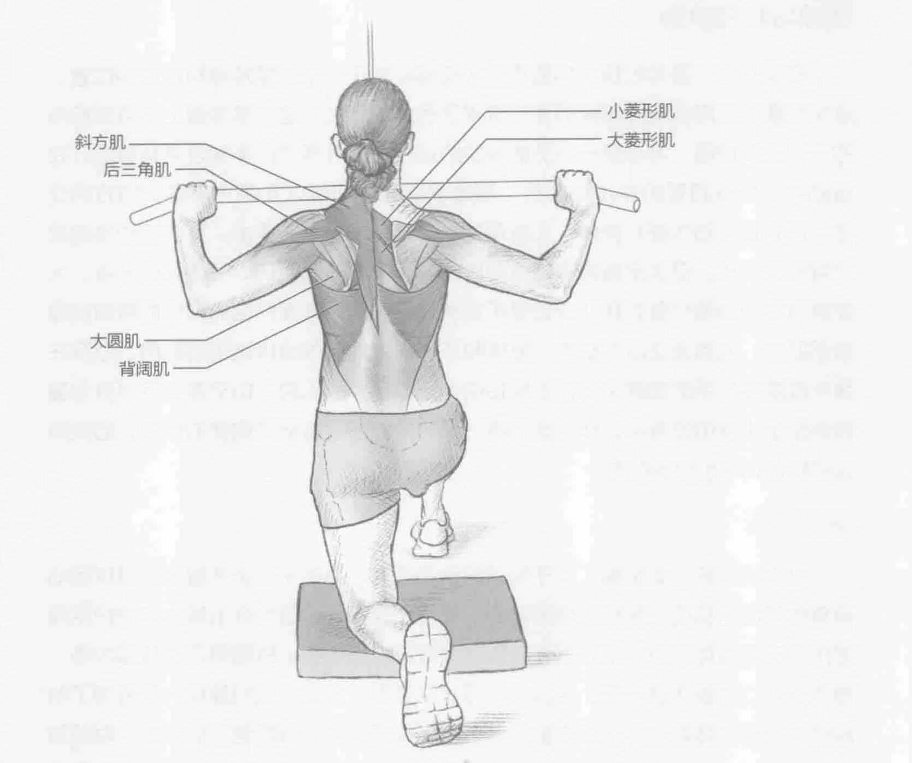
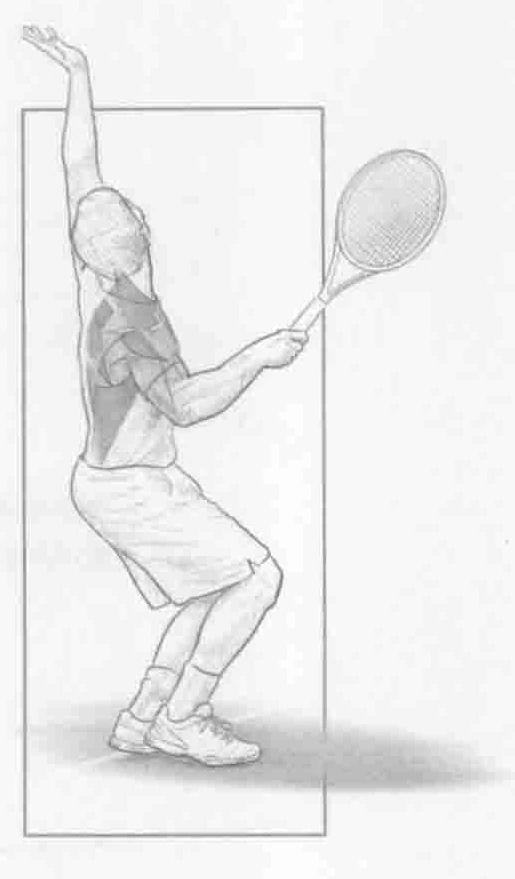
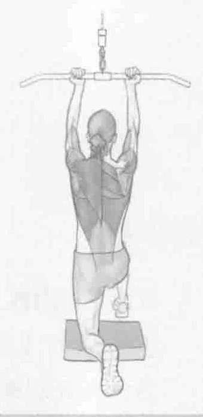

### 进行步骤

1. 单腿跪在垫子上，面向绳索拉力器。双手分开略比肩宽，抓住把手，掌心向外。保持身体重心稳定。

2. 在头上方，下拉把手至大约胸骨水平。注意将肩胛骨挤压到一起。

3. 慢慢回到起始位置，重复上述动作。

### 参与的肌肉

主要肌群：背阔肌、斜方肌、后三角肌、大菱形肌和小菱形肌

辅助肌群：肱二头肌和大圆肌

### 网球训练要点

对于保护上背部和肩关节来说，此训练锻炼的肌肉扮演重要的角色，在发球和正手击球的随球动作阶段提供离心力量。肩胛骨的收缩有助于加强肌肉，保护肩胛骨。对于网球运动员而言，这些都是非常重要的肌肉。这些肌肉也负责发球的准备阶段。此训练包含了背部最大的肌群。背阔肌是背部最大和最强的肌肉，在网球击球中，同时提供向心和离心收缩。

### 变化动作

#### 引体向上

如果将双手靠近，距离约2到3英寸（5到8厘米），并将掌心向内，做引体向上姿势，那么训练重点将集中到肩胛骨周围的稳定肌群。记住一定要在头的前方下拉把手；向头后方下拉，会给关节和肩胛骨的稳定肌群带来不必要的压力。把重量下拉到胸部上方，同时略微挺胸。还可以在背部下拉机上做这个训练。
