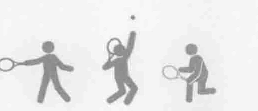
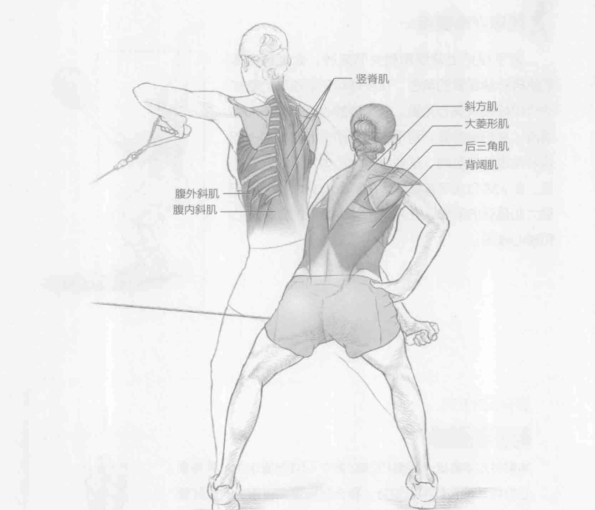
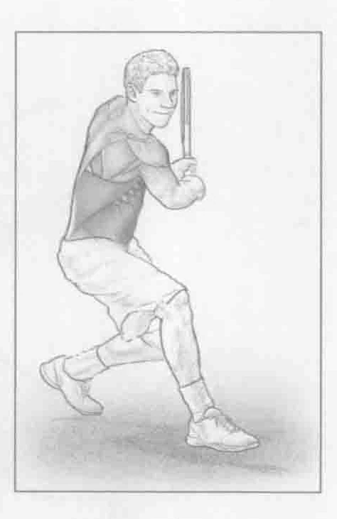

### 进行步骤

1. 在绳索拉力器上，将绳索高度设定至臀部位置。在右脚外侧，左手握住把手的同时，以运动姿势站在绳索拉力器旁边（以运动姿势站立时，体重均匀分布在双脚之间，膝盖微微弯曲，背部挺直，头抬起，眼睛目视前方）。当身体稍微前倾时，保持身体的平衡，模拟打球的预备姿势。

2. 在保持运动姿势的同时，拉绳子，通过上背部肌肉的收缩，将左肘抬至左肩的高度。控制绳子缓慢移动，注意要将肩胛骨挤压到一起。

3. 当左臂完成重复动作之后，换右臂做相同的动作。

### 参与的肌肉

主要肌群：大菱形肌、小菱形肌、腹内斜肌、腹外斜肌、竖脊肌和背阔肌

辅助肌群：后三角肌和斜方肌

### 网球训练要点

在所有网球击球的减速方面，上背部都起着至关重要的作用。在单平面动作和转体动作中，这些背部肌肉都需要训练。在现代网球比赛中，转体是极其重要的。正手和反手击球以及发球都需要身体大幅度地转动，以使击球变得更有力量。通过将这个训练纳入总体训练计划，上下背部肌肉组织都能得到改善。全面的训练计划应该不仅仅关注屈伸训练，还应该注重锻炼转体时的背部肌肉，这有助于增强保护肩膀所需的肌肉，并在接球后减缓球拍和上半身的运动速度。

### 变化动作

#### 传健身实心球

如果没有绳索拉力器，此训练还可以用一个健身实心球来代替。两名运动员背靠背站立，当他们转身时，将健身实心球传给对方，确保每个运动员在各个方向上旋转。
