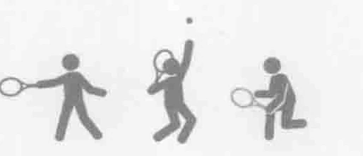
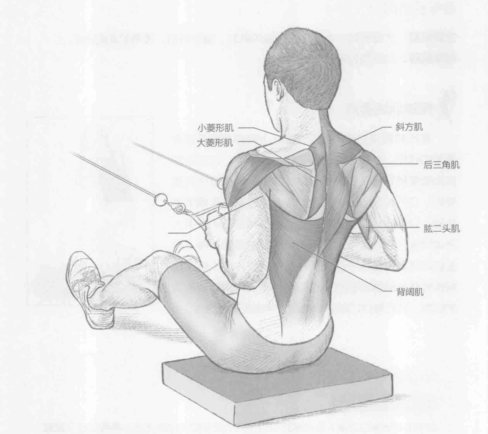
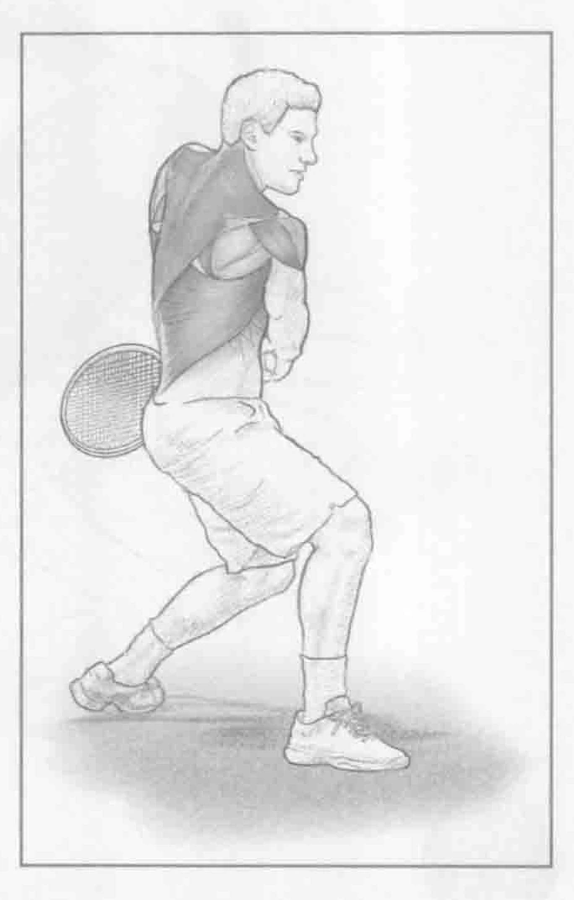

### 进行步骤

1. 面向一台靠近地板的绳索拉力器而坐，或者如果有的话，使用一台坐姿划船机。在胸部高度抓住把手。

2. 挤压肩胛骨（收缩），将把手拉向身体。保持重心稳定。

3. 慢慢地释放负重至起始位置，然后重复上述动作。

### 参与的肌肉

主要肌群：斜方肌、大菱形肌、小菱形肌、背阔肌和后三角肌

辅助肌群：肱二头肌

### 网球训练要点

对于网球运动员而言，这可能是最重要的上半身训练。此训练涉及的肌肉包括肩胛骨的稳定肌群，它们都需要加强，以帮助保护肩部和上背部。对于发球和正手的击球方式而言，此训练所锻炼的肌肉会产生离心力量，有助于保护肩部和上背部，尤其是在击球后的随球动作中起保护作用。此外，在反手击球中，这些肌肉也至关重要，因为它们提供向前挥拍的力量（通过向心收缩）。通过此训练，可以更好地控制菱形肌和肩胛的收缩，改善身体的姿势，减少斜方肌过度使用的可能性。过度使用斜方肌会导致颈部疼痛，增加受伤的可能性。

### 变化动作

#### 站式划船

此训练也可以用站立的姿势完成。此外，也可以用坐姿做这个训练，但随着负重被拉回，肘部应该保持与肩同高，这样才能重点锻炼后三角肌的力量。
