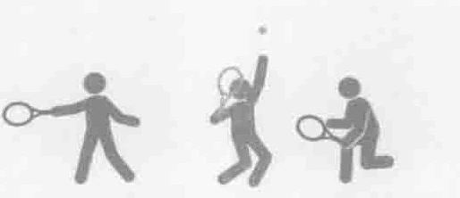
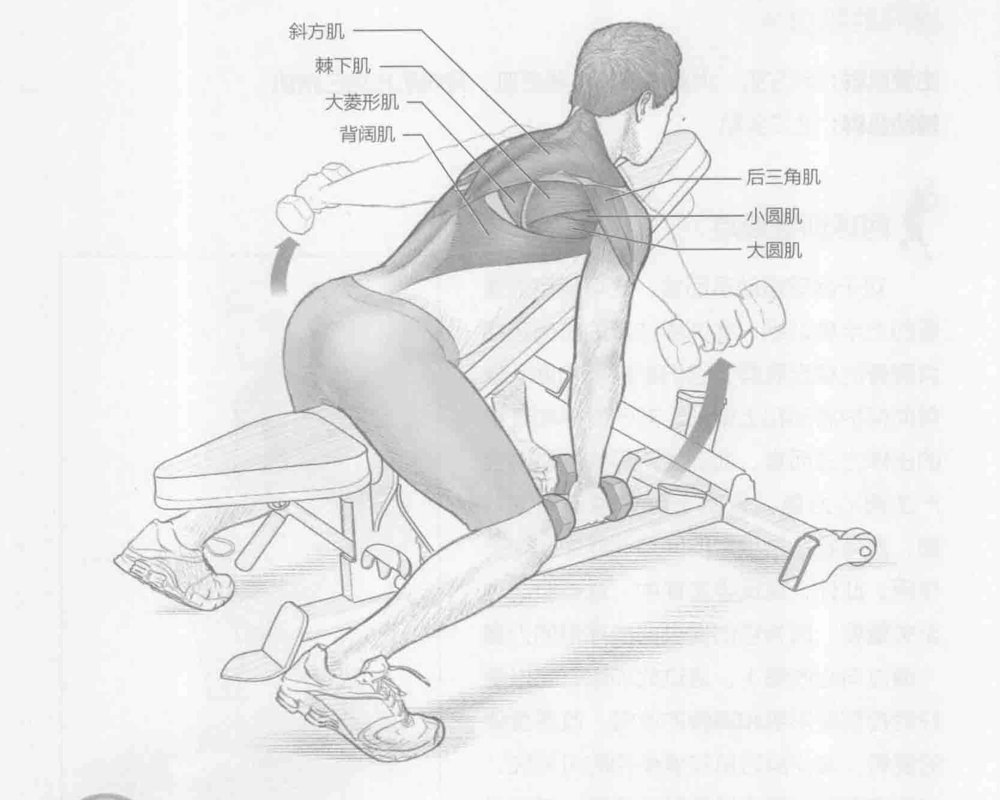
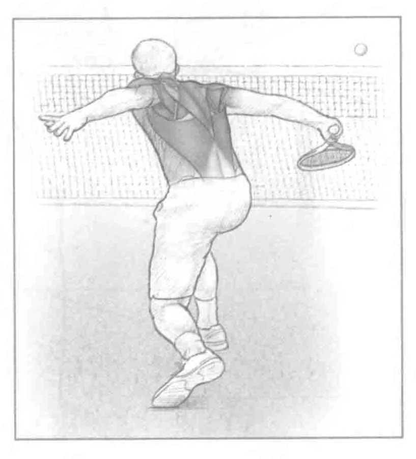

### 安全提示

做这个训练时，不要使用太重的物体。

### 进行步骤

1. 趴在一个向上倾斜且坡度为45至60度的重量训练椅上。双手各握一个哑铃。手臂应伸展，或肘部略微弯曲。掌心向内。

2. 抬高肘部至肩部水平，保持掌心向下。

3. 慢慢降低到起始位置。

### 参与的肌肉

主要肌群：后三角肌、大菱形肌、小菱形肌、斜方肌、背阔肌、大圆肌、小圆肌和棘下肌

辅助肌群：肱肌和肱二头肌

### 网球训练要点

此训练专注于锻炼那些帮助保护肩胛带的肌肉。在反手截击的接球和减速阶段，它们尤其活跃。此训练的目的是通过收缩肩胛周围的肌肉组织，以增强肩胛周围的稳定肌群。此训练应该使用较轻的物体，因为训练目标是锻炼肌肉耐力，同时掌握适当的技术。网球比赛中出现的大部分动作与此训练非常相似，在漫长的比赛中，运动员们必须完成许多次反手击球。反式蝶机展肩训练能提高运动员的肌肉耐力，保持体力以打完比赛。

