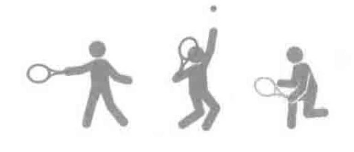
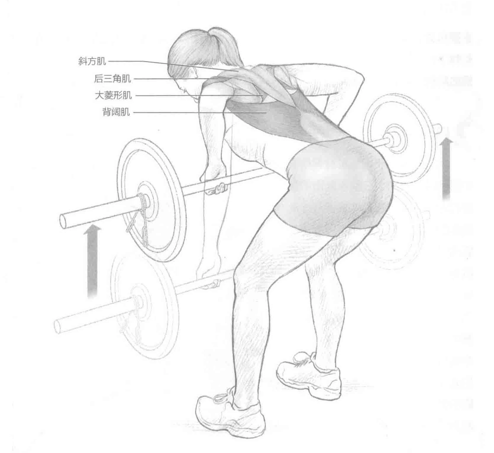
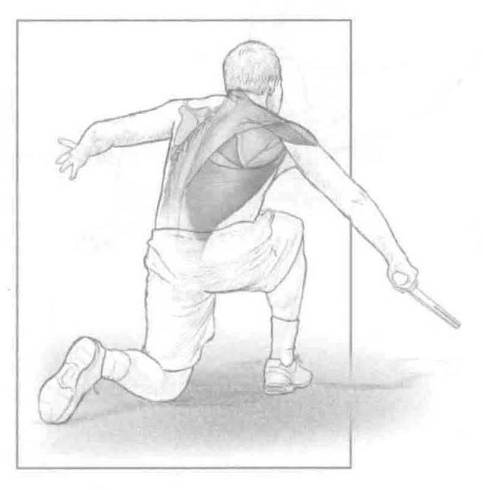
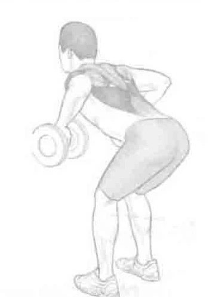

### 进行步骤

1. 双脚分开与肩同宽站立，膝盖微微弯曲（膝盖弯曲大约30度）。保持身体重心稳定，双手向下伸，距离略比肩宽，抓住杠铃。背部不要弯曲。提起杠铃至膝盖的高度。

2. 从这个位置开始，将肩胛骨挤到一起，收缩菱形肌和背阔肌，上提杠铃至胸前，同时保持身体重心和下半身稳定。

3. 慢慢回到起始位置，重复上述动作。

### 参与的肌肉

主要肌群：后三角肌、大菱形肌、小菱形肌和背阔肌

辅助肌群：斜方肌和竖脊肌

### 网球训练要点

### 俯身杠铃划船的目的是增强肩胛

的稳定肌群和背部肌肉的力量。此外，类似于颈前下拉训练，对于促进身体惯用侧和非惯用侧的肌肉平衡，也是一个极好的锻炼。在发球和正手击球的随球动作阶段，这些肌肉能产生离心力量，同时它们也参与反手击球的向心运动（向前挥拍）。俯身杠铃划船也有助于锻炼身体核心肌群的稳定性。

### 变化动作

#### 哑铃划船

此训练也可使用哑铃来代替杠铃。
