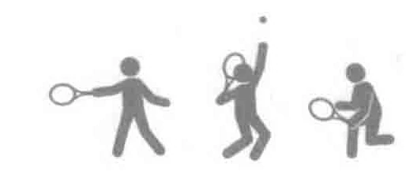
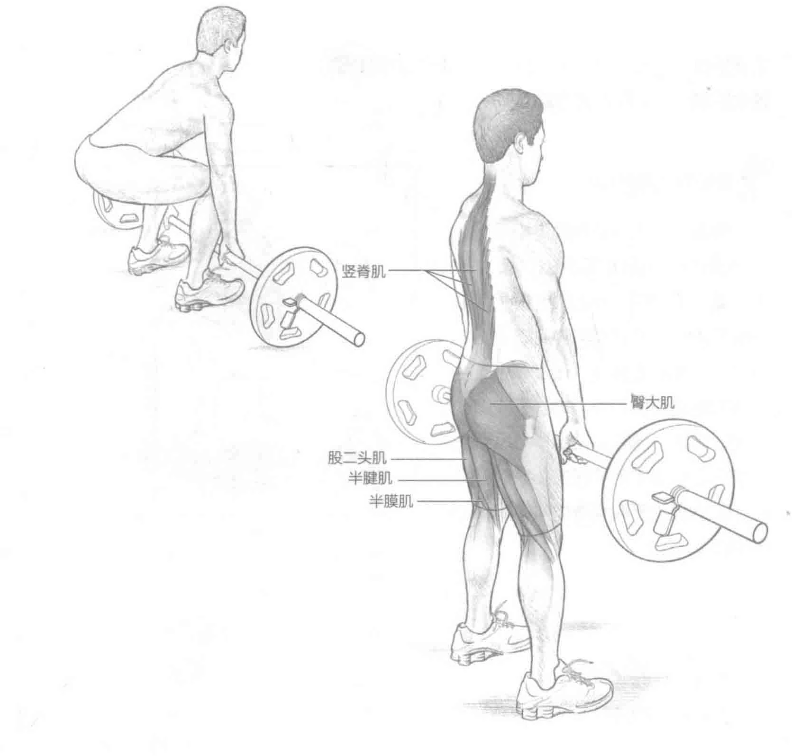
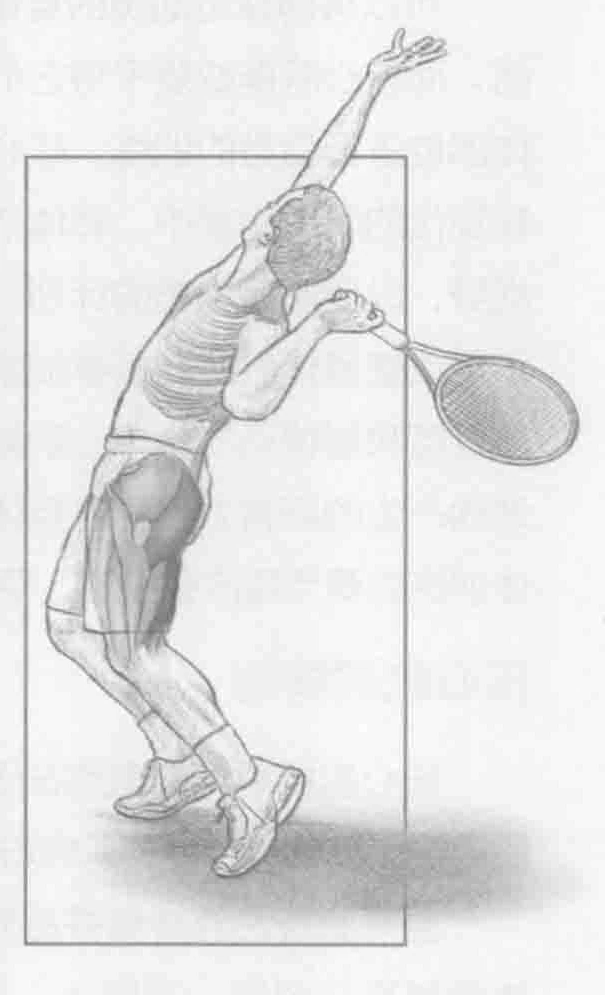

### 进行步骤

1. 把杠铃放在地上或举重台上。双脚分开与肩同宽站立。正手抓住杠铃，双手距离至少与肩同宽，深蹲，直到臀部几乎与膝盖平行。将肩胛骨挤到一起。

2. 收缩臀部伸肌并站直，将杠铃提起至臀部高度，同时保持两臂伸直。

3. 弯曲膝盖，控制好杠铃，缓慢放回到地板上，回到起始位置。

### 参与的肌肉

主要肌群：股大肌、股二头肌、半膜肌、半腱肌和竖脊肌

辅助肌群：腰大肌、多裂肌、腰方肌、背阔肌和斜方肌

### 网球训练要点

身体受伤最频繁的部位之一是下背部。此训练锻炼了身体的许多部位，包括斜方肌和臀部，但重点是下背部。强壮的下背部非常重要，因为它是连接上半身和下半身的纽带。强壮的背部可以让下半身产生的力量传输至躯干、手臂，最终到达球拍和球。在发球中，我们可以清楚地看到这种力量的转移。硬拉训练中的抬举（向上）阶段，与发球中通常由膝盖弯曲所带来的力量相似，都能够增强产生的力量。

### 变化动作

#### 正反抓握

为了增加训练重量，防止杠铃滑出手掌，我们可以使用正反抓握的方法。一只手掌心向内，另一只手掌心向外，抓住杠铃进行训练。
