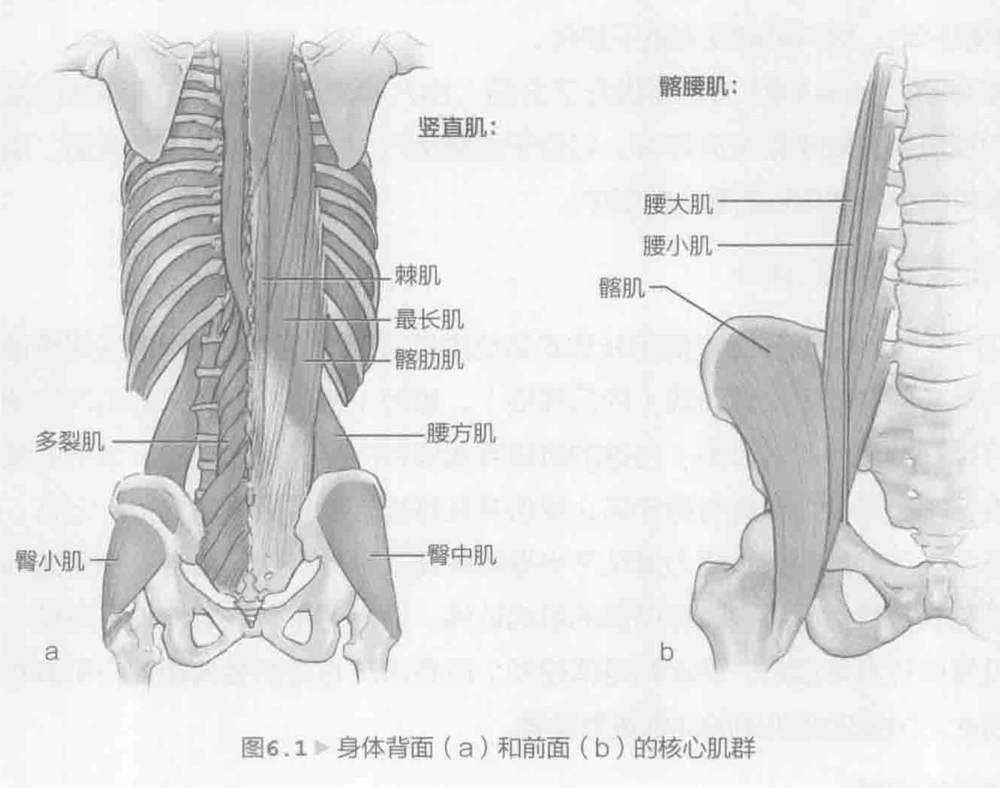
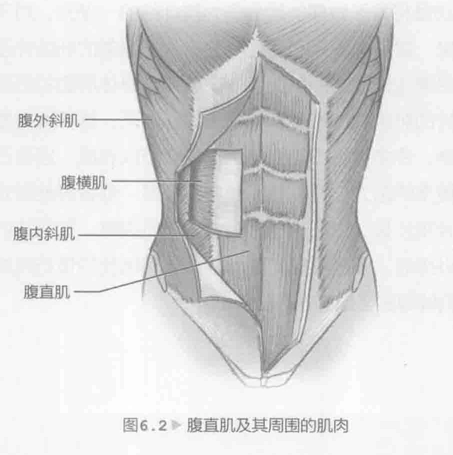

可以将网球运动员的身体分为上半身和下半身、左侧和右侧，以及正面和背面。而核心肌群或躯干将它们与身体的其他部位相连，因此必须对这些重要的身体部位进行恰当的训练。核心肌群包含在每个运动平面都参与运动的几大肌群。在现代的网球比赛中，转体动作已经变得很常见，因此网球运动员需要培养三维视野，以便制定均衡的计划。仅仅完成一些仰卧起坐和屈膝仰卧起等运动，当然不足以使身体做好准备参加娱乐或竞技比赛，因为这些比赛需要转体、侧方、伸展过度和屈伸运动。核心肌群作为力量总和的重要组成部分，将最初阶段身体从地面产生的所有力量通过身体的其他部位转移到球拍和球上。核心肌群的网球具体训练的要点是改善稳定、平衡、体态和球技，并预防损伤。

### 核心肌群解剖

核心肌群解剖的重点在于身体的中心。核心肌群由前面、后面和身体两侧的肌肉群以及包裹身体的肌肉群组成。

竖脊肌群沿着脊椎并控制身体向前弯曲（图6.1a，第103页）。它有助于身体保持直立姿势。实际上，竖脊肌群由若干个独立的肌群组成，并且延伸至腰椎、胸椎和颈椎。腰方肌和多裂肌两个都是深层肌群，有助于保持脊椎稳定和侧弯。

腰大肌有时被称为髂腰肌，严格地说，它由髂肌和腰大肌组合而成（图

6. 1b，103页）。腰大肌把腰椎连接到臀屈肌，而髂肌对大腿向前弯曲非常重要。但是，髂肌和腰大肌都使躯干向前弯曲，并能使躯干从卧位提起（比如仰卧起坐），这是因为腰大肌跨域了多个椎关节和骶髂关节。腹直肌由两块垂直运动的条状肌肉组成（图6.2，第103页）。腹直肌沿着腹部的前面延伸。在训练有素的运动员身上腹直肌通常是六块腹肌。腹直肌位于胸腔前面，并插入骨盆中。腹横肌位于腹直肌下方更深的部位。腹横肌包裹着身体，就像自然的带子一样，其肌肉纤维横向运动。核心肌群在稳定骨盆和支持身体躯干方面至关重要。腹横肌和腹内斜肌都在腹外斜肌的下面。腹内斜肌就像一块宽广的薄板，它的肌肉纤维沿大约90度角向腹外斜肌移动。腹斜肌能促进躯干旋转。前锯肌（在第4章和第5章进行了介绍）由八块肌肉构成，使肩胛骨向前伸展。前锯肌也有助于稳定肩胛骨。它位于胸侧第八块或第九块肋骨的表面，沿着肩胛骨内侧边界插在它的整个前部中。

### 击球和核心肌群运动

如今的网球运动员经常使用开放式站位击打落地球。这种击球方法需要使身体横向旋转。在准备击球阶段（向后挥拍），腹部（或核心肌群）的肌肉拉伸，以便可以在加速（向前挥拍）击球的阶段释放储存的潜在弹性能量。适当的核心肌群准备不可或缺，这将有助于防止受伤并在球场上发挥更好的水平。记住，在动力链中，这些肌肉大多将力量从下半身转移至上半身。换句话说，平衡的训练计划应包含身体背面、前面和两侧的肌肉训练。适当的平衡训练计划将有助于在极限位置保持身体姿态、稳定和身体控制。所有击球方法都会调用核心肌群和躯干。因此，加强这些肌肉的训练更为重要。

### 核心肌群训练

许多网球运动员将每天做仰卧起坐作为其训练的一部分。对于网球运动员而言，完成仰卧起坐、屈膝仰卧起和任何其他有利于腹部的训练并没有任何问题。但是，更重要的是要保持适当的平衡。一定要包含身体前面和后面肌肉的训练，以及促进身体旋转的肌肉的训练。训练一天休息一天，这样做对提升球技和防止受伤有很大的帮助。许多训练不需要使用器械就可以完成，因自己的体重可充当阻力。如果需要更多的阻力，可以使用健身实心球，或者其他形式的重量阻力，比如哑铃、杠铃片和沙袋。由于这些是身体的大肌肉群，因此它们提供平衡和稳定性。进行这些训练时，速度不是问题。而应该用适当的技巧完成这些训练，并确保身体的核心肌群得到全面的锻炼。
