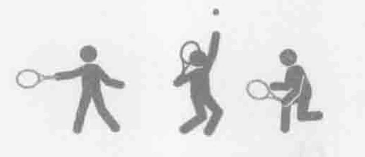
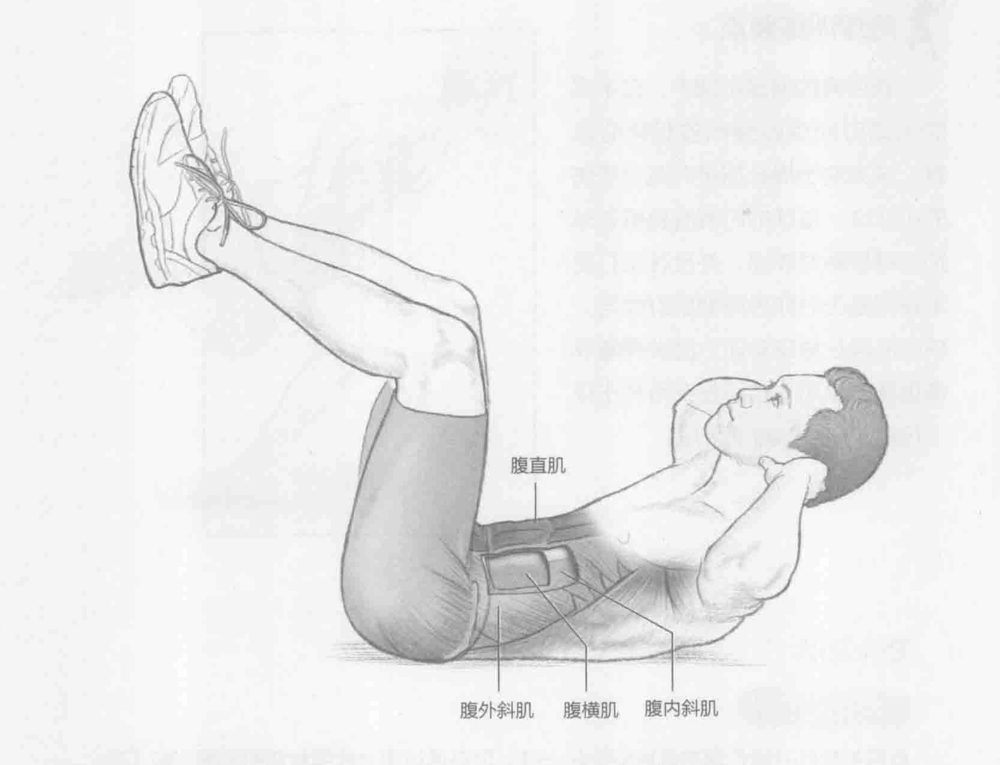
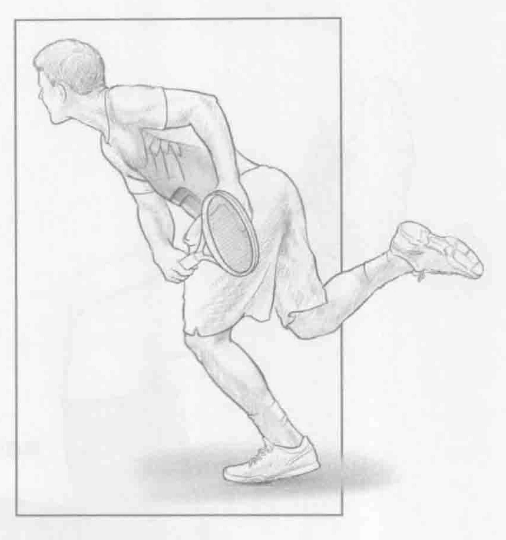

### 进行步骤

1. 平躺在地板上，臀部和膝盖弯曲呈90度，双脚离地，双手置于耳朵旁。

2. 肩膀抬起，上背部离开地面，用力收缩腹部，使胸部向前，同时要保持下背部接触地面。重点是收缩核心肌群以带动身体运动。不要用手拉脖子来带动运动。

3. 慢慢降低上背部和肩膀到起始位置，重复上述动作。

### 参与的肌肉

主要肌群：腹直肌

辅助肌群：腹横肌、腹内斜肌和腹外斜肌

### 网球训练要点

在所有的网球击球中，在不同的运动时间点收缩和放松核心肌群，这有助于提升球技并减少受伤的可能性。发球的时候腹直肌在球拍与球接触时收缩，并且在击打落地球和截击时作为辅助肌群参与。核心肌群在稳定身体方面发挥着非常重要的作用，特别是在所有击球（包括发球）的减速阶段。

### 变化动作

#### 反向卷腹

反向卷腹的开始位置与屈膝仰卧起一样。但是通过用力收缩腹直肌和臀屈肌（髂腰肌和股直肌）和腹斜肌，使骨盆抬离地面，而不是使肩膀和上背部离开地面。反向卷腹有助于核心肌群和臀屈肌下部的锻炼。网球运动员在击打落地球和截击时，依靠这些肌群让身体处于低重心状态。网球运动员的此部位经常受伤，而增加反向卷腹训练将有助于强化身体下部的核心肌群。
