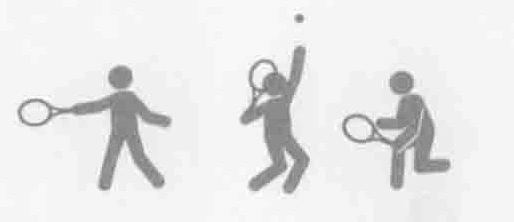
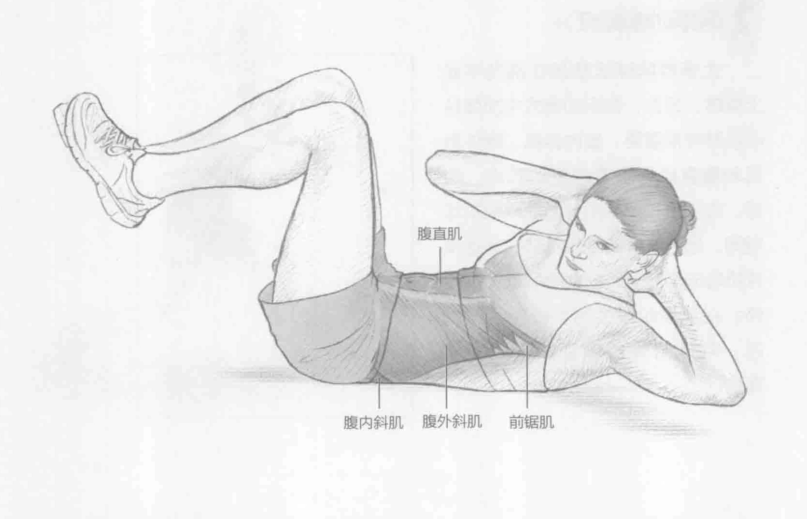
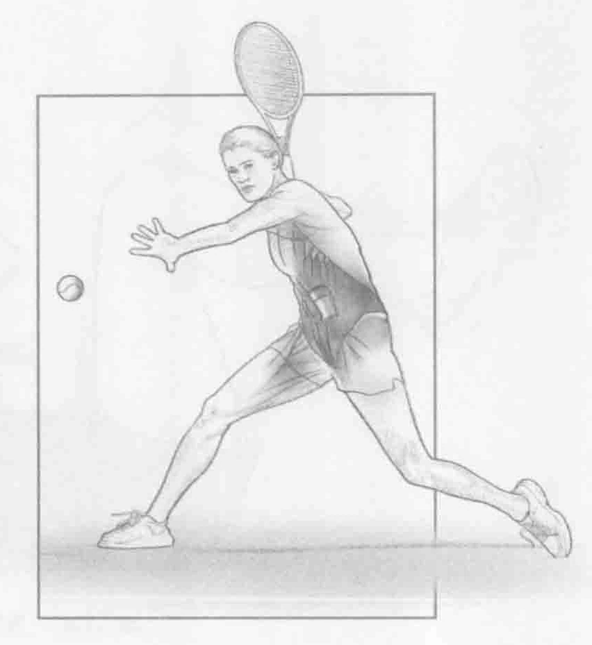
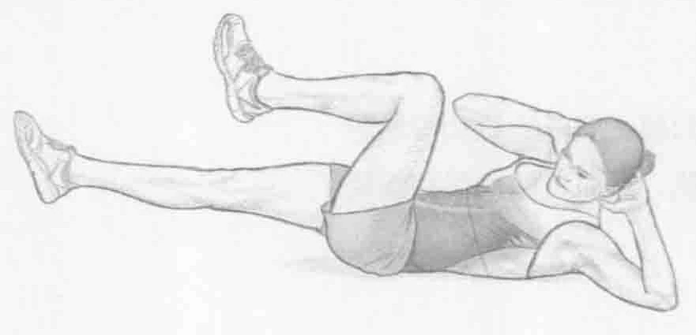

### 进行步骤

1. 平躺在地板上，臀部和膝盖弯曲呈90度，双脚离地，双手置于耳朵旁。

2. 开始做仰卧起坐和卷腹运动时，转动躯干，右肘移向左膝，努力与左膝接触。

3. 慢慢地使身体回到开始的位置。接下来重复上述动作，左肘移向右膝。

### 参与的肌肉

主要肌群：腹内斜肌、腹外斜肌和腹直肌

辅助肌群：前锯肌、髂肌、腰大肌和腹横肌

### 网球训练要点

大多数网球运动都在横向平面上旋转。因此，在运动模式中加强核心肌群非常重要。腹内斜肌、腹外斜肌和腹直肌是主要的驱动肌肉。但是，在正手和反手击打落地球和发球期间，核心肌群的旋转肌群在准备发球阶段非常活跃，在此阶段进行预拉伸；在加速阶段会再次拉伸这些肌肉，释放身体的储存能量以加速挥拍。

### 变化动作

#### 空中蹬车

空中蹬车与侧式卷腹的开始位置相同。当右肘移向左膝时，通过核心肌群的收缩和髋关节伸展来伸展右腿。然后在另一侧重复同样的动作。此训练可以慢速、中速或快速的方式完成。

