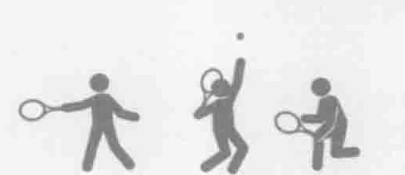
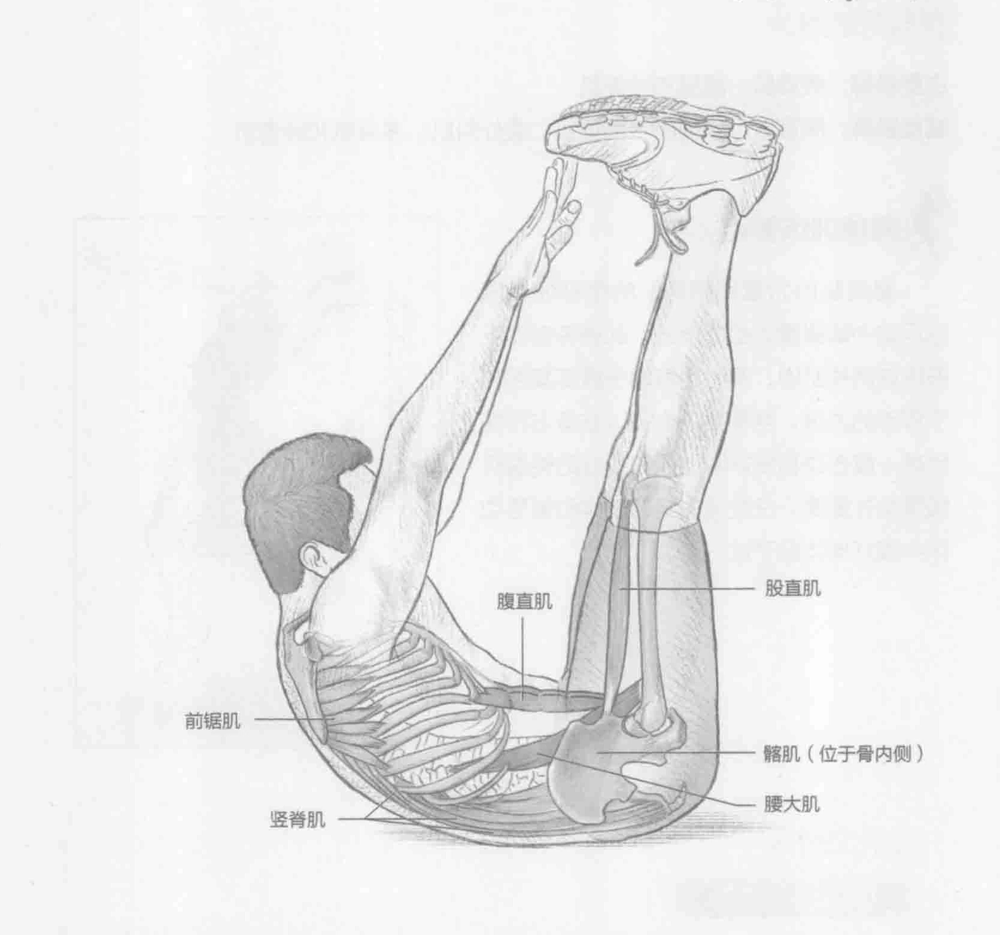
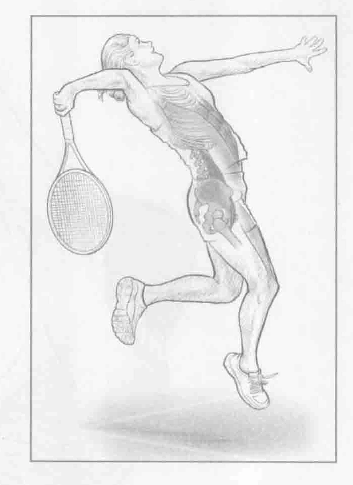

### 进行步骤

1. 平躺在地板上，臀部弯曲呈90度，双脚伸直，同时脚跟指向天花板。手臂伸直，放在眼前。

2. 利用核心肌群收缩带动运动，举起手触碰脚趾头。在此过程中，要保持双脚与腿垂直，同时放松颈部。

3. 当继续收缩腹部时，慢慢降低到开始位置，然后重复上述动作。

### 参与的肌肉

主要肌群：腹直肌、髂肌和腰大肌

辅助肌群：股直肌、腹横肌、前锯肌、腹外斜肌、多裂肌和竖脊肌

### 网球训练要点

臀屈肌的力量和腘绳肌的柔韧性是网球运动中最重要的组成部分。此训练有助于锻炼这两种肌肉，同时也有助于锻炼腹部和下背部的力量。当蓄势下半身以准备击打落地球、截击球和发球时，拥有良好的臀屈肌强度至关重要。在发球的随球动作和蓄势动作中很好地体现了这一点。

### 变化动作

#### 转体触足卷腹

完成相同的动作，但是当举起手碰触脚趾时，用左手触碰右脚外侧。重新回到开始位置，然后用右手触碰左脚。此训练能够更大程度地调用腹斜肌和前锯肌。
