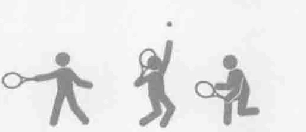
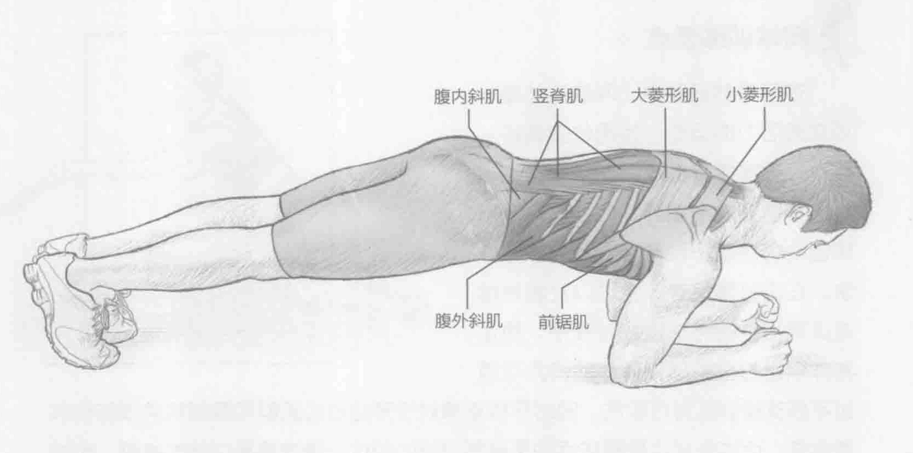
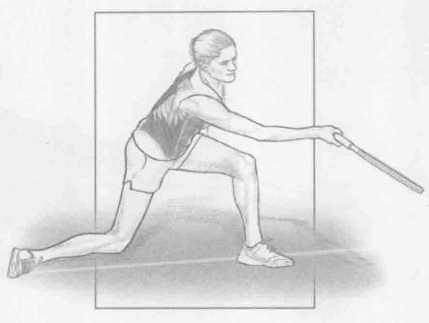
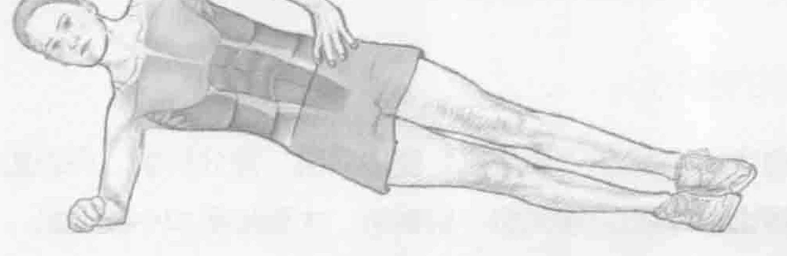

### 进行步骤

1. 面朝下躺下，用手肘和前臂支撑身体，与肩膀成一条直线。腿伸直，贴住地面，脚、膝盖和股四头肌接触地面，双脚分开大约与肩同宽。

2. 通收缩核心肌群和臀部肌群，抬起身体以形成拱形，前臂和脚趾下推。将身体抬离地面，直到只有前臂和脚趾接触地面。

3. 保持这个姿势，同时保持脊柱中立（背部平直）。初学者保持这个姿势10到30秒，优秀运动员保持此姿势1到3分钟。

### 安全提示

不要让臀部和背部下垂。此训练只有在保持肩膀和脚成一条直线时才有效。

### 参与的肌肉

主要肌群：腹横肌、腹直肌、腹内斜肌、腹外斜肌、多裂肌和竖脊肌

辅助肌群：髂肌、腰大肌、前锯肌、大菱形肌和小菱形肌

### 网球训练要点

在所有的运动中，网球运动是一项充满活力的运动，使用收缩循环。尽管平板支撑是一项提高肌张力的训练，不需要收缩循环，但是这对于网球运动仍然是一种非常重要的训练方法。在击打落地球、发球以及截击球或过顶扣球的与球接触过程中，稳定身体以击打离身球和转体的能力可通过平板支撑训练进行改进。同时平板支撑对于预防核心肌群和臀部肌肉损伤也非常重要，而这些部位是网球运动员容易损伤的部位。通过提高训练的难度，比如在适当时保持长时间不动或者增加训练的阻力，达到持续进行此训练的目标。

### 变化动作

#### 侧身平板支撑

侧身平板支撑在许多平板支撑的一种变化动作。对于侧身平板支撑训练，依靠右肘保持侧躺，同时肩膀和臀部与地板平行。把左手放在臀部。这种侧躺的状态大大地增强了腹斜肌的肌肉刺激，这对提高转体时身体的稳定性至关重要。其他变化动作包括负重平板支撑和不均衡平板支撑。只有在需要更多阻力来继续锻炼时，才应该进行负重平板支撑。不均衡平板支撑是在一个不稳定的平面进行的，比如在健身实心球或者博苏球上，这就需要更高的稳定性和更多的核心肌群收缩来保持良好的姿势。

### 编者校对注

> 原书第111页：“通收缩核心肌群和臀部肌群”。原扫描第二步确实写作“通收缩”，缺少“过”字；此处保留原书缺字，不补入推测文字。
