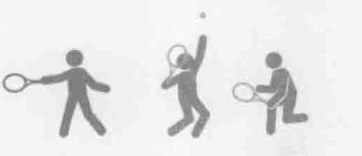
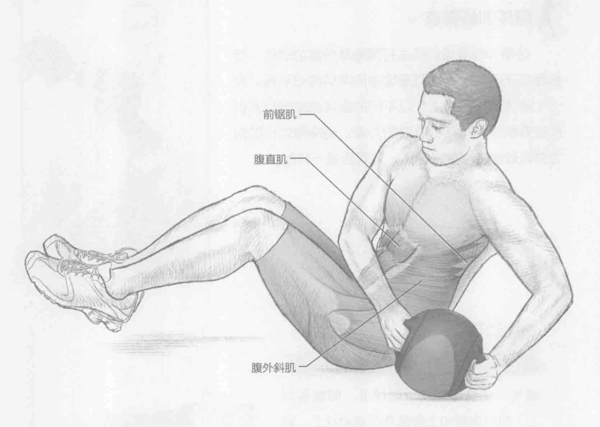
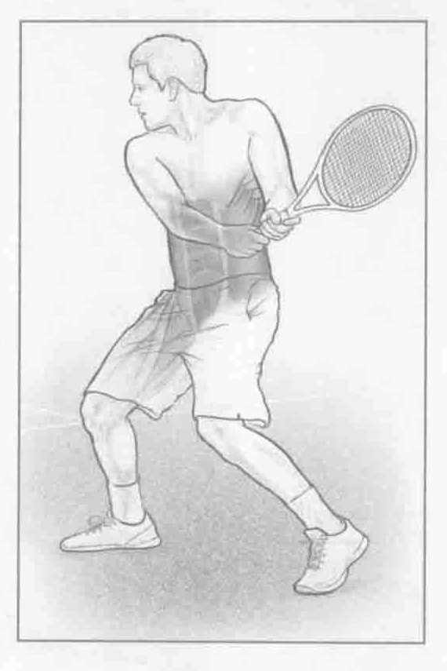
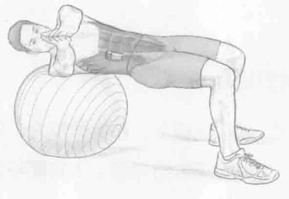

### 进行步骤

1. 坐在地板上，在身体前方，用双手握住一个健身实心球，臀部和膝盖靠近肩膀弯曲约45度。上背部与地板保持45度角，并与大腿形成90度角。双脚离地。

2. 身体躯干向左侧旋转，以便健身实心球和左臀接触地板。

3. 旋转身体躯干回到右侧，以便健身实心球和右臀接触地板。

### 参与的肌肉

主要肌群：腹直肌、腹内斜肌和腹外斜肌

辅助肌群：前锯肌、髂肌、腰大肌、腹横肌和多裂肌

### 网球训练要点

这项训练着重训练击打落地球所需的动作，特别是在正手和反手击打落地球的向后挥拍阶段。在一个转体动作路线上，以不同的旋转速度进行此训练还有助于锻炼核心肌群的力量。当使用较小的阻力并以较快的速度击球时，效果也是一样的。

### 变化动作

#### 在运动球上进行俄罗斯式扭转

首先，使身体躺在运动球上，脚放在地上，同时肩膀和上背部靠在运动球上。躯干向右侧旋转，感觉到右侧腹斜肌收缩。左侧重复同样的动作。由于此训练不是很稳定，因此它需要调动更多的辅助肌群来保持身体平衡。

