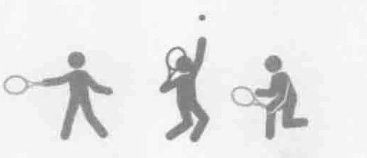
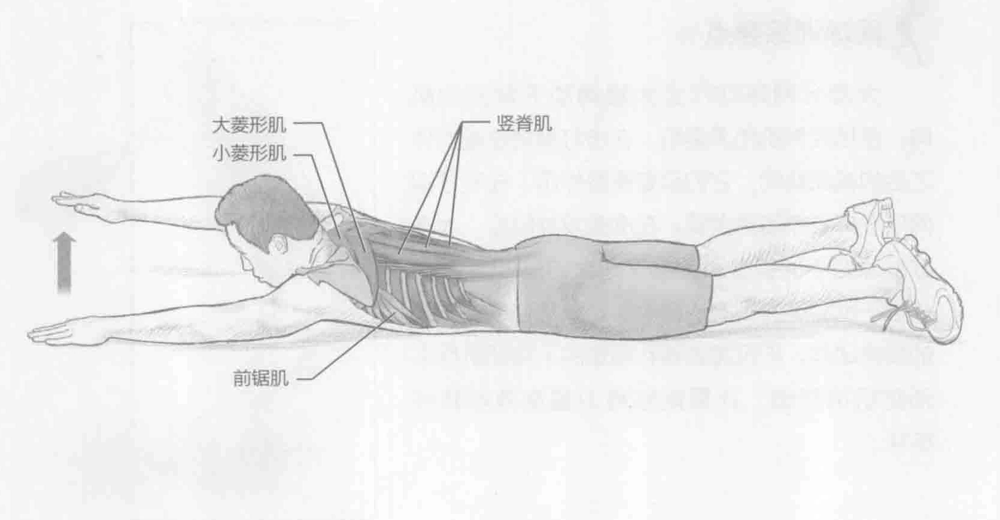
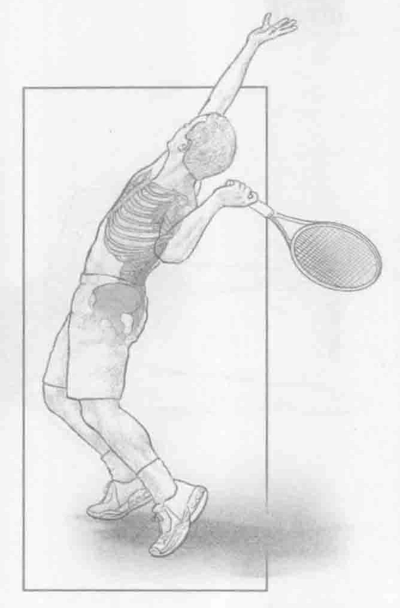

### 进行步骤

1. 面朝下躺在地板上，手臂伸展到头部前面。

2. 双脚接触地板，通过收缩整个背部和肩膀的肌肉，举起和放下左臂。

3. 更换手臂，举起和放下右臂。

4. 训练时，交替手臂，按以上的步骤重复这项运动。

### 参与的肌肉

主要肌群：竖脊肌、多裂肌、大菱形肌和小菱形肌

辅助肌群：背阔肌和前锯肌

### 网球训练要点

大部分网球动作会大量调动下背部的肌肉，包括竖脊肌和多裂肌。在击打落地球或发球之后的减速期间，它们起着重要作用。在发球期间所发挥的作用更重要。在准备发球阶段，大多数发球好手的肩膀和臀部之间大约呈20度。身体躯干也会纵向倾斜（侧弯）。要想完成此有效的发球动作，不仅需要强壮稳定的下背部肌群来预防肌肉损伤，还要能够将力量高效地转移给球。

### 变化动作

#### 转体游泳

此动作与游泳训练采用相同的动作，但不是在一个平面上举起和放下手臂，而是在举起手臂时轻微旋转躯干和上背部。这需要更多的肌肉运动，比如背阔肌、腹斜肌和前锯肌。
