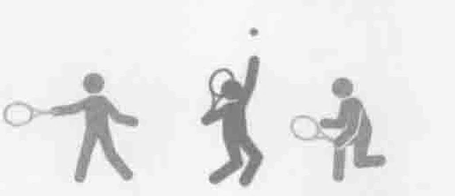
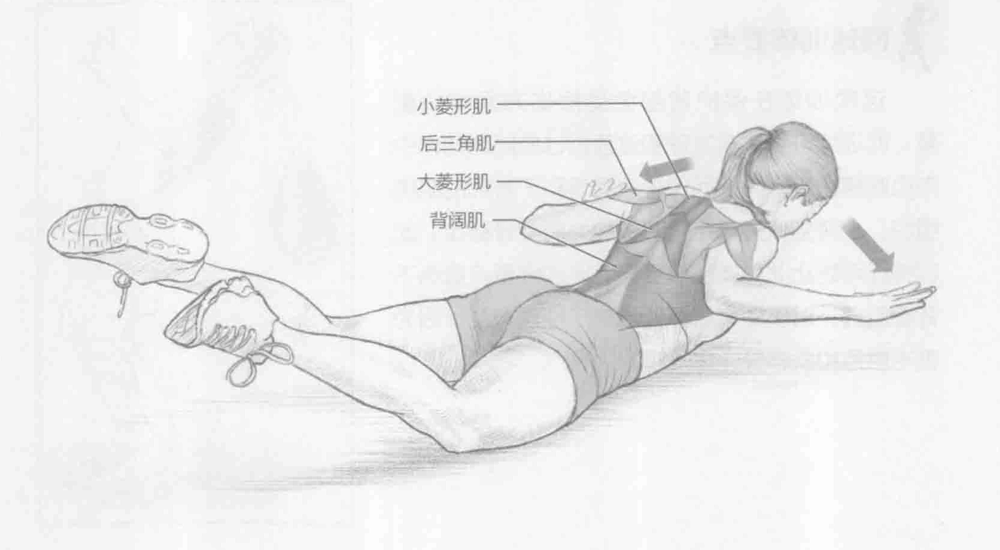
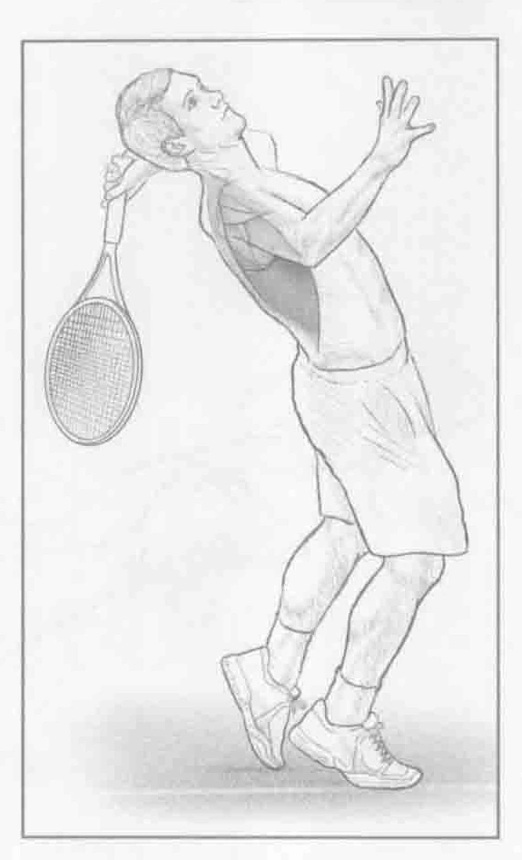

### 进行步骤

1. 面朝下躺在地板上，用手触摸头部，同时手肘弯曲约45度。伸展大腿，双脚离地。

2. 通过挤压肩胛骨，将手肘移向臀部。同时保持手肘弯曲45度。抬起上背部，保持双脚离地。

3. 回到开始位置，重复上述动作。

### 参与的肌肉

主要肌群：竖脊肌、多裂肌、大菱形肌、小菱形肌和背阔肌

辅助肌群：后三角肌

### 网球训练要点

这项训练在保护背部免受损伤方面特别重要。此训练可强化在发球和过顶扣球的随球动作中向心收缩的肌肉，从而保护肩胛骨和下背部的肌肉组织。上背部保持稳定有时被称为肩胛骨稳定。此训练还可防止此身体部位受伤。此训练重点锻炼下背部肌肉，对于提高肩胛骨的稳定性也有益，因为菱形肌是和肩胛骨连在一起的。

