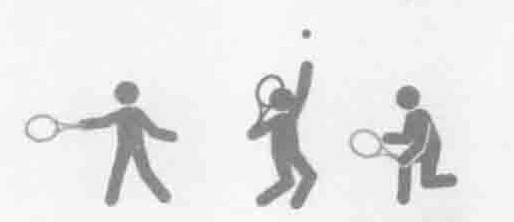
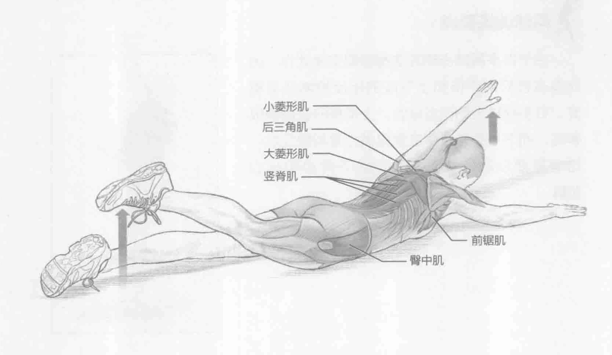
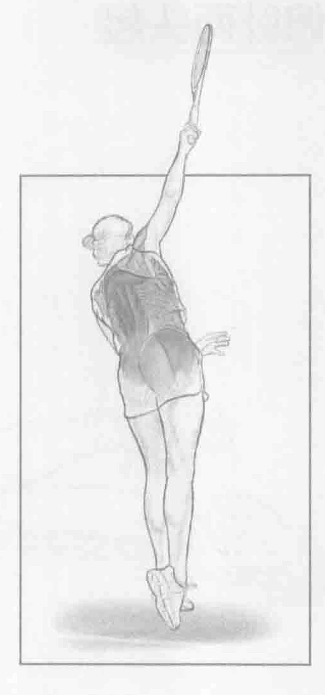
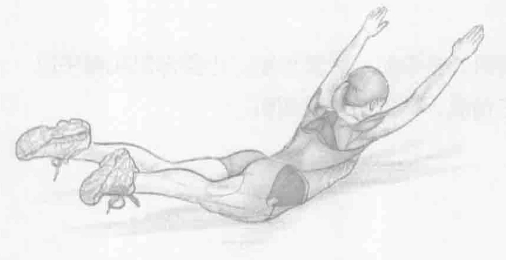

### 进行步骤

1. 面朝下躺在地板上，双臂伸直，放在头前。保持大腿伸直，双脚放在地板上。

2. 将左臂抬离地面，同时将右腿抬离地面。收缩上背部和下背部的肌肉。控制身体运动，重点在于收缩背部肌肉。

3. 回到开始位置，改用右臂和左腿，重复上述动作。

### 参与的肌肉

主要肌群：竖脊肌、多裂肌、大菱形肌、小菱形肌和臀中肌

辅助肌群：后三角肌、前锯肌和背阔肌

### 网球训练要点

由于许多网球击球方法都需要交叉动作，因此具有良好的平衡和上下肢的相反控制非常重要。右手网球运动员发球时，上半身的右侧积极参与，而下半身的左侧主要提供力量和稳定性。这就需要以功能交叉方式训练下背部和核心肌群。

### 变化动作

#### 超人飞

超人飞采用类似的姿势，但要同时抬起大腿和手臂。这会使得训练更加困难，因为必须很好地控制背部和腹部肌群。一个比较容易的办法是超人跪，四肢着地。当抬起左臂和右腿时，右臂和左腿着地来保持身体平衡。此训练锻炼相同的肌肉，但调动的下背部肌肉较少，主要调动腹横肌和臀部稳定肌。

