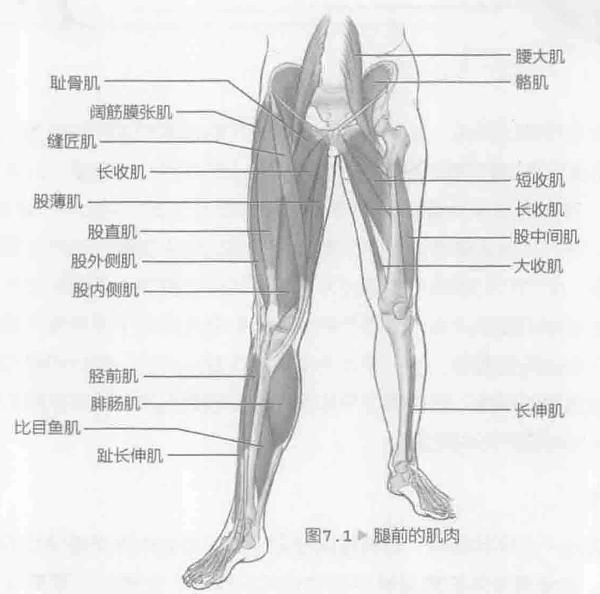
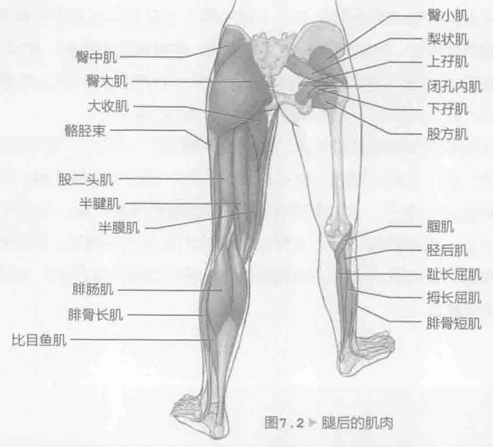
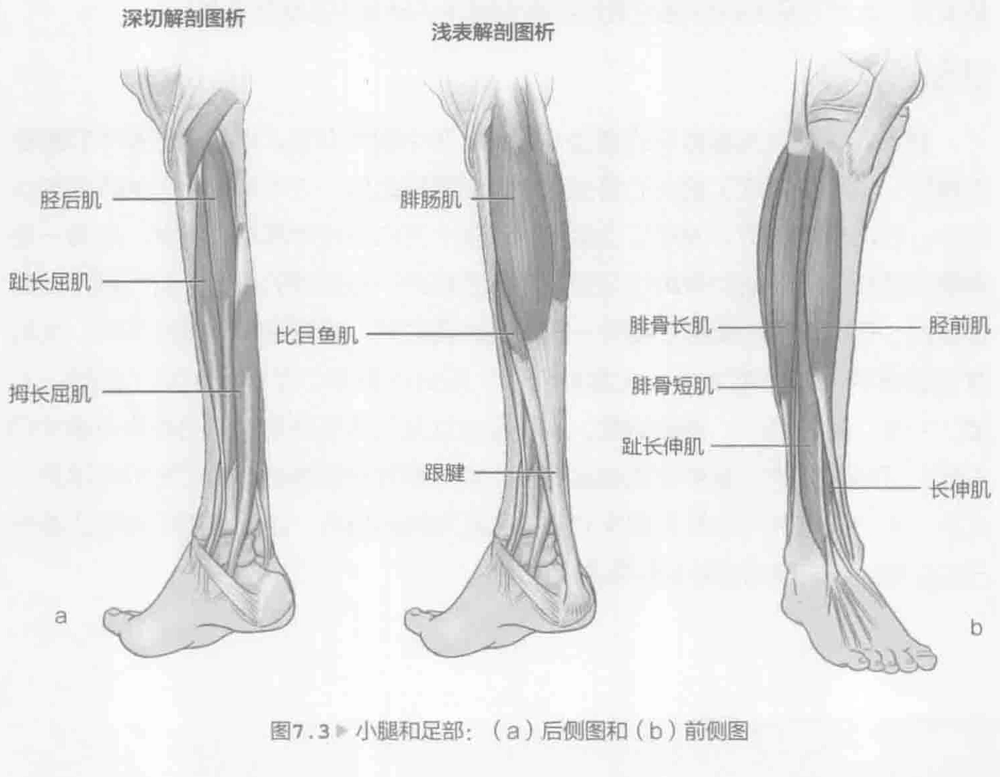

网球教练经常这样说，如果接不到球，再好的击球方法也没有用。适当的步法技巧（请参见第9章了解详细信息）对于球场上的成功十分重要。此外，对于带动动力链，并将力量从地面转移到身体的其他部位而言，强壮有力的腿部是关键，因为它可以从地面获得适宜的力量。为了在比赛中获胜，肌肉力量和肌肉耐力都很重要，因为它们能够产生爆发力，维持运动员打完一场漫长的比赛。强壮有力且状态良好的腿部还有一个额外的好处，那就是有助于保持身体的平衡。当球员未处于合适的位置时，这一点尤为重要。改变方向时，强壮的腿部还能帮助运动员克服身体的惯性，这种情况平均每局发生四到五次。状态良好的腿部也会影响每次网球击球的完成质量。

### 腿部解剖

盆骨形成一个环状结构，将脊椎连接至下肢。身体中许多最强壮的肌肉都与盆骨相连，这使得身体的重量被平稳地转移到腿部。大腿的主要骨头是大腿股骨，它将髋关节连接至膝关节。小腿的两个主要骨头是胫骨和腓骨，它们将膝关节连接到踝关节。膝关节是一个屈戌关节，能够弯曲和伸展，类似于肘关节。

股四头肌是大腿前面主要的肌肉组织，负责扩展小腿，由股直肌、股外侧肌、股内侧肌以及股中间肌构成（图7.1，第122页）。

大臀肌的肌肉包括臀大肌、臀中肌和臀小肌（图7.2，第122页）。臀大肌主要负责扩展（伸直）腿部，而步行或跑步时，臀中肌和臀小肌一起，共同维持非承重腿的骨盆水平。大腿后部的腿后肌群能使膝盖弯曲，这些肌肉包括股二头肌、半膜肌和半腱肌。其他主要的大腿肌肉还包括股薄肌，它有助于屈腿、内侧旋转臀部以及并拢大腿；还有缝匠肌，它是一块较长的肌肉，有助于弯曲大腿，以及伸展膝盖。

小腿由三个肌肉群构成。在小腿的后侧（图7.3a），腓肠肌和比目鱼肌构成了小腿肌肉，它们负责脚的跖屈，这是跑步时获得良好的推力所必需的。小腿前部的肌肉（图7.3b）包括胫前肌、趾长伸肌以及长伸肌。这些肌肉都是脚部的背屈肌肉。这意味着当这些肌肉收缩时，会将脚趾向胫骨抬起。小腿的外侧肌肉在腓骨的一侧，腓骨是两个小腿骨头中较小的那一个，包括腓骨长肌、腓骨短肌。他们的主要目的是阻止反向运动（脚底向内）。换句话说，他们帮助支撑脚踝，预防最常见的脚踝扭伤。此外，他们还有助于脚的跖屈和向外翻转（脚底向外）。另一个肌肉是腘肌（参见图7.2，第122页），对于网球运动员而言，它至关重要。腘肌通过略微旋转，打开膝关节，使伸直的腿变弯曲。它是小腿肌肉中藏得较深的一个，位于膝盖的后面。跑步、停止运动以及改变方向时，所有这些肌肉都起着非常重要的作用。

### 击球和腿部运动

为了打好网球，腿部必须提供一个强大的、稳定的基础支撑。击打溶地球和截击都是从一个小碎步开始，在此期间，腿部肌肉吸收降落在地上的冲击力，通常紧随其后的是一个极具爆发力的运动，面向一个或另一个方向。当球员为了接远球而跑得太偏时，他必须快速地返回到球场中心。如果他的腿部训练有素，而且非常强壮，就可以一次又一次地迅速回到赛场中心，而且没有疲劳的感觉。显然，腿部的爆发力用处很大，但是为了能够完成这些动作，肌肉耐力也是极其重要的。

球员经常为了接低球而反复弯腰，这时腿部起着重要作用。低截击就是一个很好的例证，它经常出现在双打比赛中，而这种击球姿势需要强大的腿部力量。

发球是唯一一个从静态开始的击球。通过强有力的弯曲和伸展，腿部产生一个纵向推力。在单打比赛中，需要经常重复这个动作，因为球员每隔一场比赛就要发球。本章介绍的训练通过锻炼腿部为网球运动提供基础性力量。

### 腿部训练

跳箱和深蹲跳都是很好的增强式训练，重点锻炼力量，但是它们都是较高级的练习。只有当建立了恰当的腿部肌肉力量基础之后，才可以把它们加入训练计划中。在比赛过程中，网球运动需要面向各个方向不停地奔跑。因此，在做一些需要在坚硬表面着陆的弹跳练习时，应该要格外小心超额的压力。进行腿部训练项目时，每次训练之间至少要有一整天的恢复时间。根据各种因素的不同，比如身体健康状况和力量水平、比赛的日程、所处的赛季以及训练目标（例如，力量、力度、耐力等），训练组数、重复次数以及训练所使用的阻力也会有很大的不同。了解网球的力量和体能训练专家，能够帮您找到最适合自己的训练项目。此外，他还能够评价您每次训练的姿势和所使用的技巧。由于腿部肌肉在比赛中已经非常活跃，因此它特别容易训练过度。
