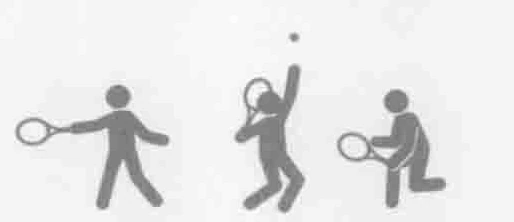
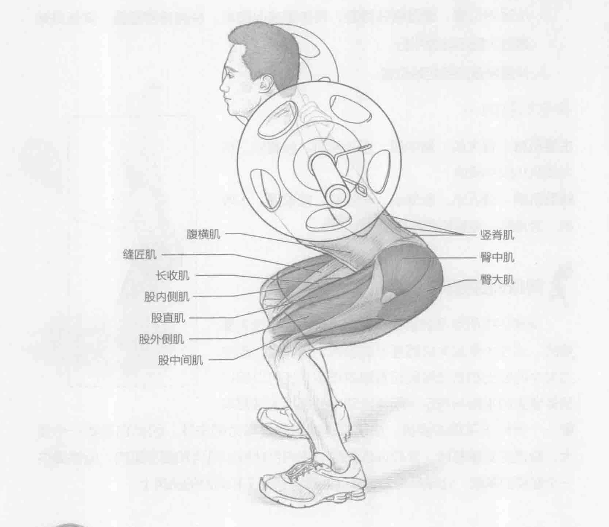
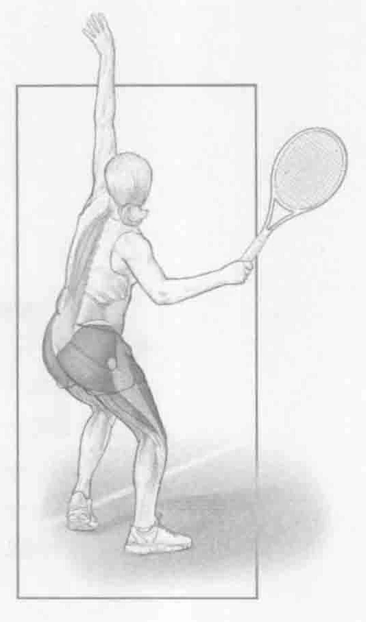
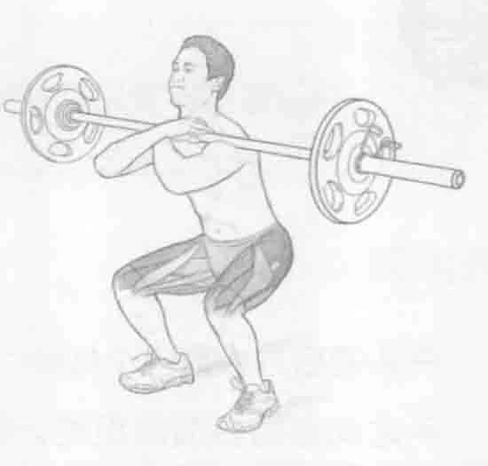

### 安全提示

确保膝盖不要发软打颤，蹲下时膝盖和脚的第二趾头对齐。

### 进行步骤

1. 在头的后方放置一个杠铃，担在肩部，斜方肌的上面。双手握住杠铃，双手之间保持合适的距离。将肩胛骨挤到一起。保持双脚分开大约与肩同宽，脚尖向前或略分开。

2. 从起始位置，慢慢弯曲膝盖，将体重推向脚跟。保持背部挺直。降低身体直到大腿与地面平行。

3. 伸展膝盖回到起始位置。

### 参与的肌肉

主要肌群：臀大肌、臀中肌、股外侧肌、股直肌、股内侧肌和股中间肌

辅助肌群：缝匠肌、股薄肌、长收肌、短收肌、大收肌、竖脊肌、多裂肌和腹横肌

### 网球训练要点

深蹲训练所涉及的肌肉在每次击球中都是至关重要的。这些大多是大块而强壮的肌肉，在奔跑、改变方向中的推出和着陆阶段起着积极作用，还可以保持预备姿势的平衡与稳定。网球运动中的每次击球都需要一个类似于深蹲的姿势。由于发球通常是最有力的击球，因此它需要一个强大、稳定的支撑基础。深蹲训练锻炼的肌肉包括臀部肌肉和腿部肌肉，能够提供一个坚实的基础，让球员将力量从地面转移到躯干和肩部的肌肉上。

### 变化动作

#### 颈前深蹲

颈前深蹲由常规的深蹲训练演变而来。在颈前深蹲中，杠铃放置在前三角肌上，双手交叉，手掌从杠铃杆上方穿过。颈前深蹲主要集中锻炼股四头肌。关键是要保持背部挺直，以帮助保持平衡。通常情况下，颈前深蹲使用较轻重量的杠铃。

