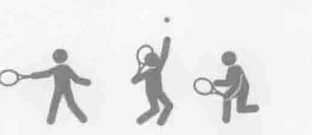
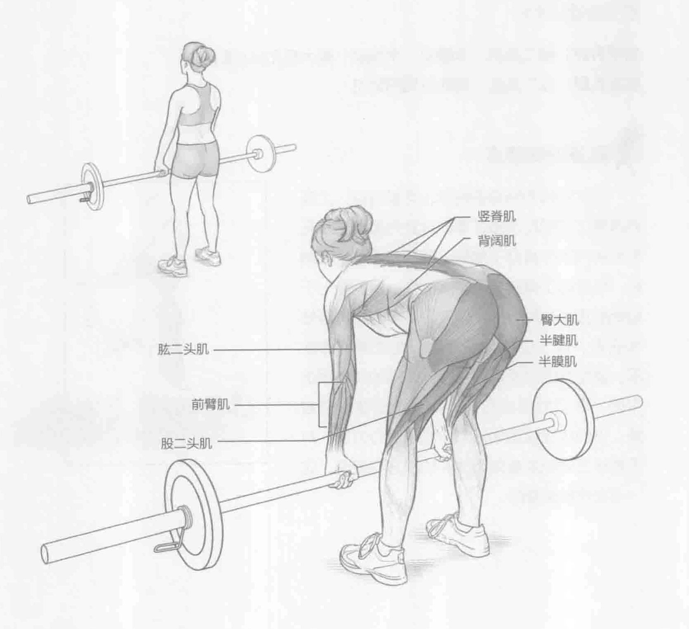
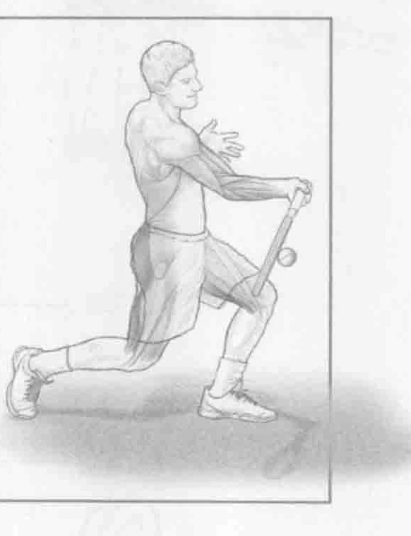

### 进行步骤

1. 双脚分开与肩同宽站立，膝盖微微弯曲（运动姿势）。在身体前面抓住一个杠铃，手臂下垂，位于大腿前方。双手距离大约与肩同宽，掌心面向身体。

2. 缓慢降低杠铃至小腿中间，把臀部作为铰链运动的中心。保持前骨盆略微倾斜的同时，臀部应该尽量向后伸与向上提。

3. 伸展臀部和腰部，重新举起杠铃，挺胸站直。

### 参与的肌肉

主要肌群：股二头肌、半腱肌、半膜肌、臀大肌和竖脊肌

辅助肌群：肱二头肌、背阔肌和前臂肌

### 网球训练要点

这个训练对所有的网球击球都有益，尤其对改善正手和反手击打落地球更为重要。罗马尼亚硬拉不仅有助于增强下背部的肌肉和腘绳肌，也有助于提高它们的灵活性。特别是对于较低的正手与反手球，以及高难度的击打落地球而言，这个训练特别管用。在提高发挥水平、避免肌肉以及臀部和膝盖周围的关节损伤方面，罗马尼亚硬拉的训练效果可谓一箭双雕。该训练还能增强臀部伸肌的离心力量，对于赛场上弹跳的着陆和改变动作方向来说，这一点是极其重要的。

