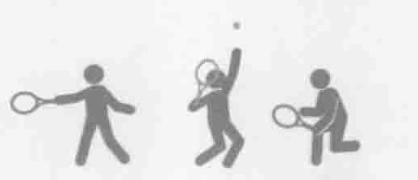
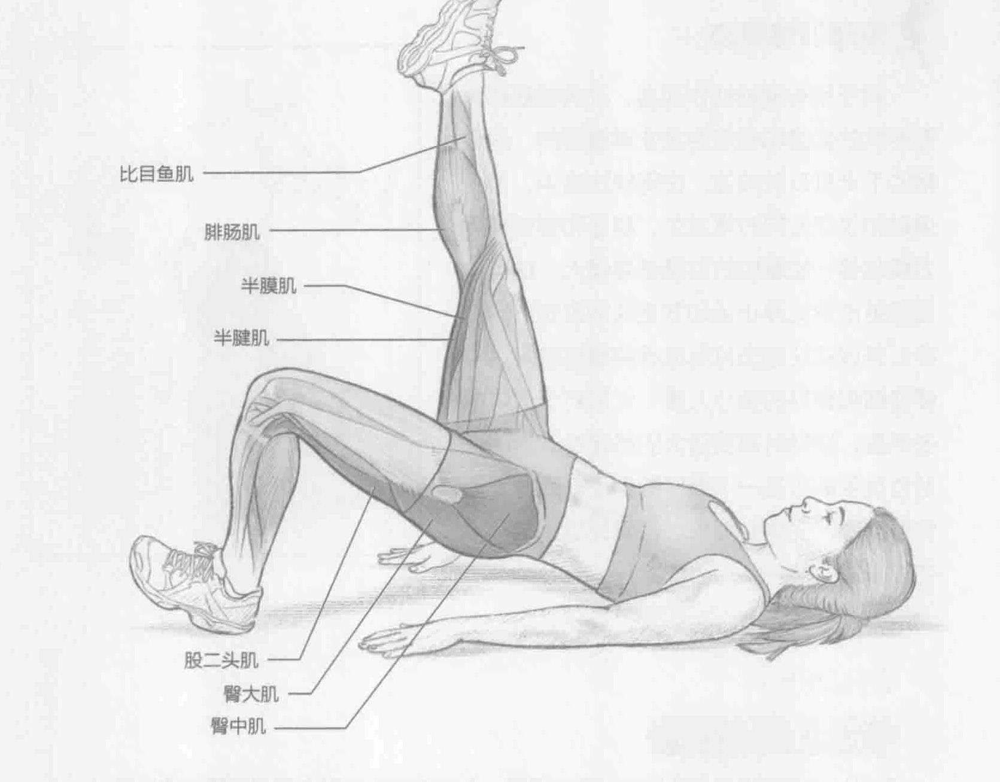
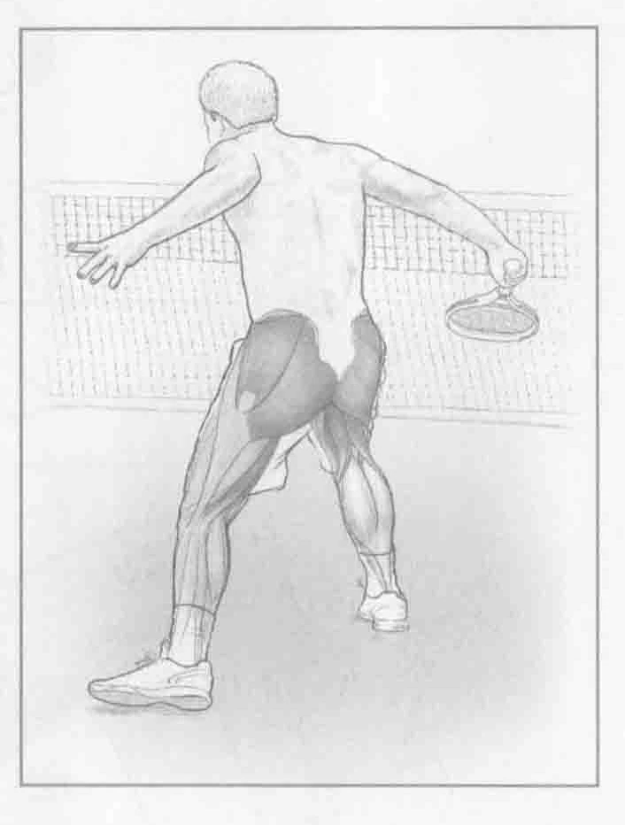
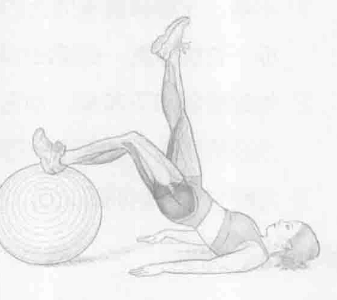

### 进行步骤

1. 平躺，左腿膝盖弯曲大约45度，左脚跟用力踩着地面，使左脚趾指向天花板。右腿伸直，右脚趾也指向天花板。

2. 抬起臀部和下背部，使它们离开地面，将身体重量移至左脚跟。保持最高点姿势两秒，然后降低到起始位置。

3. 左腿完成一组训练之后，换右腿重复以上的动作。

### 参与的肌肉

主要肌群：股二头肌、腘肌、半腱肌、半膜肌、臀大肌和臀中肌

辅助肌群：腓肠肌和比目鱼肌

### 网球训练要点

对于所有网球动作而言，改善腿筋和臀部伸肌的强度和稳定性是非常重要的，这会帮助下半身及时减速。在网球比赛中，停止运动和改变方向时常发生。腿筋和臀部扩展力量越强，能掌控的力量就越强大。这可以让您更迅速地停止运动并更快地改变方向。在以开放式站位击打落地球的着陆阶段，需要腿筋和臀部的离心力量，尤其对于低位截击而言，接球时需要强大的稳定性。封闭式站位反手截击是一个很好的例子，此时腿筋和臀部都产生离心力量，使网球选手成功地完成击球动作。

### 变化动作

#### 运动球腿筋拉伸

为了让训练动作更具挑战性，可以根据一系列的发展进度来改编肌腱拉伸训练。一旦能够轻松完成地板上的肌腱拉伸训练，就可以适宜地进行此训练，把脚跟放到更具挑战性且更不稳定的表面上。例如，在使用健身球的变化动作训练中，将脚置于健身球上，膝盖弯曲成90度。腿筋拉伸训练可以先从地板开始，再到长椅、健身平衡球、健身实心球、网球，最后到高尔夫球，这样循序渐进地进行。最后几个球的演变训练具有非常大的挑战性。

### 编者校对注

> 原书第129页：“腿筋拉伸”。正文动作标题为“腿筋拉伸”，动作索引写作“腘绳肌拉伸”；两者均忠实保留各自页面文字，导览可建立对应链接。
