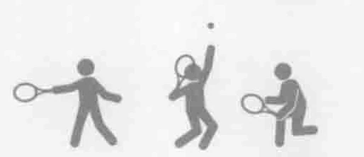
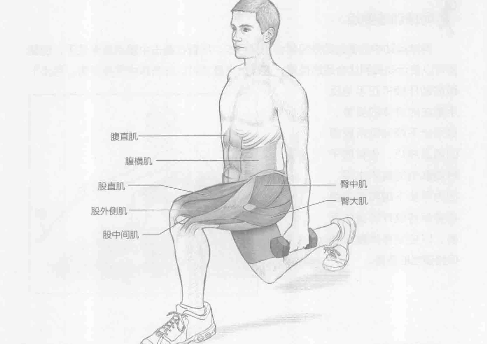
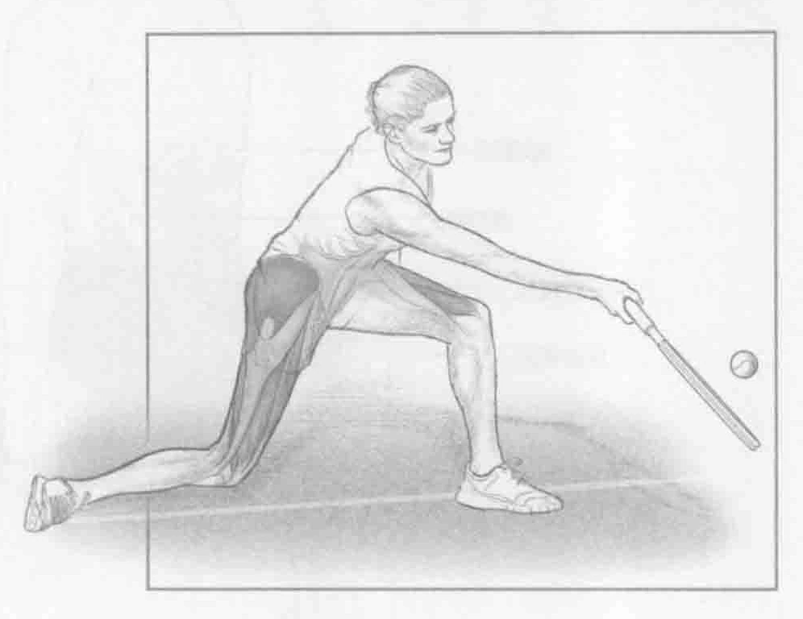
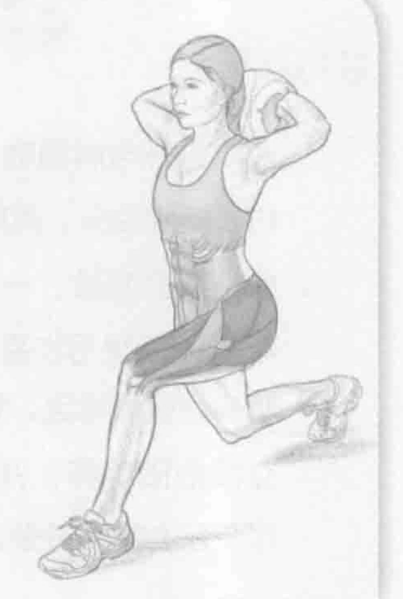

### 进行步骤

1. 双脚分开与肩同宽站立。双手各握一个哑铃。手臂伸直放在体侧，掌心向内。挺胸抬头，两肩放松，保持身体重心稳定。

2. 保持直立姿势，一只脚伸向前方，将身体重量转移至该脚上，前腿膝关节弯曲90度呈弓步姿势。大腿与地面平行。确保膝盖弯曲不超过90度。臀部和肩膀保持稳定。后腿尽可能保持伸直，后腿膝盖不要碰到地面。

3. 立即抽回前脚，并返回到起始位置。另一只脚迈向前方，重复同样的动作。左右脚交替做这个训练。

### 参与的肌肉

主要肌群：臀大肌、臀中肌、股直肌、股中间肌和股外侧肌

辅助肌群：腹直肌和腹横肌

### 网球训练要点

网球运动中的截击动作经常会用到弓步。尽管在截击中重点通常是手，但腿部可以使运动员到达合适的位置，这样上半身才可以在击球中保持平衡。弓步下蹲的动作模拟正手与反手截击时身体的姿势。做弓步下蹲训练所获得的适当技巧，也有助于提高截击的技术水平，因为弓步下蹲和截击都需要保持良好的身体平衡，以控制身体重心并保持适当的姿势。

### 变化动作

#### 健身实心球弓步下蹲

在弓步下蹲时，头部和颈部后面举着一个健身实心球。

通过提高重心，稍微改变身体的平衡，因为在网球运动中，球员必须在各种姿势下控制重心并保持平衡。这种弓步下蹲的变化动作不仅关注球员在重心提高的情況下保持平衡的能力，还要求球员增强身体核心肌群的力量，能够保持这一姿势。这两种好处有助于球员在每次击球时能够更好地掌控身体。训练时注意抬头挺胸。
