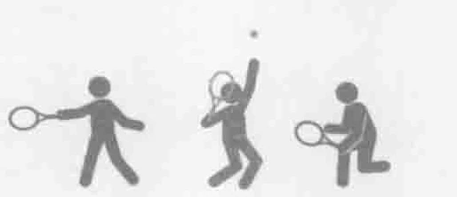
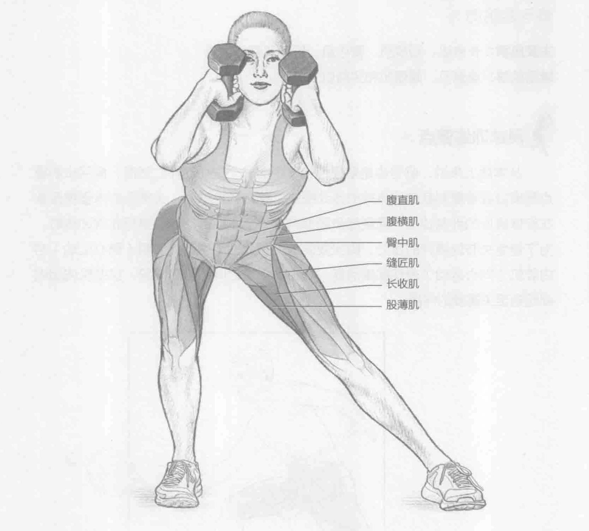
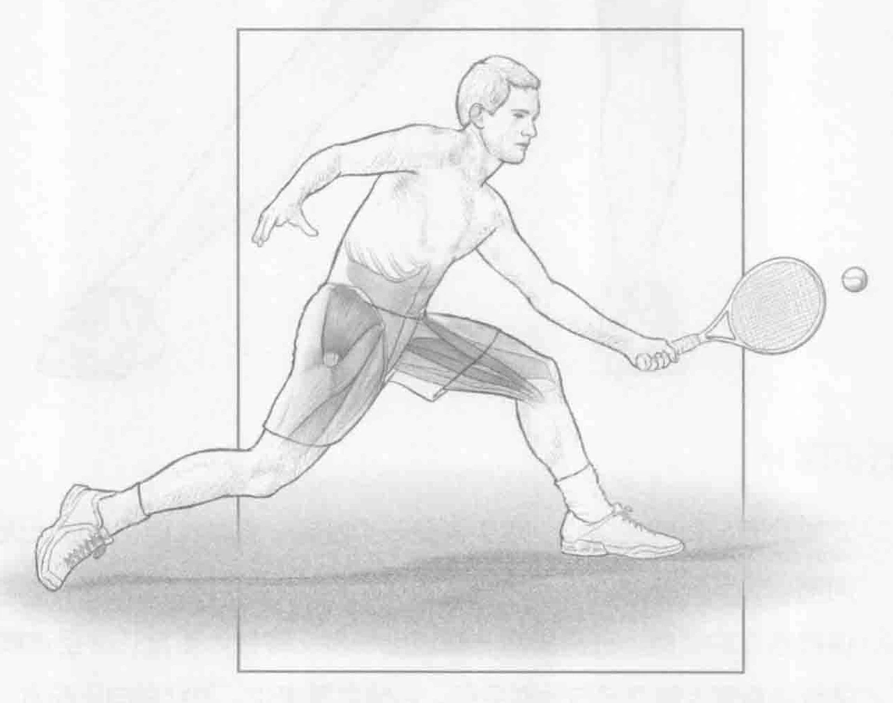

### 进行步骤

1. 双脚分开与肩同宽站立，双手各握一个哑铃。将哑铃担在肩膀上面，肘尖向前。

2. 保持直立的姿势，一只脚向一侧迈出一步，将身体重量转移至该脚上，弯曲膝盖直到大腿几乎与地面平行。后腿微微弯曲，脚趾指向正前方。

3. 抽回迈出去的那只腿，并返回到起始位置。换另一条腿，重复以上动作。左右腿交替训练。

### 参与的肌肉

主要肌群：长收肌、短收肌、臀中肌、股薄肌和缝匠肌

辅助肌群：腹直肌、腹横肌和竖脊肌

### 网球训练要点

从本质上来说，侧弓步是普通弓步下蹲的一个变化动作。然而，侧弓步的重点是模拟或者复制截击远身球的运动模式。截击远身球时，大部分的体重被聚集在离球最近的那条腿上。而侧弓步能够产生一个类似的动作。进行此次训练时，为了避免关节处额外的压力，脚尖要向前。在此训练中，外展肌（离心运动）与内收肌（向心运动）表现都很活跃。在每次击球之间的复苏阶段，这些肌肉组织都起到至关重要的作用。

