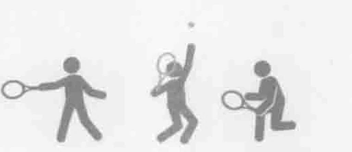
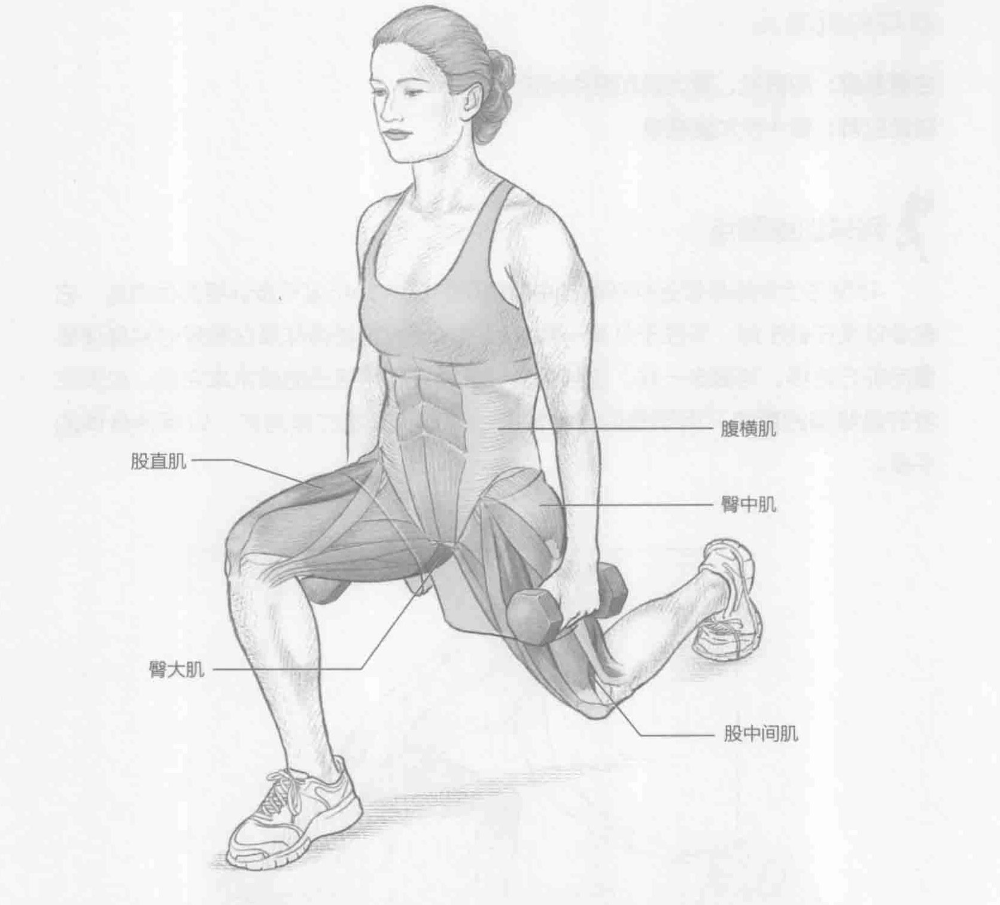
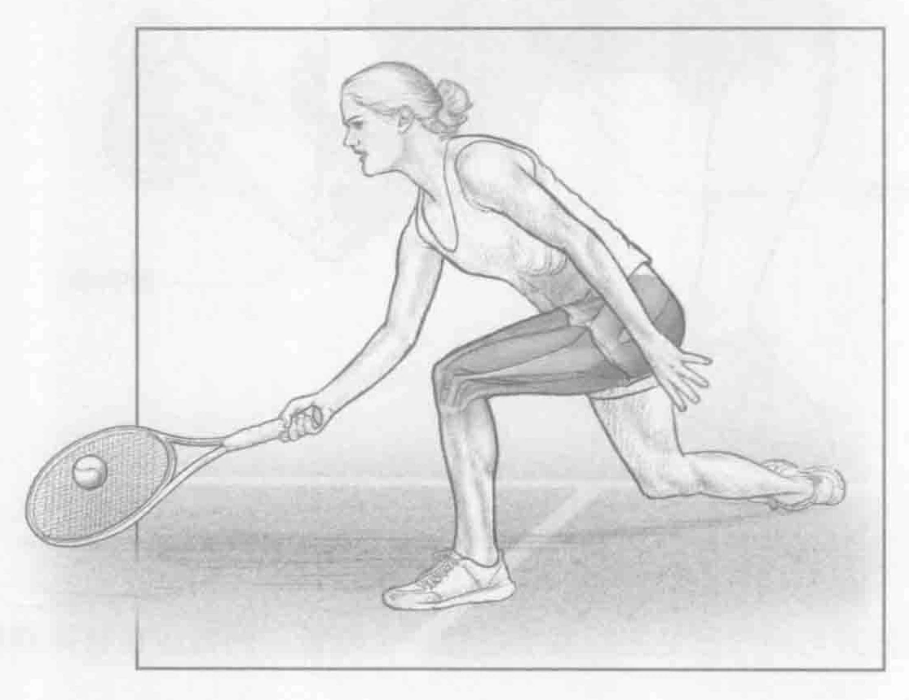

### 进行步骤

1. 双脚分开与肩同宽站立，双手各握一个哑铃。两臂放在身体两侧，掌心向内。

2. 保持直立的姿势，一只脚呈45度角迈出，将身体的重量转移至该腿上，弯曲膝盖，直到大腿几乎与地面平行。后腿弯曲。

3. 抽回迈出去的这只脚，并返回到起始位置。换另一条腿，另一只脚以45度角迈出去。左右脚交替训练。

### 参与的肌肉

主要肌群：股直肌、臀大肌和股中间肌

辅助肌群：臀中肌和腹横肌

### 网球训练要点

45度弓步训练最接近网球截击中所使用的技术。45度弓步训练的优点是，它教会球员在截击时，专注于从某一角度包围球网，这使得球员在触球时将身体重量向前方转移。与截击一样，这种弓步训练需要利用恰当的技术来完成。应该注意的是膝盖的弯曲，而不是后背。臀部、膝盖和脚踝应该对齐，以保持身体的平衡。

