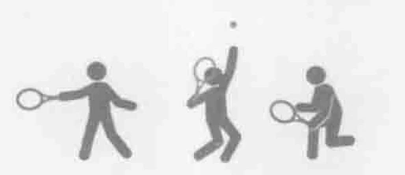
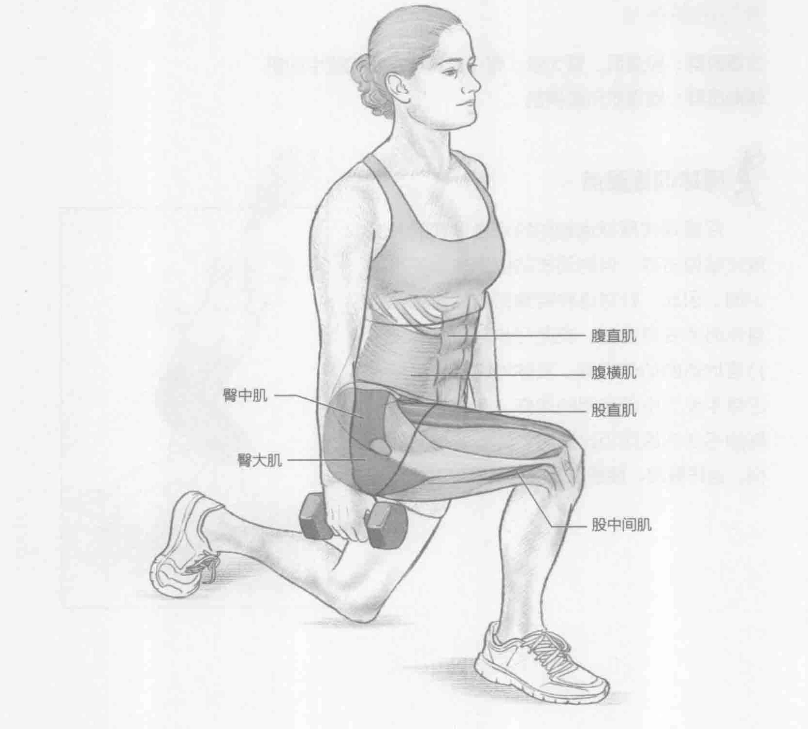
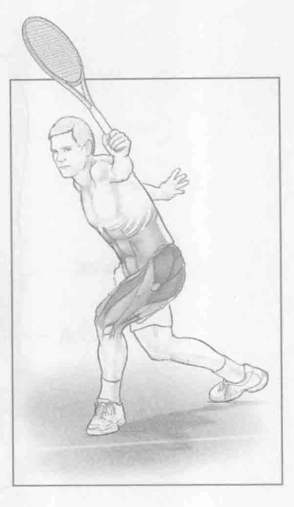

### 进行步骤

1. 两脚分开与肩同宽站立，双手各握一个哑铃。双臂放于身体两侧，掌心向内。

2. 保持直立的姿势，一只脚以45度角越过另一只脚，呈弓步，将身体重量转移到这只脚上，膝盖弯曲，直至大腿几乎与地面保持平行。后腿弯曲。

3. 抽回这只脚，并返回到起始位置。换另一条腿，另一只脚跨出。左右脚交替训练。

### 参与的肌肉

主要肌群：股直肌、臀大肌、臀中肌、臀小肌和股中间肌

辅助肌群：腹直肌和腹横肌

### 网球训练要点

尽管现代网球运动的特点是频繁的开放式站位击球，但封闭式站位也是必不可少的。因此，针对这种特殊的击球方式，身体必须妥善准备。交叉弓步与封闭式击打落地球的动作类似。具体地说，它最接近单手反手中所使用的动作。在做这个特殊的弓步训练而迈出脚时，脚趾要指向外侧，这样臀部、膝盖以及脚踝才能对齐。

