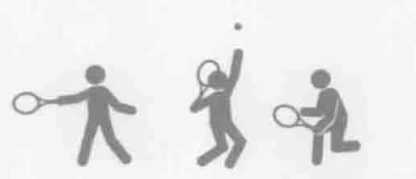
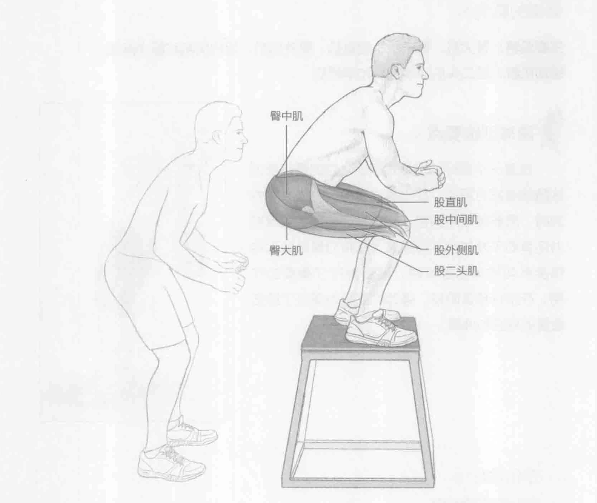
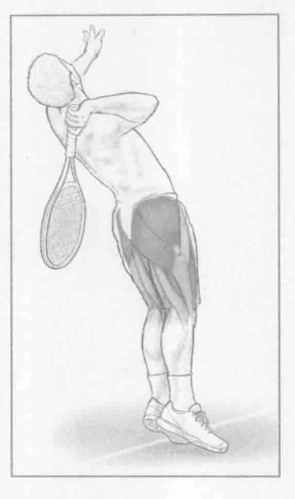

### 进行步骤

1. 这个训练需要一个12至42英寸（30至107厘米）高的箱子，具体大小取决于自身的能力。面向箱子站立，与箱子之间的距离约为1至2英尺（0.3至

0. 6米），双脚分开与肩同宽。

2. 跳到箱子上。注意在跳到箱子顶部时，脚步尽可能放轻，然后屈膝，臀部向后蹲下。这可以锻炼着陆技巧，并且减少膝关节的压力。

3. 从箱子上跳下来，回到起始位置。注重吸收冲击力，并且尽可能轻地着陆。保持胸部挺直和着陆的平稳，以便吸收着陆时所产生的冲击力。

### 参与的肌肉

主要肌群：臀大肌、臀中肌、股直肌、股外侧肌、股内侧肌和股中间肌

辅助肌群：股二头肌、半腱肌和半膜肌

### 网球训练要点

这是一个很好的增强式训练。它的重点是训练腿部爆发力运动，在比赛过程中，比如改变方向时，需要经常用到它。此外，训练腿部的爆发力还有助于发球水平的提高。在将力量从地面转移至身体的其他部位时，腿部发挥了重要的作用。在发球预备阶段，强劲的双腿也保证了膝盖适度的弯曲和伸展。

### 变化动作

#### 单腿跳箱

在跳箱训练中，使用双腿跳跃，而它更高级的一个版本是单腿跳箱，也就是只能使用一条腿跳箱。这种跳跃需要一定强大的力量与调节能力，也是一个高难度的训练。因此我们建议只有高级球员才可以训练这个动作。单腿跳箱可以使用任意一条腿，所用的箱子要比普通跳箱所用到的箱子低——通常它的高度是4到16英寸（10到40厘米）。
