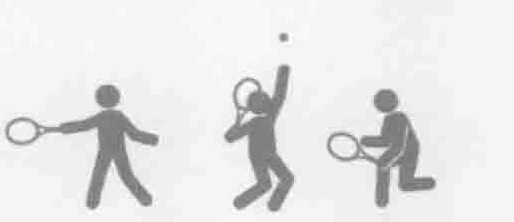
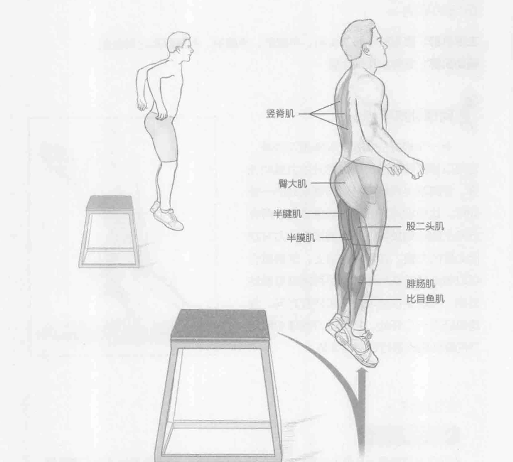
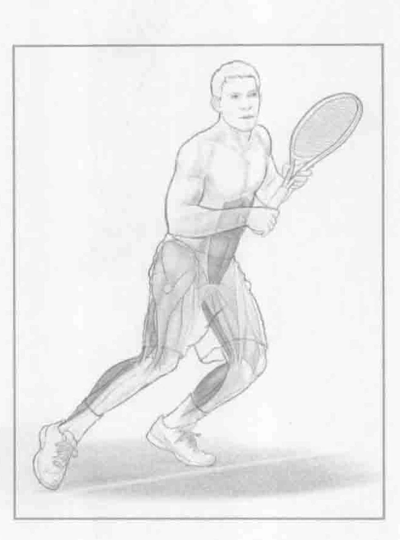

### 进行步骤

1. 需要一个12至24英寸（30到60厘米）高的箱子，它的具体规格取决于你的能力。站在箱子的顶部。

2. 抬起一只脚从箱子上跳下，双脚一起着地。着陆后，立即弹跳起。尽量在最短时间内降落在地面上。

3. 弹跳时，可以简单地直接跳起，也可以跳上另一个箱子的顶部，然后重复这样的动作。

### 参与的肌肉

主要肌群：腹直肌、股二头肌、半腱肌、半膜肌、腓肠肌和比目鱼肌

辅助肌群：竖脊肌和臀大肌

### 网球训练要点

另一个极好的加强式训练是深蹲跳，它可以提高腿部肌肉组成部分的力量和速度。深蹲跳也是特别针对网球运动的一项训练。这种训练方式可以锻炼球员在所有方向上的运动技能，并且增加强有力发球所必需的力量。在网球赛场上，深蹲跳也可以帮助球员在运动时，尽可能缩短触地时间，实现更快速地移动和转变方向。深蹲跳还有一个好处，它可以对发球中所用到的腿部肌肉进行针对性训练。

### 变化动作

#### 深蹲障碍跳

在箱子前面设置一系列小型跨栏，将它们排成一条线，深蹲跳着陆之后，弹跳起来，越过这些栏杆。注意保持臀部与肩膀竖直，尽可能缩短触地时间。
