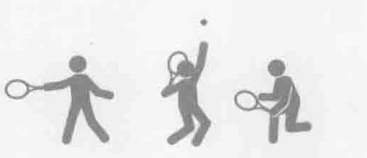
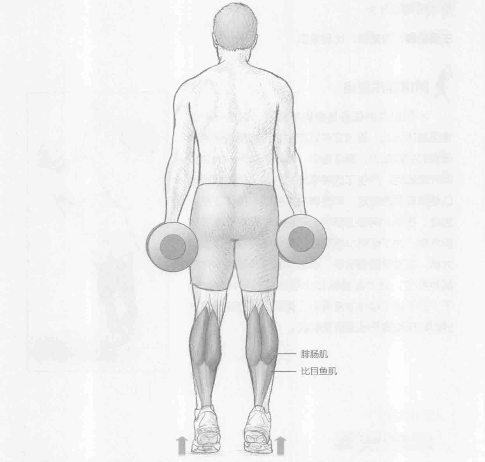
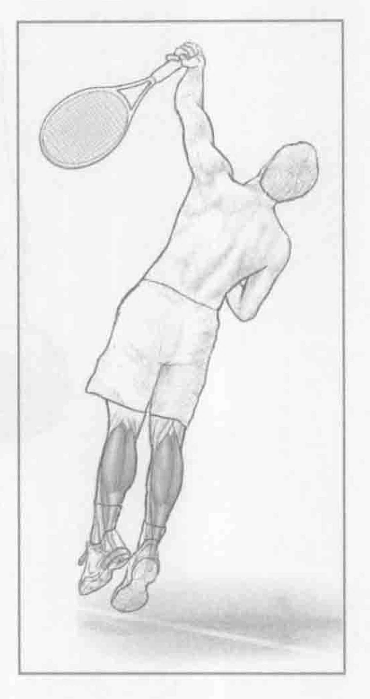

### 进行步骤

1. 两脚分开与肩同宽站立，双手各握一个哑铃。双臂放在身体两侧，掌心向内。

2. 尽可能高地提起脚后跟，同时保持良好的身体平衡。踝关节是唯一的一个运动着的关节。

3. 保持这一姿势一到两秒钟，然后慢慢地降落，回到起始位置。

### 参与的肌肉

主要肌群：腓肠肌、比目鱼肌

### 网球训练要点

小腿肌肉的任务是使脚部跖屈，这是一个非常重要的运动，因为它可以产生奔跑与跳跃所需的强有力的推动力。具体地讲，腓肠肌作为一大块纵向纤维肌肉，产生了这种推出的力量。小腿肌肉可以使得脚后跟抬起，而使脚尖承受整个身体重量。因此，在每次网球击球中，它们都发挥着非常重要的作用。为了证明小腿肌肉的重要性，我们以发球为例。在发球预备阶段，地面力量被转移至身体的其他部位，此时腓肠肌和比目鱼肌就开始起作用了。由于这个动作非常有力，实际上许多球员在发球时都双脚离开地面腾空跳起。

### 变化动作

#### 高难度提踵

为了增加这个训练的难度，我们扩大了运动的范围。站在一块垫木，或一个机器的边缘，使脚后跟悬垂，比前脚掌要低。然后抬起脚后跟，以脚尖站立。
