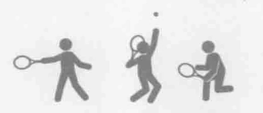
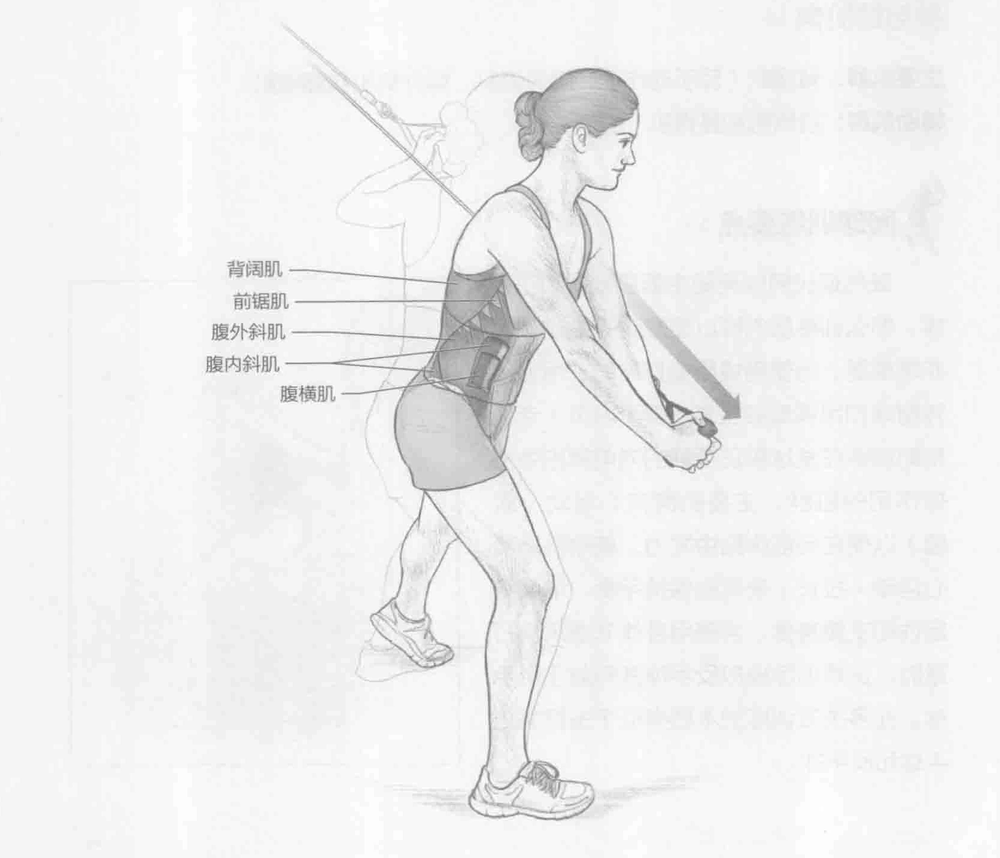
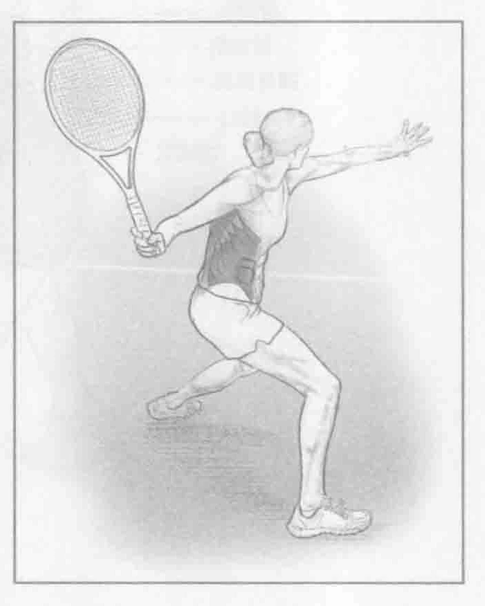

### 进行步骤

1. 在高处（与肩持平或稍高于肩）安装一个滑轮。身体左侧靠近滑轮站立。收紧腹部，肩膀向后收。

2. 双手握住滑轮手柄。双臂伸直，从上到下、从左肩到右髋在身体前部斜拉手柄。上半身保持不动。该动作强化惯用左手发球和正手击球的运动员的相关肌肉。

3. 适当地重复几次该动作，然后换另一侧进行同样的动作，从右肩向左髋运动。该动作强化惯用左手进行反手球的运动员的相关肌肉。

### 参与的肌肉

主要肌群：背阔肌（反手动作）、腹内斜肌、腹外斜肌和腹横肌

辅助肌群：前锯肌和竖脊肌

### 网球训练要点

既然现代网球运动主要是发球和正手球，那么训练肌肉群以便成功完成击球就非常重要。当使用惯用侧打球时，吊绳旋转削球和吊绳旋转上推（第149页）专门帮助训练在发球和正手球的向前挥拍中发挥作用的肌群。主要肌群向心运动（收缩）以便在向前挥拍中发力。辅助肌群离心运动（拉长）来帮助保持平衡、增强稳定性和支撑身体。当使用身体非惯用侧打球时，这项训练模拟反手球并有益于反手球。此多关节训练的本质类似于击打高正手球和反手球。

### 变化动作

#### 转髋的吊绳旋转削球

在此动作演变中，上半身的动作和主要训练中的一样。除此之外，髋部随上半身同时旋转。该动作更准确地模拟实际击球动作并允许更大的活动范围。在更高级的吊绳旋转削球训练中，阻力更小且只用一只手。
