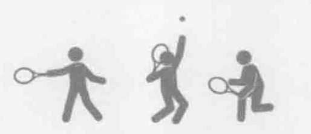
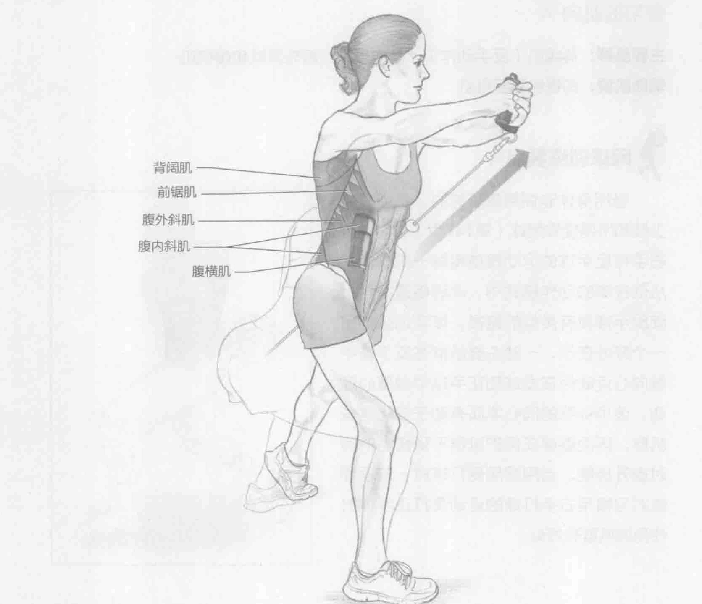
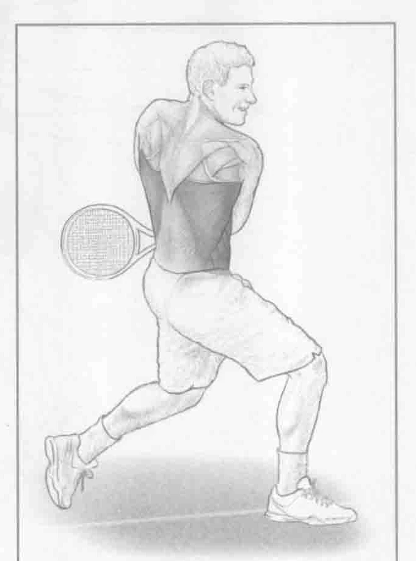

### 进行步骤

1. 在低处（与髋持平或稍低于髋）安装一个滑轮。身体左侧靠近滑轮站立。收紧腹部，向后下方拉肩膀。

2. 双手握住滑轮手柄。双臂伸直，从下到上，从左髋到右肩在身体前部斜拉手柄。上半身保持不动。该动作强化惯用右手进行反手球的运动员的相关肌肉。

3. 适当地重复几次该动作，然后换另一侧进行同样的动作，从右髋向左肩运动。该动作强化惯用右手发球和进行反手球的运动员的相关肌肉。

### 参与的肌肉

主要肌群：背阔肌（反手动作）、腹内斜肌、腹外斜肌和腹横肌

辅助肌群：前锯肌和竖脊肌

### 网球训练要点

当用身体非惯用侧打球时，吊绳旋转上推和吊绳旋转削球（第147页）与习惯用右手打反手球的运动员使用同一肌群。在从低往高的动作模式中，此训练遵循与上旋反手球具有类似的路径。该项训练的另一个好处在于，一些主要肌群在反手球中做向心运动但在发球和正手球中做离心运动。该项训练的同心本质有助于强化这些肌群，因而能够在保护肌群不受伤害的同时提升技能。当用惯用侧打球时，这项训练对习惯用右手打球的运动员打正手球时使用的肌群有好处。

### 变化动作

#### 转髋的吊绳旋转上推

在此动作演变中，上半身和吊绳旋转上推采用相同的动作模式。除此之外，髋部随上半身同时旋转。该动作更准确地模拟实际击球动作并允许更大的活动范围。
