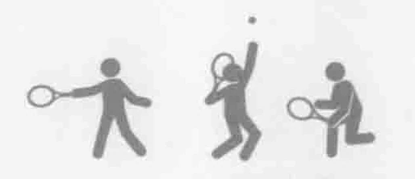
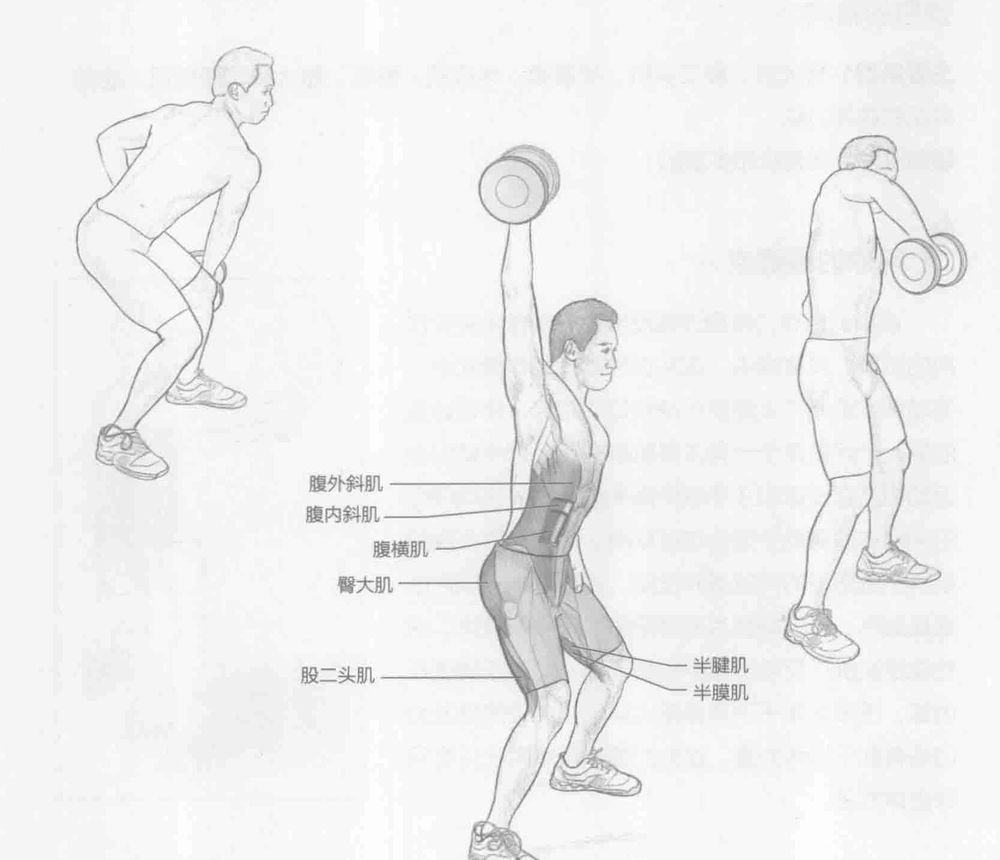
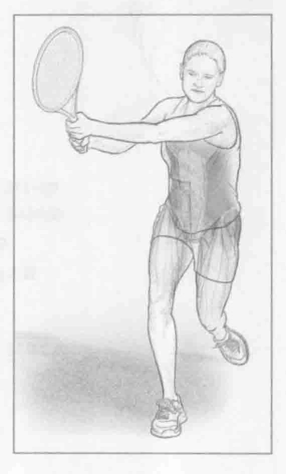
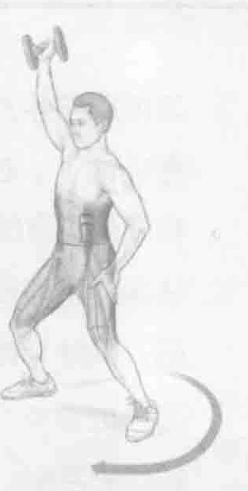

### 进行步骤

1. 习惯用右手打球的运动员右手握哑铃站立（习惯用左手打球的运动员左手握哑铃）。右手在身前斜穿过去，置于左膝外侧。腹部收紧并保持稳定。，右膝稍微弯曲，双脚分开与肩同宽。

2. 快速地将哑铃从左膝或左髋处举到靠近头右侧的位置，直至胳膊举到头右侧。保持手臂伸直。

3. 适当地重复几次该动作，然后换另一只胳膊进行同样的动作以便保持协调和肌肉平衡。

### 参与的肌肉

主要肌群：臀大肌、股二头肌、半腱肌、半膜肌、髂肌、腰大肌、腹横肌、腹内斜肌和腹外斜肌

辅助肌群：竖脊肌和多裂肌

### 网球训练要点

该项训练专门帮助训练反手击球动作中发挥作用的肌群。具体地讲，在从低往高的动作模式中，该项训练遵循与上旋反手球类似的路径。该项训练的另一个好处在于一些主要肌群在反手球中做向心运动但是在发球和正手球中做离心运动。该项训练的同心本质有助于强化这些肌群，因而能够在保护肌群不受伤害的同时提升技能。因为这是一项自由重量训练，所以需要其他稳定肌群来平衡身体。这些稳定肌群在反手击球中也很活跃。如果正确进行训练，该项专注于下半身和人体核心部位的爆发力训练有助于锻炼力量。这些力量能直接用于所有网球击球方法。

### 变化动作

#### 转髋的单臂旋转哑铃抓举

站姿和在单臂旋转哑铃抓举一样。上半身和在单臂旋转哑铃抓举中一样保持相同的动作模式。除此之外，髋部随上半身同时旋转。由于此动作的爆发力，脚部有可能离地。该动作更准确地模仿实际击球动作并允许更大的活动范围。
