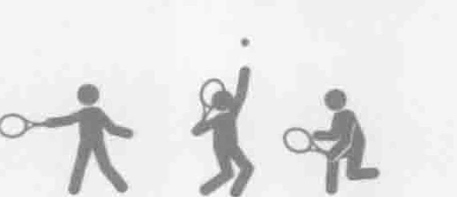
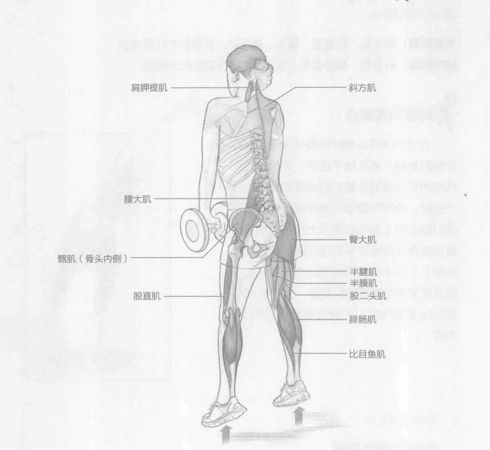
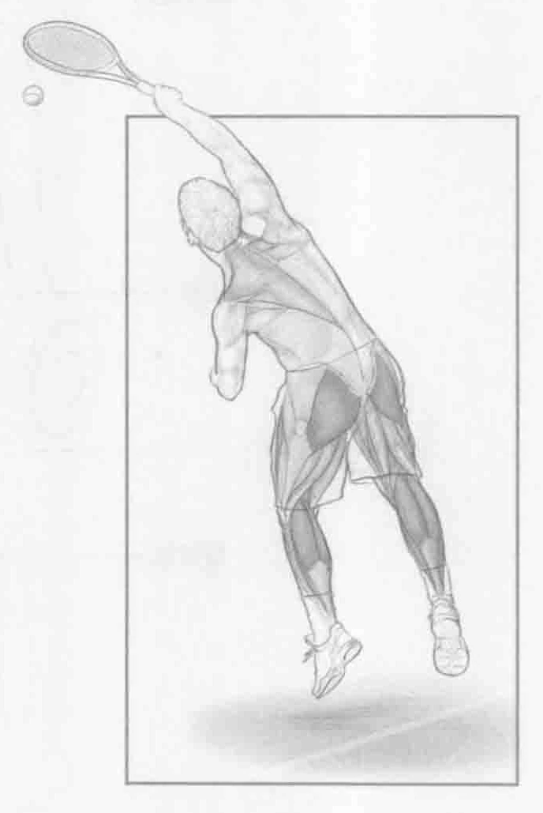

### 进行步骤

1. 站立，双脚分开与肩同宽。腰部向前微倾，挺胸，腹部收紧并保持稳定，头部放松，双眼直视前方。双手于身前各握一个相对较轻的哑铃。双臂垂直放下。哑铃略高于膝盖。膝盖以一种运动的姿势弯曲。

2. 伸展脚踝、膝盖和髋部，用力跳起。尽可能地往高跳，同时耸肩。

3. 轻轻地落地，双脚打开与肩同宽。膝盖微弯，从而减轻脚踝、髋部和下背部的压力。

### 参与的肌肉

主要肌群：臀大肌、股直肌、髂肌、腰大肌、腓肠肌和比目鱼肌

辅助肌群：斜方肌、肩胛提肌、股二头肌、半腱肌和半膜肌

### 网球训练要点

该项训练可以很好地强化发球和高球所用的肌群。虽然躯干屈伸，但是该项训练使用可以提供关键的稳定性和旋转的同一肌群。当发球或击打高球时，膝部屈伸模拟腿部向上运动的爆发力部位。通过重量加重身体负载来帮助强化腿部和提高肌肉耐力。由于该项训练专注于力量开发，因此需使用相对较轻的力量，大约是30％到50%的最大肌力（参见第1章第26页的内容）。

### 变化动作

#### 杠铃跳跃耸肩

使用杠铃而非哑铃。使用杠铃可能更容易一些，因为使用哑铃训练时，在跳跃过程中需要更高的稳定性来控制哑铃。
