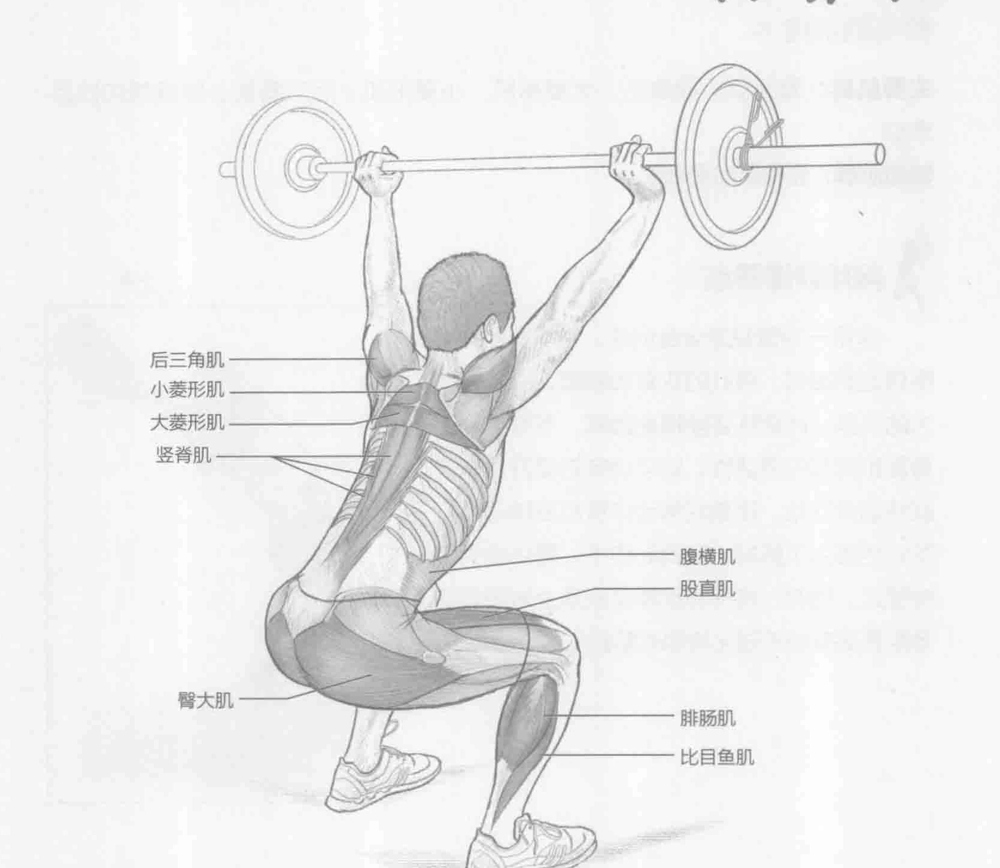
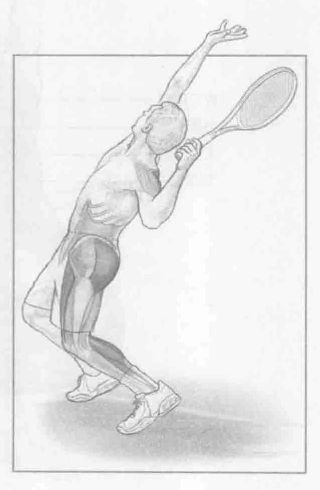

### 进行步骤

1. 将轻的杠铃从头部前方或后方的位置推举到过头位置。双臂需与杠铃横杆呈45°角。双腿分开，大约与肩齐宽。腹部收紧并保持稳定。同时收紧肩胛骨。

2. 慢慢地控制动作，屈膝以便大腿与地板平行。如果身体灵活性很好，可以蹲得更低。这样就可以保持良好的姿势。确保膝盖不能向前超出脚趾，背部挺直，挺胸抬头，双眼直视前方。

3. 运用腿部力量将杠铃拉回起始位置，同时呼气。继续面向前方。

### 参与的肌肉

主要肌群：臀大肌、股直肌、大菱形肌、小菱形肌、后三角肌、腓肠肌和比目鱼肌

辅助肌群：腹横肌和竖脊肌

### 网球训练要点

这是一项很好的全身训练。它需要保持平衡稳定的腹部、强壮的双臂和肩部，以及强有力的双腿。此训练还能提高髋部、下背部、上背部和肩部的灵活性。该项训练对提升发球技能特别有好处。膝盖屈伸动作模拟发球动作，同时也强化了肌群。在此动作中，躯体必须保持稳定。同时，将杠铃推举至头顶上方所需的等距抓举有助于强化肩部的肌群。

